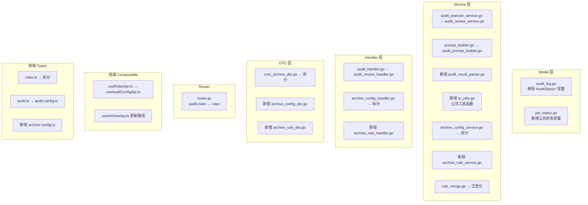

# 技术设计文档：代码规范化重构

## 概述

本设计文档描述 OA 智能审核系统的代码规范化重构方案。系统包含两个核心业务模块——审核工作台（audit）和归档复盘（archive），两者功能流程高度相似但在命名、文件组织、模块边界等方面存在不一致。本次重构的目标是：

1. 消除跨模块隐式依赖（状态常量、规则合并）
2. 统一后端各层（Service / Handler / DTO）的文件命名和职责划分
3. 修正 API 路由命名错误
4. 统一前端 Composable 和 Type 文件的命名模式

所有变更均为纯重构（rename / move / extract / generalize），不改变业务逻辑和外部行为（API 路由变更除外）。

## 架构

### 当前架构概览

```
go-service/internal/
├── model/          # 数据模型层（ORM 实体 + 常量）
├── dto/            # 数据传输对象层（请求/响应结构体）
├── repository/     # 数据访问层
├── service/        # 业务逻辑层（核心重构区域）
├── handler/        # HTTP 处理层
├── router/         # 路由注册
├── middleware/      # 中间件
├── config/         # 配置
└── pkg/            # 公共包（ai, oa 等）

frontend/
├── composables/    # API 调用封装层
├── types/          # TypeScript 类型定义层
├── components/     # Vue 组件
├── pages/          # 页面
└── ...
```

### 重构影响范围



## 组件与接口

### 需求 1：公共状态常量

**当前问题**：`AuditStatusPending` 等常量定义在 `model/audit_log.go` 中，archive 模块直接引用 `model.AuditStatusPending`，形成隐式跨模块依赖。

**方案**：在 `model/` 下新建 `job_status.go`，定义模块无关的公共常量。

```go
// model/job_status.go
package model

const (
    JobStatusPending    = "pending"
    JobStatusAssembling = "assembling"
    JobStatusReasoning  = "reasoning"
    JobStatusExtracting = "extracting"
    JobStatusCompleted  = "completed"
    JobStatusFailed     = "failed"
)
```

原 `audit_log.go` 中的 `AuditStatus*` 常量删除，所有引用处统一替换为 `JobStatus*`。

### 需求 2：Service 层文件重命名与拆分

**当前问题**：
- `audit_execute_service.go` 与 `archive_review_service.go` 命名不对称
- `prompt_builder.go` 是通用名称，实际只包含 audit 的 prompt 构建 + 公共工具函数 + ParseAuditResult
- audit 没有独立的 result_parser 文件

**方案**：

| 当前文件 | 目标文件 | 说明 |
|---------|---------|------|
| `audit_execute_service.go` | `audit_review_service.go` | 重命名 |
| `prompt_builder.go` | `audit_prompt_builder.go` | 重命名，仅保留 `BuildReasoningPrompt`、`BuildExtractionPrompt` |
| _(新建)_ | `audit_result_parser.go` | 从 prompt_builder.go 迁出 `ParseAuditResult` 及 `extractionPayload`、`coalesceRuleResults` |
| _(新建)_ | `ai_utils.go` | 公共工具函数（见需求 5） |

重命名后 audit 与 archive 的 Service 文件对称表：

| 职责 | Audit | Archive |
|------|-------|---------|
| 执行/复盘 | `audit_review_service.go` | `archive_review_service.go` |
| 配置管理 | `process_audit_config_service.go` | `archive_config_service.go` |
| 规则管理 | `audit_rule_service.go` | `archive_rule_service.go` |
| Prompt 构建 | `audit_prompt_builder.go` | `archive_prompt_builder.go` |
| 结果解析 | `audit_result_parser.go` | `archive_result_parser.go` |
| 流式消费 | `audit_stream_worker.go` | `archive_stream_worker.go` |

### 需求 3：修正 archive 模块 API 路由

**当前问题**：归档规则的路由路径为 `/api/tenant/archive/audit-rules`，包含 `audit` 前缀，语义混淆。

**方案**：

```
旧路径: /api/tenant/archive/audit-rules
新路径: /api/tenant/archive/rules
```

变更涉及：
1. `router.go` 中 4 条路由（GET/POST/PUT/DELETE）
2. `frontend/composables/useArchiveApi.ts` 中 4 个函数的请求路径
3. 全局搜索确认无其他引用

### 需求 4：拆分 archive_config_service.go

**当前问题**：`archive_config_service.go` 同时包含 `ProcessArchiveConfigService`（配置管理）和 `ArchiveRuleService`（规则管理）两个 service。

**方案**：将 `ArchiveRuleService`（`NewArchiveRuleService` 及其所有方法：`Create`、`Update`、`Delete`、`ListByConfigIDFilter`）迁移到新文件 `archive_rule_service.go`。

### 需求 5：抽取公共工具函数

**当前问题**：`prompt_builder.go` 中定义了大量工具函数，被 `archive_result_parser.go` 和 `archive_prompt_builder.go` 跨文件调用，形成隐式依赖。

**方案**：新建 `service/ai_utils.go`，迁入以下函数：

**JSON 清理类**：`cleanJSONResponse`、`extractJSONFromMarkdownFence`、`stripLeadingEllipsisPrefix`

**数值处理类**：`pickOverallScoreInt`、`clampPercentInt`

**集合工具类**：`coalesceStringSlice`、`firstNonEmpty`

**字段过滤类**：`filterFields`、`filterRowFields`

**格式化类**：`formatMainData`、`formatGroupedDetailData`

**结论归一化类**：`normalizeAuditRecommendation`、`mapComplianceAliasToRecommendation`

**通用工具**：`truncate`

同时迁移 `SelectedFieldSet` 类型定义到 `ai_utils.go`。

### 需求 6：整理 DTO 层文件组织

**当前问题**：`cron_archive_dto.go` 混合了 Cron 任务类型配置、归档复盘配置、归档规则三类 DTO。

**方案**：

| 当前位置 | 目标文件 | 包含的 DTO |
|---------|---------|-----------|
| `cron_archive_dto.go` | `cron_dto.go`（原文件重命名） | `CronTaskTypePresetResponse`、`CronTaskTypeConfigResponse`、`SaveCronTaskTypeConfigRequest`、`CronTaskResponse`、`CreateCronTaskRequest`、`UpdateCronTaskRequest` |
| `cron_archive_dto.go` | `archive_config_dto.go`（新建） | `CreateProcessArchiveConfigRequest`、`UpdateProcessArchiveConfigRequest` |
| `cron_archive_dto.go` | `archive_rule_dto.go`（新建） | `CreateArchiveRuleRequest`、`UpdateArchiveRuleRequest`、`ListArchiveRulesQuery` |

### 需求 7：统一前端 Composable 命名

**当前问题**：audit 的配置管理 API 封装在 `useRulesApi.ts` 中，与 `useArchiveApi.ts` 命名不对称。

**方案**：
- `useRulesApi.ts` → `useAuditConfigApi.ts`
- 更新所有引用该 composable 的文件（页面组件等）

重命名后的对称表：

| 职责 | Audit | Archive |
|------|-------|---------|
| 配置管理 | `useAuditConfigApi.ts` | `useArchiveApi.ts` |
| 执行/复盘 | `useAuditApi.ts` | `useArchiveReviewApi.ts` |

### 需求 8：统一前端类型定义文件命名

**当前问题**：
- `audit.ts` 与 `archive-review.ts` 命名不对称
- `rules.ts` 混合了 audit 配置类型、archive 配置类型、cron 类型和公共类型

**方案**：

| 当前文件 | 目标文件 | 包含的类型 |
|---------|---------|-----------|
| `rules.ts` | `common.ts`（重命名） | `ProcessField`、`DetailTableDef`、`SystemPromptTemplate`、`ProcessInfo`、`FieldDef`、`ProcessFields` |
| `rules.ts` | `audit-config.ts`（新建） | `ProcessAuditConfig`、`AuditRule` |
| `rules.ts` | `archive-config.ts`（新建） | `ProcessArchiveConfig`、`ArchiveRule`、`AccessControl` |
| `rules.ts` | `cron.ts`（已存在，追加） | `CronContentTemplate`、`CronTaskConfig`、`SaveCronTaskConfigRequest` |
| `audit.ts` | 保持不变或重命名为 `audit-review.ts` | 审核执行相关类型 |

### 需求 9：泛型化 rule_merge

**当前问题**：`MergeRules` 函数签名硬编码 `[]model.AuditRule`，archive 模块无法复用。

**方案**：定义 `MergeableRule` 接口，使用 Go 接口实现多态：

```go
// service/rule_merge.go

// MergeableRule 可合并规则的通用接口
type MergeableRule interface {
    GetID() string
    GetRuleContent() string
    GetRuleScope() string
    IsEnabled() bool
}

// MergeRules 合并租户规则和用户个性化配置
func MergeRules(tenantRules []MergeableRule, userDetail *UserRuleOverride) []MergedRule {
    // ... 逻辑不变，仅将 model.AuditRule 字段访问替换为接口方法调用
}
```

`model.AuditRule` 和 `model.ArchiveRule` 各自实现 `MergeableRule` 接口。

同时定义 `UserRuleOverride` 结构体抽象用户配置覆盖数据，替代直接依赖 `model.AuditDetailItem`。

### 需求 10：统一 Handler 层文件组织

**当前问题**：
- `audit_handler.go` 与 `archive_review_handler.go` 命名不对称
- `archive_config_handler.go` 混合了 `ArchiveConfigHandler` 和 `ArchiveRuleHandler`

**方案**：

| 当前文件 | 目标文件 | 说明 |
|---------|---------|------|
| `audit_handler.go` | `audit_review_handler.go` | 重命名 |
| `archive_config_handler.go` | `archive_config_handler.go` | 仅保留 `ArchiveConfigHandler` |
| _(新建)_ | `archive_rule_handler.go` | 迁入 `ArchiveRuleHandler` 及其方法 |

重命名后的对称表：

| 职责 | Audit | Archive |
|------|-------|---------|
| 执行/复盘 | `audit_review_handler.go` | `archive_review_handler.go` |
| 配置管理 | `process_audit_config_handler.go` | `archive_config_handler.go` |
| 规则管理 | `audit_rule_handler.go` | `archive_rule_handler.go` |

## 数据模型

本次重构不涉及数据库 schema 变更。所有 model 结构体（`AuditRule`、`ArchiveRule`、`AuditLog`、`ArchiveLog` 等）保持不变。

唯一的 model 层变更是：
1. 新增 `model/job_status.go` 文件，定义公共状态常量
2. 删除 `model/audit_log.go` 中的 `AuditStatus*` 常量块
3. `AuditRule` 和 `ArchiveRule` 新增接口方法实现（`GetID()`、`GetRuleContent()`、`GetRuleScope()`、`IsEnabled()`）

## 正确性属性

*正确性属性是在系统所有有效执行中都应成立的特征或行为——本质上是对系统应做什么的形式化陈述。属性是人类可读规范与机器可验证正确性保证之间的桥梁。*

### Property 1: AI 工具函数契约不变量

*For any* 字符串输入 `s`，`cleanJSONResponse(cleanJSONResponse(s))` 应等于 `cleanJSONResponse(s)`（幂等性）；*For any* 浮点数 `v`，`clampPercentInt(v)` 的结果应始终在 `[0, 100]` 范围内；*For any* 字符串 `s` 和正整数 `maxLen`，`truncate(s, maxLen)` 的结果长度应 `<= maxLen + 3`。

**Validates: Requirements 5.1**

### Property 2: 推荐结论归一化输出域约束

*For any* 字符串输入 `s`，`normalizeAuditRecommendation(s)` 的返回值应始终属于集合 `{"", "approve", "return", "review"}` 或等于 `strings.ToLower(strings.TrimSpace(s))`；`mapComplianceAliasToRecommendation(s)` 的返回值应始终属于集合 `{"", "approve", "return", "review"}`。

**Validates: Requirements 5.2**

### Property 3: 规则合并排序与启用状态不变量

*For any* 实现了 `MergeableRule` 接口的规则列表和任意用户配置覆盖，`MergeRules` 的输出应满足：(1) 所有 `scope == "mandatory"` 的规则 `Enabled` 始终为 `true`；(2) 结果列表按 `mandatory > custom > default_on > default_off` 的优先级排序；(3) 当用户 toggle 覆盖存在时，`default_on` 和 `default_off` 规则的 `Enabled` 状态应等于 toggle 值。

**Validates: Requirements 9.1**

## 错误处理

本次重构为纯代码组织变更，错误处理策略保持不变：

1. **编译期保障**：所有文件重命名、函数迁移后必须通过 `go build` 和 `nuxt build` 编译验证
2. **API 路由变更**（需求 3）：前后端必须同步更新，否则前端请求将返回 404。建议在同一个 PR 中完成前后端变更
3. **接口化 rule_merge**（需求 9）：`MergeableRule` 接口方法签名必须与现有字段访问语义一致，避免引入行为差异
4. **常量替换**（需求 1）：使用 IDE 全局替换 + `grep` 验证，确保无遗漏引用

## 测试策略

### 属性测试（Property-Based Testing）

使用 Go 的 `testing/quick` 或 `pgregory.net/rapid` 库进行属性测试，每个属性测试至少运行 100 次迭代。

**适用属性测试的场景**：
- **AI 工具函数**（Property 1）：`cleanJSONResponse` 幂等性、`clampPercentInt` 范围约束、`truncate` 长度约束
- **结论归一化**（Property 2）：`normalizeAuditRecommendation` 和 `mapComplianceAliasToRecommendation` 输出域约束
- **规则合并**（Property 3）：排序不变量、mandatory 启用不变量、toggle 覆盖正确性

每个属性测试必须以注释标注对应的设计属性：
```go
// Feature: code-standardization, Property 1: AI 工具函数契约不变量
```

### 单元测试

- 验证常量值等价性（`JobStatusPending == "pending"` 等）
- 验证 `ParseAuditResult` 和 `ParseArchiveReviewResult` 在迁移后行为不变（使用已有测试用例）
- 验证 `MergeRules` 接口化后对 `AuditRule` 和 `ArchiveRule` 的行为与原实现一致

### 编译验证

- `go build ./...` 确保后端编译通过
- `npx nuxi build` 确保前端编译通过
- `go vet ./...` 确保无静态分析警告

### 集成测试

- API 路由变更（需求 3）：验证新路径 `/api/tenant/archive/rules` 返回正确响应
- 验证旧路径 `/api/tenant/archive/audit-rules` 返回 404

### 回归验证

- 运行现有的 `prompt_builder_test.go` 测试套件，确保迁移后所有测试通过
- 全局搜索 `AuditStatus` 确认无遗漏引用
- 全局搜索 `audit-rules`（在 archive 上下文中）确认无遗漏路径引用
