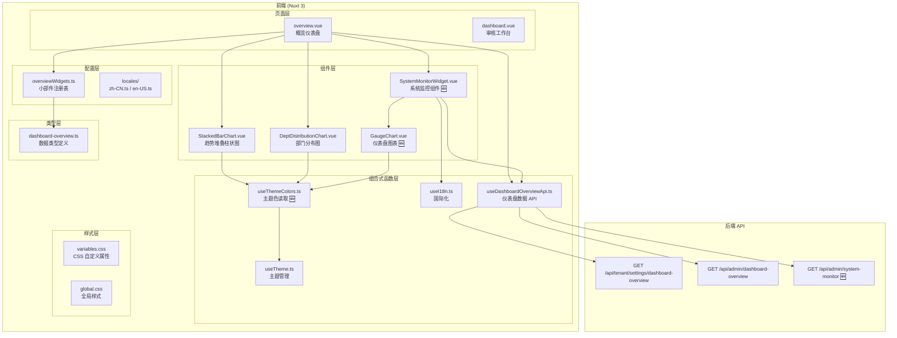
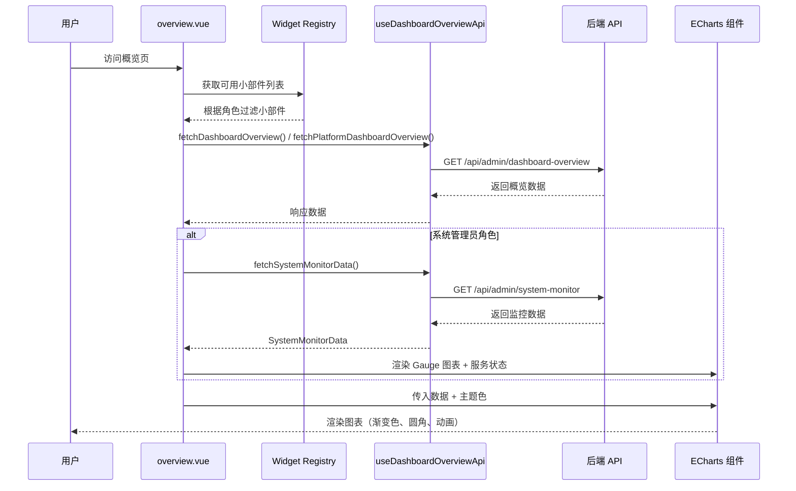

# 技术设计文档：仪表盘全面优化

## 概述

本设计文档描述 OA 智审平台仪表盘全面优化的技术实现方案，涵盖六个需求：ECharts 图表视觉增强、概览页小部件布局自适应优化、系统管理员系统运行监控、系统监控数据类型定义、国际化支持和代码规范一致性。

技术栈基于现有项目：Nuxt 3 + Vue 3 Composition API + Ant Design Vue + vue-echarts + TypeScript。所有新增代码将遵循项目现有的编码规范、CSS 自定义属性体系和国际化模式。

## 架构

### 系统架构图



### 数据流



## 组件与接口

### 1. 主题色读取工具 `useThemeColors.ts` 🆕

提供从 CSS 自定义属性中读取当前主题色值的工具函数，供所有 ECharts 组件使用。

```typescript
// frontend/composables/useThemeColors.ts

/**
 * useThemeColors — 从 CSS 自定义属性读取当前主题色值。
 * ECharts 组件通过此工具获取与 Theme_System 一致的配色。
 */
export const useThemeColors = () => {
  const { isDark } = useTheme()

  /** 读取指定 CSS 自定义属性的当前计算值 */
  function getCssVar(name: string): string {
    if (typeof window === 'undefined') return ''
    return getComputedStyle(document.documentElement).getPropertyValue(name).trim()
  }

  /** 当前主题下的图表配色方案（响应式） */
  const chartColors = computed(() => ({
    primary: getCssVar('--color-primary') || '#4f46e5',
    primaryLight: getCssVar('--color-primary-light') || '#6366f1',
    accent: getCssVar('--color-accent') || '#06b6d4',
    success: getCssVar('--color-success') || '#10b981',
    warning: getCssVar('--color-warning') || '#f59e0b',
    danger: getCssVar('--color-danger') || '#ef4444',
    textPrimary: getCssVar('--color-text-primary'),
    textSecondary: getCssVar('--color-text-secondary'),
    textTertiary: getCssVar('--color-text-tertiary'),
    border: getCssVar('--color-border'),
    bgCard: getCssVar('--color-bg-card'),
    isDark: isDark.value,
  }))

  return { chartColors, getCssVar, isDark }
}
```

### 2. 增强 `StackedBarChart.vue`

在现有组件基础上增加渐变色填充、圆角柱体、柔和阴影和主题适配：

- 通过 `useThemeColors()` 获取当前主题色
- 使用 ECharts `LinearGradient` 为每个系列创建渐变色 `itemStyle`
- 配置 `itemStyle.borderRadius: [4, 4, 0, 0]` 实现圆角柱体
- 配置 `tooltip` 使用圆角、阴影和主题适配的背景色
- 坐标轴颜色、文字颜色从 `chartColors` 读取
- 保留 `autoresize` 属性

### 3. 增强 `DeptDistributionChart.vue`

与趋势图保持一致的视觉风格：

- 横向柱状图使用 `LinearGradient` 渐变色
- 配置 `itemStyle.borderRadius: [0, 4, 4, 0]`（横向柱体圆角方向）
- tooltip、坐标轴配色与趋势图一致
- 通过 `useThemeColors()` 适配暗色主题

### 4. `GaugeChart.vue` 🆕

新增仪表盘（gauge）图表组件，用于系统监控中展示 CPU 和内存使用率：

```typescript
interface Props {
  value: number        // 0-100 百分比
  label: string        // 指标名称
  thresholds?: { warning: number; danger: number }
  height?: string
}
```

- 使用 ECharts gauge 类型
- 根据 `value` 与 `thresholds` 动态设置指针和进度条颜色
- 通过 `useThemeColors()` 适配主题

### 5. `SystemMonitorWidget.vue` 🆕

系统运行监控小部件，仅系统管理员可见：

```typescript
// 组件内部状态
const monitorData = ref<SystemMonitorData | null>(null)
const loading = ref(false)
const error = ref<string | null>(null)

// 数据获取
async function loadMonitorData() { ... }

// 阈值颜色判断
function getMetricColor(value: number, thresholds: { warning: number; danger: number }): string { ... }

// 服务状态颜色映射
function getServiceStatusColor(status: 'online' | 'offline' | 'degraded'): string { ... }
```

布局结构：
- 顶部：刷新按钮 + 系统运行时间
- 中部：CPU / 内存 Gauge 图表（并排）+ 磁盘使用率进度条
- 底部：关键服务状态列表（API 服务、数据库、Redis、AI 模型服务）

### 6. Widget Registry 更新

在 `overviewWidgets.ts` 中注册新的 `system_monitor` 小部件：

```typescript
{
  id: 'system_monitor',
  titleKey: 'overview.widgetTitle.system_monitor',
  descriptionKey: 'overview.widgetDesc.system_monitor',
  requiredPermissions: ['system_admin'],
  defaultEnabled: true,
  size: 'lg',
}
```

`OverviewWidgetId` 联合类型新增 `'system_monitor'`。

### 7. `useDashboardOverviewApi.ts` 扩展

新增方法：

```typescript
/**
 * 获取系统运行监控数据（仅系统管理员可访问）。
 * @returns 系统 CPU、内存、磁盘使用率及关键服务状态
 */
async function fetchSystemMonitorData(): Promise<SystemMonitorData> {
  return await authFetch<SystemMonitorData>('/api/admin/system-monitor')
}
```

### 8. 概览页 Widget Grid 布局优化

修改 `overview.vue` 中的 `.widget-grid` CSS：

```css
.widget-grid {
  display: grid;
  grid-template-columns: repeat(auto-fill, minmax(320px, 1fr));
  grid-auto-rows: min-content;  /* 关键：每行高度由内容决定 */
  gap: 20px;
  align-items: start;           /* 小部件顶部对齐，不拉伸 */
}

.widget--sm { min-height: 160px; }
.widget--md { min-height: 200px; }
.widget--lg { min-height: 240px; }

@media (max-width: 768px) {
  .widget-grid {
    grid-template-columns: 1fr;
  }
}
```

## 数据模型

### SystemMonitorData 🆕

```typescript
/** 系统运行监控数据 */
export interface SystemMonitorData {
  cpu_usage: number           // CPU 使用率 (0-100)
  memory_usage: number        // 内存使用率 (0-100)
  disk_usage: number          // 磁盘使用率 (0-100)
  services: ServiceStatus[]   // 关键服务状态列表
  uptime_seconds: number      // 系统运行时间（秒）
}

/** 单个服务的运行状态 */
export interface ServiceStatus {
  name: string                              // 服务名称
  status: 'online' | 'offline' | 'degraded' // 运行状态
  response_time_ms: number                  // 响应时间（毫秒）
}
```

### PlatformDashboardOverview 扩展

```typescript
export interface PlatformDashboardOverview {
  tenant_stats: PlatformTenantStatsData
  ai_performance: PlatformAIPerformanceData
  tenant_usage_list: TenantUsageRow[]
  tenant_ranking: PlatformTenantRankRowEnriched[]
  system_monitor?: SystemMonitorData  // 🆕 可选字段
}
```

### 阈值配置常量

```typescript
/** 系统监控指标阈值 */
export const MONITOR_THRESHOLDS = {
  cpu: { warning: 80, danger: 95 },
  memory: { warning: 85, danger: 95 },
  disk: { warning: 90, danger: 95 },
} as const
```

### I18n 键值对新增

中文（zh-CN.ts）：
```
'overview.widgetTitle.system_monitor': '系统运行监控'
'overview.widgetDesc.system_monitor': '系统 CPU、内存、磁盘使用率及关键服务状态'
'overview.monitor.cpuUsage': 'CPU 使用率'
'overview.monitor.memoryUsage': '内存使用率'
'overview.monitor.diskUsage': '磁盘使用率'
'overview.monitor.serviceStatus': '服务状态'
'overview.monitor.online': '在线'
'overview.monitor.offline': '离线'
'overview.monitor.degraded': '降级'
'overview.monitor.responseTime': '响应时间'
'overview.monitor.refresh': '刷新'
'overview.monitor.loadFailed': '加载监控数据失败'
'overview.monitor.retry': '重试'
```

英文（en-US.ts）：
```
'overview.widgetTitle.system_monitor': 'System Monitor'
'overview.widgetDesc.system_monitor': 'System CPU, memory, disk usage and service status'
'overview.monitor.cpuUsage': 'CPU Usage'
'overview.monitor.memoryUsage': 'Memory Usage'
'overview.monitor.diskUsage': 'Disk Usage'
'overview.monitor.serviceStatus': 'Service Status'
'overview.monitor.online': 'Online'
'overview.monitor.offline': 'Offline'
'overview.monitor.degraded': 'Degraded'
'overview.monitor.responseTime': 'Response Time'
'overview.monitor.refresh': 'Refresh'
'overview.monitor.loadFailed': 'Failed to load monitor data'
'overview.monitor.retry': 'Retry'
```

## 正确性属性

*正确性属性是在系统所有有效执行中都应成立的特征或行为——本质上是对系统应做什么的形式化陈述。属性是人类可读规范与机器可验证正确性保证之间的桥梁。*

### Property 1: 图表配置视觉一致性

*For any* 有效的图表数据数组（趋势数据或部门分布数据），图表选项构建函数生成的 ECharts option 对象 SHALL 包含渐变色 itemStyle（含 LinearGradient）、大于 0 的 borderRadius 值和动画配置，且所有系列的视觉风格保持一致。

**Validates: Requirements 1.1, 1.2**

### Property 2: 主题感知配色适配

*For any* 有效的图表数据和主题模式（'light' 或 'dark'），图表选项构建函数生成的 ECharts option 对象中的坐标轴颜色、文字颜色和 tooltip 背景色 SHALL 与当前主题模式对应的 CSS 自定义属性值一致。

**Validates: Requirements 1.4, 1.5**

### Property 3: Gauge 图表数据映射

*For any* 有效的百分比值（0 到 100 之间的数字），Gauge 图表选项构建函数 SHALL 生成包含正确 data 值的 gauge series，且 data[0].value 等于输入百分比值。

**Validates: Requirements 3.3**

### Property 4: 阈值颜色分类

*For any* 0 到 100 之间的指标值和给定的阈值配置（warning, danger），阈值颜色判断函数 SHALL 返回：当值 ≤ warning 时返回正常色，当值 > warning 且 ≤ danger 时返回警告色，当值 > danger 时返回危险色。

**Validates: Requirements 3.4**

### Property 5: 服务状态指示器映射

*For any* ServiceStatus 对象，其 status 为 'online'、'offline' 或 'degraded' 之一，服务状态颜色映射函数 SHALL 分别返回成功色（绿色）、危险色（红色）或警告色（黄色）。

**Validates: Requirements 3.5**

### Property 6: I18n 键完整性

*For any* 系统监控小部件中使用的 i18n 键，zh-CN 和 en-US 两个语言文件中 SHALL 都包含该键的非空字符串翻译值。

**Validates: Requirements 5.1, 5.3**

## 错误处理

| 场景 | 处理策略 |
|------|----------|
| 系统监控 API 请求失败 | 显示错误提示卡片，包含错误信息和重试按钮；`console.error` 记录详细错误 |
| 系统监控 API 返回部分数据缺失 | 使用默认值（0）填充缺失字段，正常渲染可用数据 |
| ECharts 组件 CSS 变量读取失败 | 使用硬编码的默认色值作为 fallback（如 `#4f46e5`） |
| 概览数据 API 超时 | 现有 `loadOverviewPage` 的 catch 逻辑已处理，显示 `overview.loadFailed` 提示 |
| Widget Grid 拖拽过程中数据异常 | 保持当前布局不变，不执行排序操作 |
| 主题切换时图表未更新 | 通过 `watch(isDark)` 触发图表 option 重新计算，ECharts 自动更新 |

## 测试策略

### 属性测试（Property-Based Testing）

使用 `fast-check` 库进行属性测试，每个属性测试最少运行 100 次迭代。

测试文件：`frontend/__tests__/dashboard-enhancement.property.test.ts`

每个属性测试需标注对应的设计属性：
- `// Feature: dashboard-enhancement, Property 1: 图表配置视觉一致性`
- `// Feature: dashboard-enhancement, Property 2: 主题感知配色适配`
- `// Feature: dashboard-enhancement, Property 3: Gauge 图表数据映射`
- `// Feature: dashboard-enhancement, Property 4: 阈值颜色分类`
- `// Feature: dashboard-enhancement, Property 5: 服务状态指示器映射`
- `// Feature: dashboard-enhancement, Property 6: I18n 键完整性`

关键测试函数需要从组件中提取为纯函数以便测试：
- `buildChartOption(data, themeColors)` — 图表选项构建
- `buildGaugeOption(value, label, thresholds, themeColors)` — Gauge 选项构建
- `getMetricColor(value, thresholds)` — 阈值颜色判断
- `getServiceStatusColor(status)` — 服务状态颜色映射

### 单元测试

使用 Vitest 进行单元测试：

- `useThemeColors` 工具函数的 CSS 变量读取逻辑
- `SystemMonitorWidget` 的数据加载和错误处理
- Widget Registry 中 `system_monitor` 的注册正确性
- I18n 键值对的完整性检查
- Widget Grid CSS 类名与尺寸映射

### 集成测试

- 系统管理员角色登录后概览页加载系统监控小部件
- 主题切换后图表颜色自动更新
- 语言切换后监控小部件文案更新
- 刷新按钮触发数据重新加载
