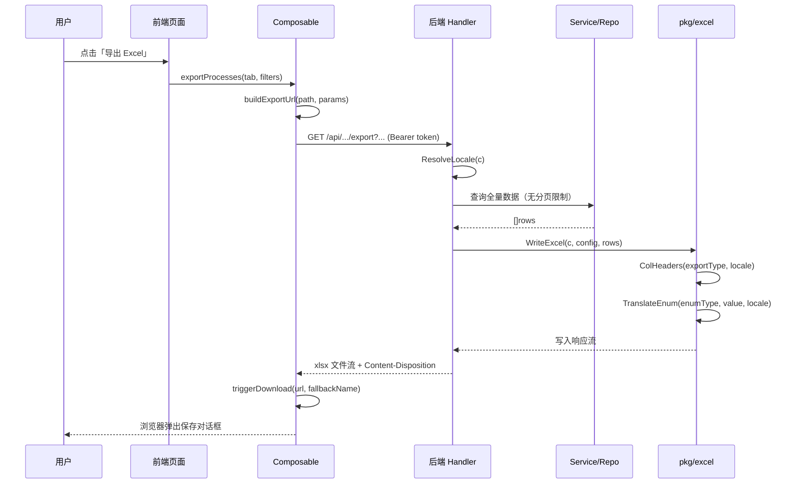
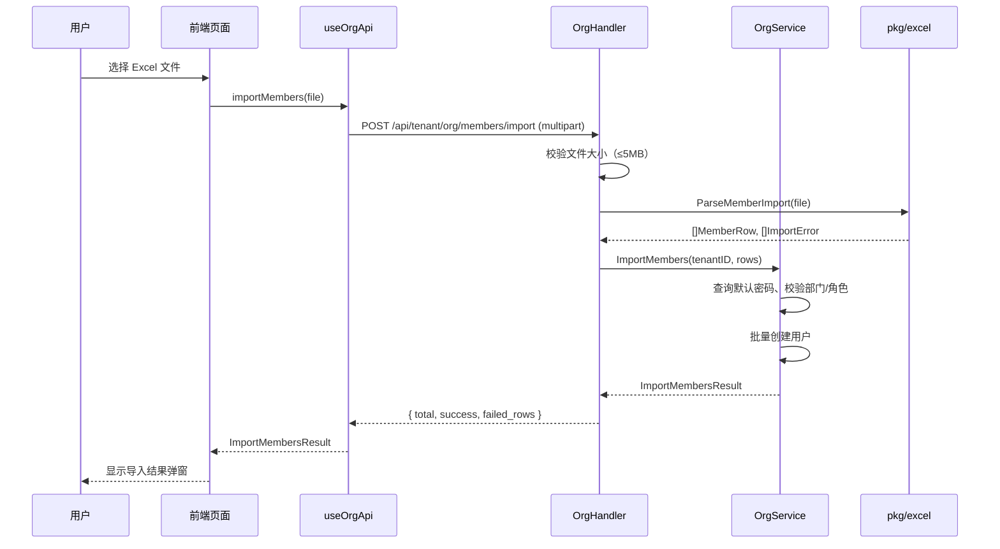

# Design Document — excel-import-export

## Overview

本设计文档描述 OA 智审平台 Excel 导入/导出功能的技术实现方案，涵盖四个子模块：

1. **审核工作台** — 按页签 + 筛选条件全量导出 Excel
2. **归档复盘** — 按页签 + 筛选条件全量导出 Excel；单流程导出简化为直接导出 JSON
3. **组织人员** — Excel 批量导入成员（默认密码）+ 双语模板下载
4. **用户偏好** — 后端全量导出 Excel，移除前端 xlsx 依赖

所有导出均通过后端生成，支持 zh-CN / en-US 国际化，枚举值做语言转换。

---

## Architecture Overview

```
┌─────────────────────────────────────────────────────────────┐
│  Frontend (Nuxt 3 / Vue 3)                                  │
│                                                             │
│  pages/dashboard.vue  ──► useAuditApi.exportProcesses()     │
│  pages/archive.vue    ──► useArchiveReviewApi.exportProcesses() │
│                       ──► handleExport() → JSON only        │
│  pages/admin/tenant/org.vue ──► useOrgApi.importMembers()   │
│                             ──► useOrgApi.downloadTemplate() │
│  pages/admin/tenant/user-configs.vue                        │
│                       ──► useAdminUserConfigApi.exportUserConfigs() │
│                                                             │
│  共用 triggerDownload() (来自 useAdminDataApi)               │
└──────────────────────┬──────────────────────────────────────┘
                       │ HTTP (Bearer token)
┌──────────────────────▼──────────────────────────────────────┐
│  Backend (Go / Gin)                                         │
│                                                             │
│  handler/audit_review_handler.go   ExportProcesses()        │
│  handler/archive_review_handler.go ExportProcesses()        │
│  handler/org_handler.go            ImportMembers()          │
│                                    DownloadImportTemplate() │
│  handler/user_config_management_handler.go ExportUserConfigs() │
│                                                             │
│  pkg/excel/                                                 │
│    exporter.go   — 通用 Excel 构建（excelize）               │
│    importer.go   — Excel 解析与行校验                        │
│    i18n.go       — 列名 & 枚举值国际化映射                   │
│    templates/    — 嵌入式导入模板（embed.FS）                │
└─────────────────────────────────────────────────────────────┘
```

---

## Backend Design

### 1. 新增公共包 `go-service/internal/pkg/excel/`

#### 1.1 `i18n.go` — 国际化映射

```go
// Locale 表示支持的语言代码。
type Locale string

const (
    LocaleZH Locale = "zh-CN"
    LocaleEN Locale = "en-US"
)

// ResolveLocale 从 gin.Context 中解析用户语言：
// 优先读取 JWT claims.Locale，其次读取 Accept-Language header，
// 最终 fallback 到 zh-CN。
func ResolveLocale(c *gin.Context) Locale

// ColHeaders 返回指定导出类型在给定语言下的列头切片。
func ColHeaders(exportType ExportType, locale Locale) []string

// TranslateEnum 将数据库枚举原始值转换为对应语言的可读文本。
// 若目标语言无映射则 fallback 到 zh-CN；若 zh-CN 也无映射则返回原始值。
func TranslateEnum(enumType EnumType, value string, locale Locale) string
```

**ExportType 枚举：**
- `ExportTypeAuditUnaudited` — 审核工作台待审核
- `ExportTypeAuditCompleted` — 审核工作台已完成
- `ExportTypeArchiveUnaudited` — 归档复盘未复核
- `ExportTypeArchiveReviewed` — 归档复盘已复核（合规/部分合规/不合规）
- `ExportTypeUserConfig` — 用户偏好

**EnumType 枚举：**
- `EnumAuditRecommendation` — 审核建议（approve/reject/review）
- `EnumAuditStatus` — 审核状态（pending_ai/completed/failed 等）
- `EnumCompliance` — 合规性（compliant/partially_compliant/non_compliant）
- `EnumMemberStatus` — 成员状态（active/inactive）

**列名映射表（zh-CN / en-US）：**

| ExportType | 列名（zh-CN） | 列名（en-US） |
|---|---|---|
| AuditUnaudited | 流程编号, 流程标题, 申请人, 部门, 流程类型, 提交时间, 当前节点 | Process ID, Title, Applicant, Department, Process Type, Submit Time, Current Node |
| AuditCompleted | （上述 7 列）+ 审核建议, 评分, 审核状态, 审核时间 | （above 7）+ Recommendation, Score, Audit Status, Audit Time |
| ArchiveUnaudited | 流程编号, 流程标题, 申请人, 部门, 流程类型, 归档时间 | Process ID, Title, Applicant, Department, Process Type, Archive Time |
| ArchiveReviewed | （上述 6 列）+ 合规性, 合规评分, 置信度, 复核时间 | （above 6）+ Compliance, Score, Confidence, Review Time |
| UserConfig | 用户名, 显示名, 部门, 角色, 审核流程数, 归档流程数, 定时任务数, 最近修改时间 | Username, Display Name, Department, Roles, Audit Processes, Archive Processes, Cron Tasks, Last Modified |

**枚举翻译表：**

| EnumType | 原始值 | zh-CN | en-US |
|---|---|---|---|
| AuditRecommendation | approve | 通过 | Approve |
| AuditRecommendation | reject | 拒绝 | Reject |
| AuditRecommendation | review | 复核 | Review |
| AuditStatus | pending_ai | 待审核 | Pending |
| AuditStatus | completed | 已完成 | Completed |
| AuditStatus | failed | 失败 | Failed |
| Compliance | compliant | 合规 | Compliant |
| Compliance | partially_compliant | 部分合规 | Partially Compliant |
| Compliance | non_compliant | 不合规 | Non-Compliant |
| MemberStatus | active | 启用 | Active |
| MemberStatus | inactive | 禁用 | Inactive |

#### 1.2 `exporter.go` — 通用 Excel 导出器

```go
// ExportConfig 描述一次导出任务的配置。
type ExportConfig struct {
    ExportType ExportType  // 导出类型，决定列头
    Locale     Locale      // 用户语言
    SheetName  string      // 工作表名称（可选，默认 "Sheet1"）
    Filename   string      // 下载文件名（不含扩展名）
}

// WriteExcel 将 rows 数据按 config 配置写入 Excel 并通过 gin.Context 流式响应。
// rows 为 [][]string，每个内层切片对应一行，顺序与列头一致。
// 自动设置 Content-Type 和 Content-Disposition（RFC 5987 UTF-8 编码文件名）。
func WriteExcel(c *gin.Context, config ExportConfig, rows [][]string) error
```

#### 1.3 `importer.go` — Excel 导入解析器

```go
// MemberRow 表示从 Excel 解析出的一条成员记录。
type MemberRow struct {
    Name           string
    Username       string
    DepartmentName string
    RoleNames      []string // 逗号分隔后拆分
}

// ImportError 表示单行导入失败的详情。
type ImportError struct {
    RowNumber int    `json:"row_number"`
    Reason    string `json:"reason"`
}

// ParseMemberImport 解析上传的 Excel 文件，返回有效行和错误行。
// 从第一个 Sheet 的第二行开始读取（第一行为表头）。
// 文件大小超过 maxBytes 时返回 ErrFileTooLarge。
func ParseMemberImport(file multipart.File, maxBytes int64) ([]MemberRow, []ImportError, error)
```

#### 1.4 `templates/` — 嵌入式导入模板

```
go-service/internal/pkg/excel/templates/
  member_import_zh.xlsx   — 中文列头模板（含示例行）
  member_import_en.xlsx   — 英文列头模板（含示例行）
```

通过 `//go:embed templates/*.xlsx` 嵌入到二进制，无需外部文件。

---

### 2. 新增 API 端点

#### 2.1 审核工作台导出

```
GET /api/audit/processes/export
权限：JWT + TenantContext（无角色限制，与 ListProcesses 一致）
```

**查询参数：**（与 `GET /api/audit/processes` 完全一致）
- `tab` — 页签（pending_ai / completed / all 等）
- `keyword`, `applicant`, `process_type`, `department`, `audit_status`
- `start_date`, `end_date`（YYYY-MM-DD）

**响应：**
- Content-Type: `application/vnd.openxmlformats-officedocument.spreadsheetml.sheet`
- Content-Disposition: `attachment; filename*=UTF-8''audit_{tab}_{timestamp}.xlsx`
- Body: Excel 文件流

**列选择逻辑：**
- `tab == "completed"` → `ExportTypeAuditCompleted`（11 列）
- 其他 tab → `ExportTypeAuditUnaudited`（7 列）

**Handler 扩展（`audit_review_handler.go`）：**

```go
// ExportProcesses 按当前页签和筛选条件导出全量审核流程为 Excel 文件。
// GET /api/audit/processes/export
// 查询参数：同 ListProcesses（不含分页参数）
// 响应：xlsx 文件流，文件名含页签名和时间戳，支持 UTF-8 编码。
func (h *AuditHandler) ExportProcesses(c *gin.Context)
```

#### 2.2 归档复盘导出

```
GET /api/archive/processes/export
权限：JWT + TenantContext（无角色限制）
```

**查询参数：**（与 `GET /api/archive/processes` 一致）
- `audit_status` — 页签（unaudited / compliant / partially_compliant / non_compliant）
- `keyword`, `applicant`, `process_type`, `department`
- `start_date`, `end_date`

**列选择逻辑：**
- `audit_status == "unaudited"` → `ExportTypeArchiveUnaudited`（6 列）
- 其他 → `ExportTypeArchiveReviewed`（10 列）

**Handler 扩展（`archive_review_handler.go`）：**

```go
// ExportProcesses 按当前页签和筛选条件导出全量归档流程为 Excel 文件。
// GET /api/archive/processes/export
// 查询参数：同 ListProcesses（不含分页参数）
// 响应：xlsx 文件流，文件名含页签名和时间戳，支持 UTF-8 编码。
func (h *ArchiveReviewHandler) ExportProcesses(c *gin.Context)
```

#### 2.3 组织人员导入

```
POST /api/tenant/org/members/import
权限：JWT + TenantContext + tenant_admin
Content-Type: multipart/form-data
```

**请求：**
- `file` — Excel 文件（.xlsx / .xls），最大 5MB

**响应（200）：**
```json
{
  "code": 0,
  "data": {
    "total": 10,
    "success": 8,
    "failed_rows": [
      { "row_number": 3, "reason": "用户名已存在" },
      { "row_number": 7, "reason": "部门不存在: 研发部门X" }
    ]
  }
}
```

**错误响应：**
- 400：文件格式不合法
- 413：文件超过 5MB

```
GET /api/tenant/org/members/import-template
权限：JWT + TenantContext + tenant_admin
```

**查询参数：**
- `locale` — `zh-CN`（默认）或 `en-US`

**响应：** xlsx 文件流（从 embed.FS 读取对应语言模板）

**Handler 扩展（`org_handler.go`）：**

```go
// ImportMembers 解析上传的 Excel 文件并批量创建成员，使用系统默认密码。
// POST /api/tenant/org/members/import
// 请求：multipart/form-data，file 字段（xlsx/xls，最大 5MB）
// 响应：导入结果摘要（total/success/failed_rows）。
func (h *OrgHandler) ImportMembers(c *gin.Context)

// DownloadImportTemplate 下载成员导入 Excel 模板文件。
// GET /api/tenant/org/members/import-template
// 查询参数：locale（zh-CN 或 en-US，默认 zh-CN）
// 响应：xlsx 文件流（嵌入式静态模板）。
func (h *OrgHandler) DownloadImportTemplate(c *gin.Context)
```

#### 2.4 用户偏好导出

```
GET /api/tenant/user-configs/export
权限：JWT + TenantContext + tenant_admin
```

**响应：** xlsx 文件流

**Handler 扩展（`user_config_management_handler.go`）：**

```go
// ExportUserConfigs 导出当前租户所有用户配置摘要为 Excel 文件。
// GET /api/tenant/user-configs/export
// 响应：xlsx 文件流，文件名含时间戳，支持 UTF-8 编码。
func (h *UserConfigManagementHandler) ExportUserConfigs(c *gin.Context)
```

---

### 3. 路由注册变更（`router.go`）

```go
// 审核工作台 — 新增导出路由（无角色限制）
audit.GET("/processes/export", auditHandler.ExportProcesses)

// 归档复盘 — 新增导出路由（无角色限制）
archive.GET("/processes/export", archiveReviewHandler.ExportProcesses)

// 组织人员 — 新增导入路由（tenant_admin）
tenantOrg.POST("/members/import", orgHandler.ImportMembers)
tenantOrg.GET("/members/import-template", orgHandler.DownloadImportTemplate)

// 用户偏好 — 新增导出路由（tenant_admin）
tenantUserConfigs.GET("/export", userConfigMgmtHandler.ExportUserConfigs)
```

---

### 4. 依赖变更（`go.mod`）

新增：
```
github.com/xuri/excelize/v2 v2.8.x
```

`excelize` 是 Go 生态中最成熟的 xlsx 读写库，支持流式写入（StreamWriter），适合大数据量导出。

---

### 5. 导入业务逻辑（`org_service.go` 扩展）

```go
// ImportMembersResult 批量导入成员的结果摘要。
type ImportMembersResult struct {
    Total      int                    `json:"total"`
    Success    int                    `json:"success"`
    FailedRows []excel.ImportError    `json:"failed_rows"`
}

// ImportMembers 批量导入成员：
// 1. 调用 excel.ParseMemberImport 解析文件
// 2. 查询系统默认密码（system_configs）
// 3. 逐行校验（部门存在性、角色存在性、用户名唯一性）
// 4. 批量创建用户并分配部门/角色
// 5. 返回导入结果摘要
func (s *OrgService) ImportMembers(c *gin.Context, tenantID uuid.UUID, file multipart.File) (*ImportMembersResult, error)
```

---

## Frontend Design

### 1. 移除 xlsx 依赖

从 `frontend/package.json` 中移除 `"xlsx": "^0.18.5"`。

所有导出改为调用后端 API + `triggerDownload()`，不再在前端生成 Excel。

### 2. Composable 扩展

#### 2.1 `useAuditApi.ts` — 新增导出函数

```typescript
/**
 * 按当前页签和筛选条件导出全量审核流程为 Excel 文件，触发浏览器下载。
 * @param tab 当前页签（pending_ai / completed 等）
 * @param params 筛选参数（与 listProcesses 一致，不含分页）
 */
async function exportProcesses(tab: AuditTab, params?: {
  keyword?: string
  applicant?: string
  process_type?: string
  department?: string
  audit_status?: string
  start_date?: string
  end_date?: string
}): Promise<void>
```

实现：构建 `/api/audit/processes/export?tab=...&...` URL，调用 `triggerDownload()`。

#### 2.2 `useArchiveReviewApi.ts` — 新增导出函数

```typescript
/**
 * 按当前页签和筛选条件导出全量归档流程为 Excel 文件，触发浏览器下载。
 * @param params 筛选参数（含 audit_status 作为页签标识）
 */
async function exportProcesses(params?: {
  audit_status?: string
  keyword?: string
  applicant?: string
  process_type?: string
  department?: string
  start_date?: string
  end_date?: string
}): Promise<void>
```

#### 2.3 `useAdminUserConfigApi.ts` — 新增导出函数

```typescript
/**
 * 导出当前租户所有用户配置摘要为 Excel 文件，触发浏览器下载。
 */
async function exportUserConfigs(): Promise<void>
```

#### 2.4 `useOrgApi.ts` — 新增导入/模板函数

```typescript
/**
 * 上传 Excel 文件批量导入成员。
 * @param file 用户选择的 Excel 文件
 * @returns 导入结果摘要（total / success / failed_rows）
 */
async function importMembers(file: File): Promise<ImportMembersResult>

/**
 * 下载成员导入模板文件，触发浏览器下载。
 * @param locale 语言（zh-CN 或 en-US），默认使用当前用户语言
 */
async function downloadImportTemplate(locale?: string): Promise<void>
```

**ImportMembersResult 类型：**
```typescript
interface ImportError {
  row_number: number
  reason: string
}

interface ImportMembersResult {
  total: number
  success: number
  failed_rows: ImportError[]
}
```

### 3. 页面 UI 变更

#### 3.1 `pages/dashboard.vue` — 审核工作台

在每个页签的列表工具栏右侧新增「导出 Excel」按钮：
- 点击时调用 `exportProcesses(currentTab, currentFilters)`
- 按钮在导出进行中显示 loading 状态
- 导出成功/失败通过 `message.success/error` 提示

#### 3.2 `pages/archive.vue` — 归档复盘

**列表导出：** 在页签工具栏新增「导出 Excel」按钮，调用 `exportProcesses(currentFilters)`。

**单流程导出简化：** 修改现有 `handleExport` 函数：
- 移除 format 参数和格式选择逻辑
- 直接执行 JSON 导出（现有逻辑已支持）
- 移除下拉菜单，改为单一「导出报告」按钮

#### 3.3 `pages/admin/tenant/org.vue` — 组织人员

在成员列表工具栏新增：
- 「导入成员」按钮 → 触发文件选择（accept=".xlsx,.xls"）→ 上传 → 显示导入结果弹窗
- 「下载模板」按钮 → 调用 `downloadImportTemplate(currentLocale)`

导入结果弹窗展示：
- 成功数量
- 失败行列表（行号 + 原因）

#### 3.4 `pages/admin/tenant/user-configs.vue` — 用户偏好

- 移除现有 checkbox 多选 UI
- 移除前端 xlsx 导出逻辑
- 新增「导出 Excel」按钮，调用 `exportUserConfigs()`

### 4. 国际化 key 新增

在 `frontend/locales/zh-CN.ts` 和 `en-US.ts` 中新增：

```typescript
// 导出/导入通用
'export.excel': '导出 Excel',           // Export Excel
'export.exporting': '导出中...',         // Exporting...
'export.success': '导出成功',            // Export successful
'export.failed': '导出失败',             // Export failed
'export.report': '导出报告',             // Export Report

// 组织人员导入
'org.import.button': '导入成员',         // Import Members
'org.import.template': '下载模板',       // Download Template
'org.import.uploading': '上传中...',     // Uploading...
'org.import.result.title': '导入结果',   // Import Result
'org.import.result.total': '共处理 {0} 行', // Processed {0} rows
'org.import.result.success': '成功导入 {0} 条', // Successfully imported {0}
'org.import.result.failed': '失败 {0} 条', // Failed {0}
'org.import.result.row': '第 {0} 行',   // Row {0}
'org.import.error.format': '文件格式不支持，请上传 .xlsx 或 .xls 文件', // Unsupported format
'org.import.error.size': '文件大小超过 5MB 限制', // File exceeds 5MB limit

// 用户偏好
'userConfig.export.button': '导出 Excel', // Export Excel
```

---

## Data Flow

### 导出流程



### 导入流程



---

## Error Handling

| 场景 | 处理方式 |
|---|---|
| 导出零记录 | 返回仅含表头行的 xlsx，HTTP 200 |
| 导入文件非 xlsx/xls | 返回 HTTP 400，`errcode.ErrParamValidation` |
| 导入文件超过 5MB | 返回 HTTP 413 |
| 导入部分行失败 | HTTP 200，`failed_rows` 列表记录行号和原因 |
| 导入用户名重复 | 记录为 `failed_rows`，跳过该行，继续处理 |
| 导入部门/角色不存在 | 记录为 `failed_rows`，跳过该行，继续处理 |
| 导出查询超时 | 返回 HTTP 500，前端 `message.error` 提示 |
| locale 无效 | fallback 到 zh-CN |

---

## Correctness Properties

1. **导出完整性**：导出文件的行数（不含表头）= 后端查询返回的总记录数，不受分页影响。
2. **列头语言一致性**：当 locale=zh-CN 时，所有列头和枚举值均为中文；locale=en-US 时均为英文。
3. **枚举无原始值泄露**：导出文件中不出现 `pending_ai`、`compliant` 等数据库原始枚举值。
4. **导入幂等性**：同一用户名的成员重复导入时，第二次导入该行记录为 `failed_rows`（duplicate），不创建重复用户。
5. **导入默认密码**：所有成功导入的成员使用 `system_configs` 中配置的默认密码，不使用硬编码值。
6. **模板持久性**：导入模板通过 `embed.FS` 嵌入二进制，服务重启后模板始终可用。
7. **前端无 xlsx 依赖**：移除 `xlsx` 包后，前端 bundle 中不包含任何 Excel 生成逻辑。
