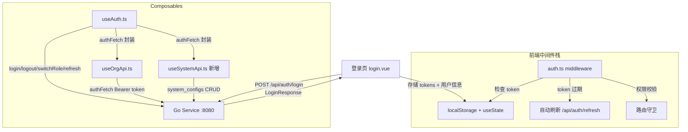
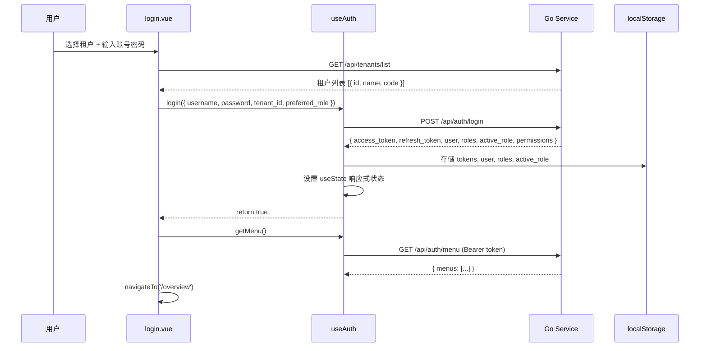
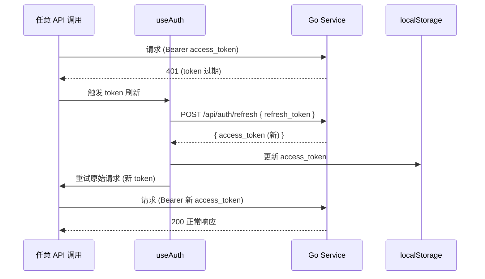
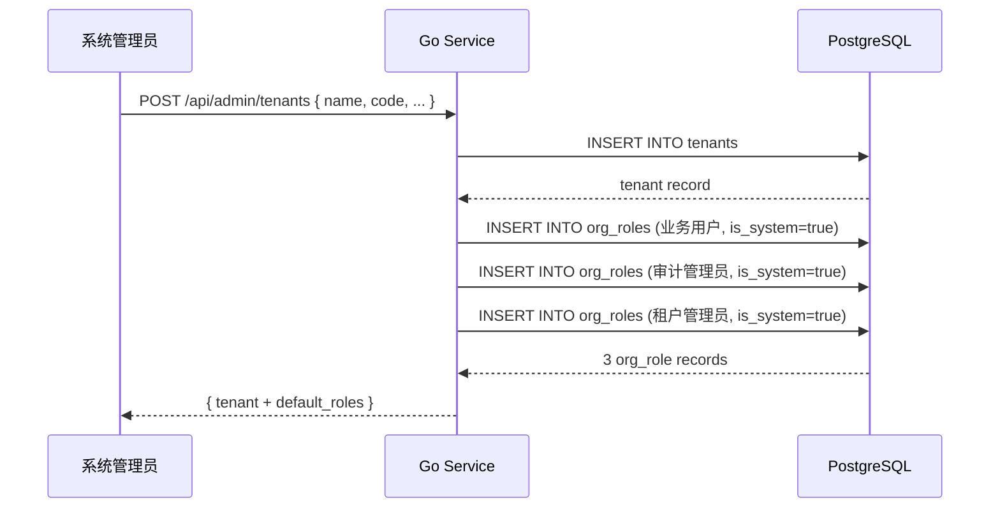

# 设计文档：前端 API 对接与默认角色功能 (frontend-api-integration)

## 概述

本设计文档覆盖 OA 智审平台前端中与认证、登录、组织、人员、权限相关模块的 API 对接改造工作。基于已完成的 `tenant-org-auth` 后端子系统（Go + PostgreSQL），将这些模块从 Mock 数据替换为真实后端 API 调用。同时新增"默认角色"功能：创建租户时自动生成三个系统级组织角色（业务用户、审计管理员、租户管理员）。

改造范围：仅限认证（登录、登出、Token 刷新、角色切换）、组织管理（部门、角色、成员 CRUD）、个人设置、系统配置等已有后端支撑的模块。其他业务模块（审核工作台、Cron 任务、归档复盘等）后端尚未开发完成，继续使用 Mock 数据。

改造策略：对上述范围内的模块，移除 Mock 模式判断逻辑，前端通过 `$fetch` 调用 Go 后端 REST API，所有请求自动携带 Bearer Token，Token 过期时自动刷新。类型定义（`Department`、`OrgRole`、`OrgMember` 等）从 `useMockData.ts` 迁移到独立的类型文件中。`useMockData.ts` 本身保留，供其他尚未对接后端的模块继续使用。

## 架构

### 前端认证流程架构



### 登录流程时序图



### Token 刷新流程



### 默认角色创建流程



## 组件与接口

### 组件 1: 类型定义文件（新增 types/org.ts）

**职责**: 将 `Department`、`OrgRole`、`OrgMember` 等类型从 `useMockData.ts` 迁移到独立类型文件

```typescript
// types/org.ts — 组织管理相关类型（从 useMockData.ts 迁出）

export interface Department {
  id: string
  name: string
  parent_id: string | null
  manager: string
  member_count: number
}

export interface OrgRole {
  id: string
  name: string
  description: string
  page_permissions: string[]
  is_system: boolean
}

export interface OrgMember {
  id: string
  name: string
  username: string
  department_id: string
  department_name: string
  role_ids: string[]
  role_names: string[]
  email: string
  phone: string
  position: string
  status: 'active' | 'disabled'
  created_at: string
}
```

```typescript
// types/auth.ts — 认证相关类型

export type UserRole = 'business' | 'tenant_admin' | 'system_admin'
export type PermissionGroup = 'business' | 'tenant_admin' | 'system_admin'

export interface RoleInfo {
  id: string
  role: UserRole
  tenant_id: string | null
  tenant_name: string | null
  label: string
}

export interface LoginRequest {
  username: string
  password: string
  tenant_id: string
  preferred_role?: UserRole
}

export interface LoginResponse {
  access_token: string
  refresh_token: string
  user: {
    id: string
    username: string
    display_name: string
    email: string
    phone: string
    avatar_url: string
    locale: string
  }
  roles: RoleInfo[]
  active_role: RoleInfo
  permissions: string[]
}

export interface MenuItem {
  key: string
  label: string
  icon?: string
  path: string
  children?: MenuItem[]
}

export interface TenantOption {
  id: string
  name: string
  code: string
}
```

### 组件 2: useAuth.ts（认证 Composable 全面改造）

**职责**: 登录、登出、Token 刷新、角色切换、菜单获取，全部对接真实后端 API

```typescript
// composables/useAuth.ts — 改造后的方法签名

// 核心方法
login(req: LoginRequest): Promise<boolean>
  // POST /api/auth/login → 解析完整 LoginResponse，映射到 useState

getMenu(): Promise<MenuItem[]>
  // GET /api/auth/menu (Bearer token)

switchRole(roleId: string): Promise<boolean>
  // PUT /api/auth/switch-role { role_id } → 更新 token + active_role + permissions

logout(): Promise<void>
  // POST /api/auth/logout (Bearer token) → 清除本地状态

refreshToken(): Promise<boolean>
  // POST /api/auth/refresh { refresh_token } → 更新 access_token

changePassword(req: { current_password: string; new_password: string }): Promise<boolean>
  // PUT /api/auth/change-password

// 带 token 的 fetch 封装
authFetch<T>(path: string, options?: FetchOptions): Promise<T>
  // 自动注入 Bearer token，401 时自动刷新重试，刷新期间请求排队
```

**改造要点**:
- 移除所有 `isMockMode` 判断和 Mock 数据引用
- 移除 `MOCK_USERS` 导入和导出
- `login()`: 调用 `/api/auth/login`，从响应中解析 `user`、`roles`、`active_role`、`permissions`
- `getMenu()`: 调用 `/api/auth/menu`，响应格式适配前端 `MenuItem` 结构
- `switchRole()`: 调用 `/api/auth/switch-role`，用新 token 替换旧 token
- `logout()`: 调用 `/api/auth/logout`，然后清除本地状态
- 新增 `refreshToken()`: 调用 `/api/auth/refresh`
- 新增 `authFetch()`: 封装带 Bearer token 的请求，自动处理 401 刷新
- 新增 `changePassword()`: 调用 `/api/auth/change-password`

### 组件 3: login.vue（登录页全面改造）

**职责**: 租户列表从 API 获取，移除测试账号快速填充，移除 Mock 相关逻辑

```typescript
// 改造点
// 1. 租户列表从后端 API 获取
const tenants = ref<TenantOption[]>([])
onMounted(async () => {
  const { authFetch } = useAuth()
  tenants.value = await authFetch<TenantOption[]>('/api/tenants/list')
})

// 2. 完全移除 quickAccounts / fillAccount / isMockMode
// 3. 移除 MOCK_USERS 引用
// 4. 移除 useMockData() 中的 mockTenants 引用
// 5. 登录成功后从 LoginResponse 获取完整用户信息
```

**改造要点**:
- 移除 `isMockMode` 和所有 Mock 模式条件分支
- 移除测试账号快速填充区域（`mock-accounts` 整个区块）
- 租户选择下拉框数据源改为 `GET /api/tenants/list`（公开接口，无需 token）
- 登录成功后的用户信息、角色信息全部来自后端响应

### 组件 4: useOrgApi.ts（注入 Bearer Token）

**职责**: 所有组织管理 API 请求通过 `authFetch` 携带 Bearer Token

```typescript
// composables/useOrgApi.ts — 改造 apiFetch 为使用 authFetch
import type { Department, OrgRole, OrgMember } from '~/types/org'

export const useOrgApi = () => {
  const { authFetch } = useAuth()

  // 所有 API 调用改为使用 authFetch（自动注入 Bearer token + 401 刷新）
  async function listDepartments(): Promise<Department[]> {
    return authFetch<Department[]>('/api/tenant/org/departments')
  }

  async function createDepartment(dept: Omit<Department, 'id' | 'member_count'>): Promise<Department> {
    return authFetch<Department>('/api/tenant/org/departments', { method: 'POST', body: dept })
  }
  // ... 其余 CRUD 方法同理
}
```

**改造要点**:
- 类型导入从 `~/composables/useMockData` 改为 `~/types/org`
- `apiFetch` 替换为 `useAuth().authFetch`，自动处理 token 注入和统一响应解析
- 移除手动 `$fetch` + `ApiResponse` 解包逻辑（由 `authFetch` 统一处理）

### 组件 5: settings.vue（个人设置改造）

**职责**: 密码修改对接后端 API，移除 Mock 验证逻辑

```typescript
// 改造点
// 1. 密码修改调用后端 API
const { changePassword } = useAuth()

async function handleChangePassword() {
  // PUT /api/auth/change-password { current_password, new_password }
  const ok = await changePassword({
    current_password: passwordForm.value.currentPassword,
    new_password: passwordForm.value.newPassword,
  })
  if (ok) message.success('密码修改成功')
}

// 2. 移除 MOCK_USERS 引用和本地密码验证
// 3. 移除 mockUserSecurityInfo 引用
```

### 组件 6: admin/system/settings.vue（平台配置改造）

**职责**: 系统配置从 system_configs 表获取和保存

```typescript
// 新增 composable: useSystemApi.ts
import type { SystemGeneralConfig, OADatabaseConnection, AIModelConfig } from '~/types/system'

export const useSystemApi = () => {
  const { authFetch } = useAuth()

  async function getConfigs(): Promise<SystemGeneralConfig> {
    return authFetch<SystemGeneralConfig>('/api/admin/system/configs')
  }

  async function updateConfigs(configs: Partial<SystemGeneralConfig>): Promise<void> {
    await authFetch('/api/admin/system/configs', { method: 'PUT', body: configs })
  }
}

// 页面改造: 移除 mockOASystemConfigs / mockAIModelConfigs / mockSystemGeneralConfig
// 改为 onMounted 时从 API 加载
```

### 组件 7: TenantService（后端默认角色功能）

**职责**: 创建租户时自动创建三个默认组织角色

```go
// go-service/internal/service/tenant_service.go — CreateTenant 改造
func (s *TenantService) CreateTenant(req *dto.CreateTenantRequest) (*dto.TenantResponse, error) {
    tx := s.db.Begin()
    // 1. 创建租户
    tx.Create(tenant)
    // 2. 创建三个默认角色（同一事务）
    defaultRoles := []model.OrgRole{
        {TenantID: tenant.ID, Name: "业务用户", Description: "普通业务人员，可使用审核工作台等前台功能。仪表盘为所有角色默认拥有。", IsSystem: true, PagePermissions: ["/overview", "/dashboard", "/settings"]},
        {TenantID: tenant.ID, Name: "审计管理员", Description: "在业务用户基础上，额外拥有归档复盘权限，可进行合规复核。", IsSystem: true, PagePermissions: ["/overview", "/dashboard", "/cron", "/archive", "/settings"]},
        {TenantID: tenant.ID, Name: "租户管理员", Description: "可进入后台管理，配置规则、组织人员、数据信息、用户偏好。", IsSystem: true, PagePermissions: ["/overview", "/dashboard", "/cron", "/archive", "/settings", "/admin/tenant/rules", "/admin/tenant/org", "/admin/tenant/data", "/admin/tenant/user-configs"]},
    }
    tx.Create(&defaultRoles)
    tx.Commit()
}
```

### 组件 8: 数据库种子脚本更新（db/seeds/004_org_roles.sql）

**职责**: 更新种子数据中的默认角色定义，与 TenantService 中的默认角色保持一致

当前种子脚本中的角色名称和权限与实际前端路由不匹配（使用了 `/review/workbench` 等不存在的路径），需要更新为与前端路由一致的配置。

## 数据模型

### 前端 — LoginResponse 映射

```typescript
// 后端 LoginResponse → 前端状态映射
// 'access_token'  → token.value
// 'refresh_token' → refreshToken.value
// 'user'          → currentUser.value (需字段映射)
// 'roles'         → allRoles.value (需类型适配)
// 'active_role'   → activeRole.value
// 'permissions'   → userPermissions.value

// 后端 RoleInfo → 前端 RoleInfo 适配
// 后端: { id, role, tenant_id, label }
// 前端需额外: tenant_name（从 roles 列表中获取或后端直接返回）
```

### 后端 — 新增/改造的 API 接口

| 接口 | 方法 | 路径 | 说明 |
|------|------|------|------|
| 租户列表（公开） | GET | `/api/tenants/list` | 登录页获取可选租户（仅返回 id, name, code） |
| 系统配置查询 | GET | `/api/admin/system/configs` | 获取 system_configs 键值对 |
| 系统配置更新 | PUT | `/api/admin/system/configs` | 批量更新 system_configs |
| 修改密码 | PUT | `/api/auth/change-password` | 当前用户修改密码 |

### 统一响应格式

```typescript
interface ApiResponse<T> {
  code: number      // 0 = 成功
  message: string
  data: T
  trace_id: string
}
```

### 后端 — 默认角色数据

```sql
-- 创建租户时自动插入的三个默认角色
INSERT INTO org_roles (tenant_id, name, description, is_system, page_permissions) VALUES
  (:tenant_id, '业务用户', '普通业务人员，可使用审核工作台等前台功能。仪表盘为所有角色默认拥有。', true, '["\/overview","\/dashboard","\/settings"]'),
  (:tenant_id, '审计管理员', '在业务用户基础上，额外拥有归档复盘权限，可进行合规复核。', true, '["\/overview","\/dashboard","\/cron","\/archive","\/settings"]'),
  (:tenant_id, '租户管理员', '可进入后台管理，配置规则、组织人员、数据信息、用户偏好。', true, '["\/overview","\/dashboard","\/cron","\/archive","\/settings","\/admin\/tenant\/rules","\/admin\/tenant\/org","\/admin\/tenant\/data","\/admin\/tenant\/user-configs"]');
```

### 数据库种子脚本 — 004_org_roles.sql 更新

种子脚本中的角色数据需同步更新，角色名称、描述、`page_permissions` 与上述默认角色定义保持一致，路径与前端实际路由匹配。

## 错误处理

### Token 过期处理

**场景**: API 请求返回 401
**响应**: `authFetch` 拦截 401，自动调用 `refreshToken()`
**恢复**: 刷新成功后重试原始请求；刷新失败则跳转登录页

### 错误码映射

| 后端错误码 | 前端处理 |
|-----------|---------|
| 40100 | 跳转登录页 |
| 40101 | 尝试刷新 token，失败则跳转登录页 |
| 40102 | 跳转登录页（token 已吊销） |
| 40103 | 显示"用户名或密码错误" |
| 40104 | 显示"账户已锁定，请稍后重试" |
| 40105 | 显示"账户已被禁用" |
| 40106 | 显示"租户不存在或已停用" |
| 40300 | 显示"权限不足" |
| 40400 | 显示"资源不存在" |
| 50000 | 显示"服务器错误，请稍后重试" |

### 网络异常处理

**场景**: 后端不可达或网络超时
**响应**: `authFetch` 捕获网络异常，显示"网络连接失败，请检查网络"
**恢复**: 用户手动重试

## 性能考量

- Token 刷新使用防抖机制，避免并发请求同时触发多次刷新
- 租户列表在登录页缓存，避免重复请求
- `authFetch` 使用请求队列，Token 刷新期间暂停其他请求，刷新完成后批量重试

## 安全考量

- access_token 仅存储在 localStorage（SSR 场景下通过 useState 传递）
- refresh_token 存储在 localStorage，仅用于 `/api/auth/refresh` 接口
- 所有 API 请求通过 HTTPS（生产环境）
- 前端不存储密码明文，登录表单提交后立即清除
- Token 刷新失败时立即清除所有本地认证状态并跳转登录页

## 依赖

### 前端（已有，无需新增）

| 依赖 | 用途 |
|------|------|
| Nuxt 3 | SSR 框架 |
| Ant Design Vue | UI 组件库 |
| ofetch ($fetch) | HTTP 客户端（Nuxt 内置） |

### 后端改动

| 改动项 | 说明 |
|--------|------|
| TenantService.CreateTenant | 新增事务内创建默认角色逻辑 |
| db/seeds/004_org_roles.sql | 更新种子数据角色名称、描述、page_permissions 与前端路由一致 |
| 新增 GET /api/tenants/list | 公开接口，登录页获取租户列表 |
| 新增 GET/PUT /api/admin/system/configs | 系统配置 CRUD |
| 新增 PUT /api/auth/change-password | 修改密码接口 |

## 正确性属性

### Property 1: Token 自动刷新透明性

*For any* API 请求，若 access_token 已过期（后端返回 401），`authFetch` 自动调用 `/api/auth/refresh` 获取新 token 并重试原始请求，整个过程对调用方透明；若 refresh_token 也已过期，则清除所有认证状态并跳转登录页。

### Property 2: 登录响应完整映射

*For any* 成功的登录请求，后端 `LoginResponse` 中的 `access_token`、`refresh_token`、`user`、`roles`、`active_role`、`permissions` 全部正确映射到前端 useState 状态和 localStorage，且后续页面可正常使用这些状态。

### Property 3: Bearer Token 全局注入

*For any* 通过 `authFetch` 或 `useOrgApi` 发起的 API 请求，请求头中自动包含 `Authorization: Bearer {access_token}`，不需要调用方手动传入。

### Property 4: 角色切换状态原子更新

*For any* 成功的角色切换操作，前端同时更新 `token`（新 access_token）、`activeRole`、`permissions`、`menus`，不存在中间状态；若切换失败，所有状态保持不变。

### Property 5: 默认角色创建完整性

*For any* 新创建的租户，系统在同一事务中自动创建三个 `is_system=true` 的组织角色（业务用户、审计管理员、租户管理员），且这三个角色的 `page_permissions` 符合预定义配置；若角色创建失败，整个租户创建事务回滚。

### Property 6: 登出状态彻底清除

*For any* 登出操作，前端清除 localStorage 中所有认证相关键（token、refresh_token、user、roles、active_role、permissions），清除所有 useState 认证状态，并调用后端 `/api/auth/logout` 使服务端 token 失效。

### Property 7: 密码修改安全性

*For any* 密码修改请求，必须通过后端验证当前密码正确后才能设置新密码；前端不在本地验证当前密码。

### Property 8: Token 刷新防抖

*For any* 并发的多个 API 请求同时遇到 401，系统只触发一次 token 刷新操作，所有等待中的请求在刷新完成后使用新 token 重试，避免多次刷新导致的竞态条件。

### Property 9: 租户列表数据源正确性

*For any* 登录页的租户选择下拉框，数据从后端 `/api/tenants/list` 获取，返回的数据结构包含 `id`、`name`、`code` 字段。
