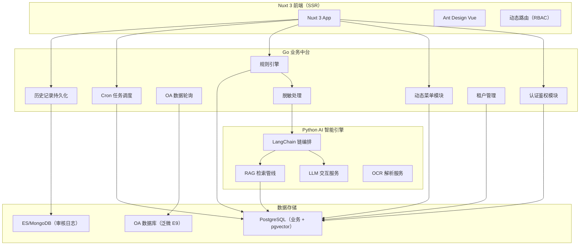

# 设计文档：OA智审（流程智能审核平台）

## 概述

OA智审平台采用 Go + Python 混合架构，前端使用 Nuxt 3 构建现代化 SSR 应用。系统核心流程为：用户通过 Nuxt 前端访问审核工作台 → Go 业务服务处理鉴权、OA 数据轮询和规则合并 → Python AI 服务执行 LLM 审核和 RAG 检索 → 审核结果返回前端展示，全量审核快照写入日志库。

系统设计遵循以下原则：
- 前后端分离，Nuxt 3 SSR 提升首屏体验
- Go 处理高并发业务逻辑，Python 专注 AI 智能服务
- 敏感数据在 Go 层脱敏后再传递给 Python 层
- 审核记录追加写入，不可篡改
- 多租户数据隔离，RBAC 权限控制
- Docker Compose 统一编排所有服务，简化开发和部署
- Git 版本控制，配置合理的 .gitignore

### 实现阶段划分

- **第一阶段（当前）**：仅实现规则库模式（Rules_Only），即结构化 Checklist 审核
- **第二阶段（后续）**：引入制度库 RAG 模式和混合模式，包括文档向量化、RAG 检索管线、OCR 解析
- KB_Mode 配置和链编排接口在第一阶段预留，但 RAG_Only 和 Hybrid 模式的具体实现留空

## 架构



### 服务间通信

- 前端 ↔ Go 服务：RESTful API（JSON），JWT Bearer Token 认证
- Go 服务 → Python 服务：gRPC 或内部 HTTP API，携带 Trace ID 实现链路追踪
- Go 服务 → OA 数据库：JDBC 连接（通过 OA 适配器）
- Go 服务 → PostgreSQL：直连（业务数据 + 配置）
- Go 服务 → ES/MongoDB：审核快照写入
- Python 服务 → PostgreSQL：pgvector 向量检索（第二阶段启用）

### Docker Compose 部署方案

使用 Docker Compose 统一编排所有服务，开发和生产环境共用基础配置，通过 override 文件区分差异。

```yaml
# docker-compose.yml
services:
  # Nuxt 3 前端
  frontend:
    build:
      context: ./frontend
      dockerfile: Dockerfile
    ports:
      - "3000:3000"
    depends_on:
      - go-service
    environment:
      - NUXT_PUBLIC_API_BASE=http://go-service:8080

  # Go 业务中台
  go-service:
    build:
      context: ./go-service
      dockerfile: Dockerfile
    ports:
      - "8080:8080"
    depends_on:
      - postgres
      - mongodb
    environment:
      - DB_HOST=postgres
      - DB_PORT=5432
      - DB_NAME=oa_smart_audit
      - MONGO_URI=mongodb://mongodb:27017
      - AI_SERVICE_URL=http://ai-service:8000

  # Python AI 智能引擎
  ai-service:
    build:
      context: ./ai-service
      dockerfile: Dockerfile
    ports:
      - "8000:8000"
    depends_on:
      - postgres
    environment:
      - DB_HOST=postgres
      - DB_PORT=5432

  # PostgreSQL（业务 + pgvector）
  postgres:
    image: pgvector/pgvector:pg16
    ports:
      - "5432:5432"
    environment:
      - POSTGRES_DB=oa_smart_audit
      - POSTGRES_USER=oa_admin
      - POSTGRES_PASSWORD=${POSTGRES_PASSWORD}
    volumes:
      - pg_data:/var/lib/postgresql/data
      - ./db/init:/docker-entrypoint-initdb.d

  # MongoDB（审核日志）
  mongodb:
    image: mongo:7
    ports:
      - "27017:27017"
    volumes:
      - mongo_data:/data/db

volumes:
  pg_data:
  mongo_data:
```

### Git 配置

项目根目录包含 `.gitignore` 文件，排除构建产物、依赖、环境配置和敏感信息：

```gitignore
# 依赖
node_modules/
vendor/
__pycache__/
*.pyc
.venv/

# 构建产物
.output/
.nuxt/
dist/
bin/
*.exe

# 环境配置（敏感信息）
.env
.env.local
.env.production
*.pem
*.key

# IDE
.idea/
.vscode/
*.swp
*.swo

# Docker 数据卷
pg_data/
mongo_data/

# OS
.DS_Store
Thumbs.db

# 测试覆盖率
coverage/
htmlcov/
.coverage
```

## 组件与接口

### 1. Nuxt 3 前端应用

**职责**：提供现代化 SSR 界面，动态路由，审核工作台交互

**关键页面**：
- `/login` — 登录页
- `/dashboard` — 审核工作台（待办列表 + 规则侧边栏 + AI 推理展示）
- `/cron` — 定时任务中心
- `/archive` — 归档流程复盘
- `/admin/tenant` — 租户管理员配置
- `/admin/system` — 系统管理员配置
- `/admin/monitor` — 全局监控面板

**接口调用**：
```typescript
// composables/useAuth.ts
interface AuthAPI {
  login(credentials: LoginRequest): Promise<TokenResponse>
  refreshToken(): Promise<TokenResponse>
  getMenu(): Promise<MenuItem[]>
}

// composables/useAudit.ts
interface AuditAPI {
  getTodoList(params: PaginationParams): Promise<AuditTodoList>
  getAuditDetail(processId: string): Promise<AuditDetail>
  submitFeedback(processId: string, feedback: UserFeedback): Promise<void>
}

// composables/usePreference.ts
interface PreferenceAPI {
  getUserPreferences(): Promise<UserPreference>
  updateRuleToggle(ruleId: string, enabled: boolean): Promise<void>
  addPrivateRule(rule: PrivateRuleInput): Promise<PrivateRule>
  updateSensitivity(level: SensitivityLevel): Promise<void>
}
```

### 2. Go 业务中台

#### 2.1 认证鉴权模块（Auth Module）

**职责**：用户登录验证、JWT 签发与校验、RBAC 权限判断

```go
// internal/auth/service.go
type AuthService interface {
    Login(ctx context.Context, req LoginRequest) (TokenResponse, error)
    ValidateToken(ctx context.Context, token string) (Claims, error)
    RefreshToken(ctx context.Context, refreshToken string) (TokenResponse, error)
}

// internal/auth/rbac.go
type RBACService interface {
    GetUserMenus(ctx context.Context, userID string, role Role) ([]MenuItem, error)
    CheckPermission(ctx context.Context, userID string, resource string, action string) (bool, error)
}
```

#### 2.2 规则引擎（Rule Engine）

**职责**：加载租户规则、合并用户偏好、按优先级排序、输出最终规则列表

```go
// internal/rule/engine.go
type RuleEngine interface {
    // 按优先级合并规则：租户强制 > 用户私有 > 租户默认
    MergeRules(ctx context.Context, tenantID string, userID string, processType string) ([]MergedRule, error)
    // 获取用户可配置的规则列表
    GetConfigurableRules(ctx context.Context, tenantID string, userID string) ([]ConfigurableRule, error)
}

type MergedRule struct {
    ID          string
    Content     string
    Scope       RuleScope   // Mandatory | DefaultOn | DefaultOff
    Source      RuleSource  // Tenant | User
    IsLocked    bool
    Priority    int
}

type RuleScope string
const (
    RuleScopeMandatory  RuleScope = "mandatory"
    RuleScopeDefaultOn  RuleScope = "default_on"
    RuleScopeDefaultOff RuleScope = "default_off"
)
```

#### 2.3 OA 适配器（OA Adapter）

**职责**：对接 OA 数据库，读取流程表单数据，映射为统一数据结构

```go
// internal/oa/adapter.go
type OAAdapter interface {
    // 获取待办流程列表
    FetchTodoProcesses(ctx context.Context, userID string) ([]OAProcess, error)
    // 获取流程详情（表单数据）
    FetchProcessDetail(ctx context.Context, processID string) (ProcessFormData, error)
    // 健康检查与重连
    HealthCheck(ctx context.Context) error
}

// internal/oa/registry.go
type AdapterRegistry interface {
    // 根据 OA 类型加载对应适配脚本
    GetAdapter(oaType string, version string) (OAAdapter, error)
    RegisterAdapter(oaType string, version string, adapter OAAdapter) error
}
```

#### 2.4 脱敏处理（Data Masking）

**职责**：对敏感字段执行正则脱敏，确保传递给 Python 层的数据不含原始敏感信息

```go
// internal/security/masking.go
type DataMasker interface {
    // 对表单数据执行脱敏
    MaskFormData(ctx context.Context, data ProcessFormData) (ProcessFormData, error)
    // 加载脱敏规则配置
    LoadMaskingRules(ctx context.Context, tenantID string) ([]MaskingRule, error)
}

type MaskingRule struct {
    FieldPattern  string  // 正则匹配字段名
    ValuePattern  string  // 正则匹配字段值
    ReplaceWith   string  // 替换策略
}
```

#### 2.5 Cron 任务调度

**职责**：管理用户定时任务，触发批量审核，生成日报/周报

```go
// internal/cron/scheduler.go
type CronScheduler interface {
    CreateTask(ctx context.Context, task CronTaskInput) (CronTask, error)
    DeleteTask(ctx context.Context, taskID string) error
    ListTasks(ctx context.Context, userID string) ([]CronTask, error)
    ExecuteTask(ctx context.Context, taskID string) (TaskResult, error)
}
```

#### 2.6 历史记录持久化

**职责**：将审核快照写入 ES/MongoDB，支持检索和导出

```go
// internal/history/service.go
type HistoryService interface {
    // 追加写入审核快照（不可修改）
    SaveAuditSnapshot(ctx context.Context, snapshot AuditSnapshot) error
    // 按条件检索
    SearchSnapshots(ctx context.Context, query SearchQuery) (SearchResult, error)
    // 审计导出
    ExportSnapshots(ctx context.Context, query SearchQuery, format ExportFormat) (io.Reader, error)
}

type AuditSnapshot struct {
    ID            string
    TenantID      string
    UserID        string
    ProcessID     string
    FormInput     ProcessFormData  // 脱敏后的表单数据
    ActiveRules   []MergedRule     // 生效的规则配置
    AIReasoning   string           // AI 推理过程（思维链）
    AuditResult   AuditResult      // 审核建议
    UserFeedback  *UserFeedback    // 用户采纳情况
    CreatedAt     time.Time
    OperatorID    string
}
```

#### 2.7 租户管理

**职责**：租户 CRUD、配置空间初始化、Token 配额管理

```go
// internal/tenant/service.go
type TenantService interface {
    CreateTenant(ctx context.Context, input TenantInput) (Tenant, error)
    UpdateTenantQuota(ctx context.Context, tenantID string, quota QuotaConfig) error
    GetTenantConfig(ctx context.Context, tenantID string) (TenantConfig, error)
    SetKBMode(ctx context.Context, tenantID string, processType string, mode KBMode) error
}

type KBMode string
const (
    KBModeRulesOnly KBMode = "rules_only"
    KBModeRAGOnly   KBMode = "rag_only"
    KBModeHybrid    KBMode = "hybrid"
)
```

### 3. Python AI 智能引擎

#### 3.1 LangChain 链编排

**职责**：根据 KB_Mode 选择并执行对应的审核链（第一阶段仅实现 Checklist Chain）

```python
# ai_service/chains/orchestrator.py
class ChainOrchestrator:
    def execute_audit(
        self,
        form_data: dict,
        rules: list[MergedRule],
        kb_mode: KBMode,
        ai_config: AIConfig
    ) -> AuditResponse:
        """根据 kb_mode 选择链并执行审核"""
        ...

    def _run_checklist_chain(self, form_data: dict, rules: list) -> ChecklistResult:
        """逐条执行结构化规则（第一阶段核心）"""
        ...

    def _run_retrieval_chain(self, form_data: dict, query: str) -> RetrievalResult:
        """RAG 检索并生成审核意见（第二阶段实现）"""
        raise NotImplementedError("RAG mode will be implemented in phase 2")

    def _run_hybrid(self, form_data: dict, rules: list, query: str) -> HybridResult:
        """并行执行两条链并合并结果（第二阶段实现）"""
        raise NotImplementedError("Hybrid mode will be implemented in phase 2")
```

#### 3.2 RAG 检索管线（第二阶段）

**职责**：向量化文档、检索相关片段、构建上下文。第一阶段预留接口，不实现。

```python
# ai_service/rag/pipeline.py
class RAGPipeline:
    def ingest_document(self, tenant_id: str, document: Document) -> None:
        """将制度文档向量化并存入 pgvector（第二阶段实现）"""
        ...

    def retrieve(self, tenant_id: str, query: str, top_k: int = 5) -> list[DocumentChunk]:
        """从向量库检索相关文档片段（第二阶段实现）"""
        ...
```

#### 3.3 OCR 解析服务（第二阶段）

**职责**：解析图片/扫描件中的文字内容。第一阶段预留接口，不实现。

```python
# ai_service/ocr/service.py
class OCRService:
    def extract_text(self, file_bytes: bytes, file_type: str) -> str:
        """从图片或扫描件中提取文字（第二阶段实现）"""
        ...
```

## 数据模型

### PostgreSQL 业务数据表

```sql
-- 租户表
CREATE TABLE tenants (
    id UUID PRIMARY KEY DEFAULT gen_random_uuid(),
    name VARCHAR(255) NOT NULL,
    token_quota INTEGER NOT NULL DEFAULT 10000,
    token_used INTEGER NOT NULL DEFAULT 0,
    max_concurrency INTEGER NOT NULL DEFAULT 10,
    oa_type VARCHAR(50) NOT NULL DEFAULT 'weaver_e9',
    oa_jdbc_config JSONB NOT NULL,
    created_at TIMESTAMPTZ NOT NULL DEFAULT NOW(),
    updated_at TIMESTAMPTZ NOT NULL DEFAULT NOW()
);

-- 用户表
CREATE TABLE users (
    id UUID PRIMARY KEY DEFAULT gen_random_uuid(),
    tenant_id UUID NOT NULL REFERENCES tenants(id),
    username VARCHAR(100) NOT NULL,
    password_hash VARCHAR(255) NOT NULL,
    role VARCHAR(50) NOT NULL, -- admin | tenant_admin | user
    oa_user_id VARCHAR(100),   -- OA 系统中的用户 ID
    created_at TIMESTAMPTZ NOT NULL DEFAULT NOW(),
    UNIQUE(tenant_id, username)
);

-- 审核规则表
CREATE TABLE audit_rules (
    id UUID PRIMARY KEY DEFAULT gen_random_uuid(),
    tenant_id UUID NOT NULL REFERENCES tenants(id),
    process_type VARCHAR(100) NOT NULL,
    rule_content TEXT NOT NULL,
    rule_scope VARCHAR(20) NOT NULL CHECK (rule_scope IN ('mandatory', 'default_on', 'default_off')),
    is_locked BOOLEAN NOT NULL DEFAULT false,
    priority INTEGER NOT NULL DEFAULT 0,
    created_at TIMESTAMPTZ NOT NULL DEFAULT NOW()
);

-- 用户私有规则表
CREATE TABLE user_private_rules (
    id UUID PRIMARY KEY DEFAULT gen_random_uuid(),
    user_id UUID NOT NULL REFERENCES users(id),
    rule_content TEXT NOT NULL, -- 用户自定义 Prompt
    is_active BOOLEAN NOT NULL DEFAULT true,
    created_at TIMESTAMPTZ NOT NULL DEFAULT NOW()
);

-- 用户偏好表
CREATE TABLE user_preferences (
    id UUID PRIMARY KEY DEFAULT gen_random_uuid(),
    user_id UUID NOT NULL REFERENCES users(id),
    rule_id UUID NOT NULL REFERENCES audit_rules(id),
    enabled BOOLEAN NOT NULL,
    UNIQUE(user_id, rule_id)
);

-- 用户敏感度设置
CREATE TABLE user_sensitivity (
    user_id UUID PRIMARY KEY REFERENCES users(id),
    level VARCHAR(20) NOT NULL DEFAULT 'normal' CHECK (level IN ('strict', 'normal', 'relaxed'))
);

-- 知识库模式配置
CREATE TABLE kb_mode_config (
    id UUID PRIMARY KEY DEFAULT gen_random_uuid(),
    tenant_id UUID NOT NULL REFERENCES tenants(id),
    process_type VARCHAR(100) NOT NULL,
    kb_mode VARCHAR(20) NOT NULL CHECK (kb_mode IN ('rules_only', 'rag_only', 'hybrid')),
    UNIQUE(tenant_id, process_type)
);

-- Cron 任务表
CREATE TABLE cron_tasks (
    id UUID PRIMARY KEY DEFAULT gen_random_uuid(),
    user_id UUID NOT NULL REFERENCES users(id),
    cron_expression VARCHAR(100) NOT NULL,
    task_type VARCHAR(50) NOT NULL, -- batch_audit | daily_report | weekly_report
    is_active BOOLEAN NOT NULL DEFAULT true,
    last_run_at TIMESTAMPTZ,
    next_run_at TIMESTAMPTZ,
    created_at TIMESTAMPTZ NOT NULL DEFAULT NOW()
);

-- 日志留存策略
CREATE TABLE log_retention_policies (
    tenant_id UUID PRIMARY KEY REFERENCES tenants(id),
    retention_days INTEGER, -- NULL 表示永久保存
    updated_at TIMESTAMPTZ NOT NULL DEFAULT NOW()
);

-- AI 配置表
CREATE TABLE ai_configs (
    tenant_id UUID PRIMARY KEY REFERENCES tenants(id),
    model_provider VARCHAR(50) NOT NULL DEFAULT 'local',
    model_name VARCHAR(100) NOT NULL,
    prompt_template TEXT,
    context_window_size INTEGER NOT NULL DEFAULT 4096,
    updated_at TIMESTAMPTZ NOT NULL DEFAULT NOW()
);

-- 脱敏规则表
CREATE TABLE masking_rules (
    id UUID PRIMARY KEY DEFAULT gen_random_uuid(),
    tenant_id UUID NOT NULL REFERENCES tenants(id),
    field_pattern VARCHAR(255) NOT NULL,
    value_pattern VARCHAR(255) NOT NULL,
    replace_with VARCHAR(255) NOT NULL DEFAULT '***',
    created_at TIMESTAMPTZ NOT NULL DEFAULT NOW()
);
```

### pgvector 向量表（第二阶段）

```sql
-- 制度文档向量表（第二阶段启用 RAG 时创建）
CREATE TABLE document_chunks (
    id UUID PRIMARY KEY DEFAULT gen_random_uuid(),
    tenant_id UUID NOT NULL REFERENCES tenants(id),
    document_name VARCHAR(255) NOT NULL,
    chunk_index INTEGER NOT NULL,
    chunk_text TEXT NOT NULL,
    embedding vector(1536),  -- OpenAI embedding 维度，可配置
    created_at TIMESTAMPTZ NOT NULL DEFAULT NOW()
);

CREATE INDEX idx_document_chunks_embedding ON document_chunks
    USING ivfflat (embedding vector_cosine_ops) WITH (lists = 100);
```

### ES/MongoDB 审核快照结构

```json
{
  "snapshot_id": "uuid",
  "tenant_id": "uuid",
  "user_id": "uuid",
  "process_id": "string",
  "form_input": {
    "fields": [{"name": "string", "value": "string (masked)"}]
  },
  "active_rules": [
    {
      "rule_id": "uuid",
      "content": "string",
      "scope": "mandatory|default_on|default_off",
      "source": "tenant|user"
    }
  ],
  "ai_reasoning": "string (思维链全文)",
  "audit_result": {
    "recommendation": "approve|reject|revise",
    "details": [
      {
        "rule_id": "uuid",
        "passed": true,
        "reasoning": "string"
      }
    ]
  },
  "user_feedback": {
    "adopted": true,
    "action_taken": "string",
    "feedback_at": "datetime"
  },
  "created_at": "datetime",
  "operator_id": "uuid"
}
```


## 正确性属性（Correctness Properties）

*正确性属性是一种在系统所有有效执行中都应成立的特征或行为——本质上是关于系统应该做什么的形式化陈述。属性是人类可读规范与机器可验证正确性保证之间的桥梁。*

以下属性基于需求文档中的验收标准推导而来，经过冗余合并后保留具有独立验证价值的属性。

### Property 1: JWT Token 包含角色信息
*For any* 有效的登录凭证，Go_Business_Service 返回的 JWT Token 解码后应包含正确的用户角色声明（role claim），且角色值与数据库中该用户的角色一致。
**Validates: Requirements 1.1**

### Property 2: RBAC 菜单权限过滤
*For any* 用户和角色组合，返回的动态菜单列表中的每一项都应属于该角色的授权菜单集合，且不包含任何未授权的菜单项。
**Validates: Requirements 1.2**

### Property 3: 无效 Token 拒绝
*For any* 过期、篡改或格式错误的 Token，Go_Business_Service 应返回 401 状态码，且不执行任何业务逻辑。
**Validates: Requirements 1.3**

### Property 4: 未授权资源访问拒绝
*For any* 用户尝试访问其角色权限范围外的资源，Go_Business_Service 应返回 403 状态码。
**Validates: Requirements 1.4**

### Property 5: OA 待办流程归属正确性
*For any* 用户请求待办列表，OA_Adapter 返回的每条流程记录的审批人字段都应匹配该请求用户的 OA 用户 ID。
**Validates: Requirements 2.1**

### Property 6: AI 审核建议有效性
*For any* 审核执行结果，AI_Audit_Service 输出的 recommendation 字段值必须为 approve、reject 或 revise 之一，且 details 列表非空。
**Validates: Requirements 2.5**

### Property 7: 规则 UI 可编辑性由作用域决定
*For any* 审核规则，当 rule_scope 为 mandatory 时，该规则在前端应标记为 is_locked=true 且用户不可修改；当 rule_scope 为 default_on 或 default_off 时，用户应可通过 Toggle 开关修改其启用状态。
**Validates: Requirements 3.1, 6.6**

### Property 8: 私有规则数据隔离
*For any* 用户 A 添加的私有规则，在用户 B 的规则合并结果中不应出现该私有规则，即私有规则仅对创建者可见。
**Validates: Requirements 3.2**

### Property 9: 规则优先级合并顺序
*For any* 租户强制规则集合 M、用户私有规则集合 P 和租户默认规则集合 D，规则引擎合并后的列表中，M 中的规则优先级高于 P，P 中的规则优先级高于 D。若存在冲突，高优先级规则覆盖低优先级规则。
**Validates: Requirements 3.4**

### Property 10: 用户偏好持久化往返一致性
*For any* 用户偏好配置（规则开关状态、敏感度设置），保存后重新加载应得到与保存时完全一致的配置值。
**Validates: Requirements 3.5**

### Property 11: Cron 任务注册往返一致性
*For any* 用户创建的 Cron 任务，创建后通过列表查询应能找到该任务，且 cron_expression 和 task_type 与创建时一致。
**Validates: Requirements 4.1**

### Property 12: 失败任务重试
*For any* 执行失败的定时任务，系统应记录失败原因，且该任务的 next_run_at 应被更新为下一个调度周期的时间。
**Validates: Requirements 4.5**

### Property 13: 历史检索过滤正确性
*For any* 包含时间范围、部门或流程类型过滤条件的检索请求，返回的每条审核记录都应满足所有指定的过滤条件。
**Validates: Requirements 5.2**

### Property 14: 审核快照完整性
*For any* 写入日志库的审核快照，必须包含以下非空字段：snapshot_id、tenant_id、user_id、process_id、form_input、active_rules、ai_reasoning、audit_result、created_at、operator_id。
**Validates: Requirements 5.3, 11.4**

### Property 15: KB_Mode 链选择正确性
*For any* 审核请求，当 KB_Mode 为 Rules_Only 时仅执行 Checklist Chain；当为 RAG_Only 时仅执行 Retrieval Chain；当为 Hybrid 时同时执行两条链并合并结果。链选择结果与 KB_Mode 配置严格对应。
**Validates: Requirements 6.1, 6.2, 6.3, 6.4, 9.1**

### Property 16: KB_Mode 配置往返一致性
*For any* 租户管理员设置的 KB_Mode 配置（Rules_Only、RAG_Only 或 Hybrid），保存后查询应返回相同的模式值。
**Validates: Requirements 6.1, 6.5**

### Property 17: 租户数据隔离
*For any* 新创建的租户，该租户的数据（规则、用户、配置）应与其他租户完全隔离，跨租户查询不应返回其他租户的数据。
**Validates: Requirements 7.1**

### Property 18: Token 配额限制
*For any* 已耗尽 Token 配额的租户（token_used >= token_quota），新的审核请求应被拒绝并返回配额不足的错误。
**Validates: Requirements 7.2**

### Property 19: 并发数控制
*For any* 租户的并发限制 N，同时处理的审核请求数量不应超过 N。
**Validates: Requirements 7.5**

### Property 20: OA 数据映射一致性
*For any* 泛微 E9 的原始流程表单数据，OA_Adapter 映射后的统一数据结构应包含所有必要字段（process_id、form_fields、applicant、submit_time），且字段值与原始数据语义一致。
**Validates: Requirements 8.1**

### Property 21: OA 连接断线重试
*For any* OA 数据库连接中断事件，OA_Adapter 应记录错误日志，并在配置的重试间隔后尝试重连，重试次数不超过配置的最大值。
**Validates: Requirements 8.3**

### Property 22: 流程选择器过滤
*For any* 流程选择条件（按目录、路径或 ID），返回的流程列表中每条记录都应匹配该选择条件。
**Validates: Requirements 8.4**

### Property 23: Checklist Chain 结果完整性
*For any* 包含 N 条规则的 Checklist Chain 执行，返回的结果列表应恰好包含 N 条结果，每条结果对应一条输入规则且包含 passed 状态和 reasoning 字段。
**Validates: Requirements 9.2**

### Property 24: RAG 检索租户隔离
*For any* RAG 检索请求，返回的文档片段应全部属于请求中指定的 tenant_id，不应包含其他租户的文档。
**Validates: Requirements 9.3**

### Property 25: AI 推理过程记录
*For any* AI 审核执行，返回的 ai_reasoning 字段应为非空字符串，包含推理过程描述。
**Validates: Requirements 9.5**

### Property 26: 敏感字段脱敏正确性
*For any* 表单数据和脱敏规则配置，经过 Data_Masker 处理后，所有匹配脱敏规则的字段值应被替换为配置的替换字符串，不匹配的字段保持原值不变。
**Validates: Requirements 10.1, 10.2**

### Property 27: 快照中无原始敏感数据
*For any* 存储在日志库中的审核快照，其 form_input 中不应包含任何匹配脱敏规则的原始敏感字段值。
**Validates: Requirements 10.4**

### Property 28: 审核快照不可篡改
*For any* 已写入日志库的审核快照，对该快照的更新或删除操作应被拒绝，快照内容保持写入时的原始状态。
**Validates: Requirements 11.2**

### Property 29: 审计导出过滤正确性
*For any* 审计导出请求的过滤条件，导出文件中包含的每条记录都应满足指定的过滤条件，且记录数量与检索结果一致。
**Validates: Requirements 11.3**

### Property 30: 跨服务 Trace ID 传播
*For any* 从 Go_Business_Service 发往 AI_Audit_Service 的请求，该请求应携带非空且唯一的 Trace ID，且 AI_Audit_Service 的响应中应包含相同的 Trace ID。
**Validates: Requirements 12.1**

### Property 31: 阈值告警触发
*For any* 监控指标值超出预设阈值的情况，系统应生成一条告警记录，包含指标名称、当前值和阈值。
**Validates: Requirements 12.4**

## 错误处理

### Go 业务服务错误处理

| 错误场景 | 处理策略 |
|:---|:---|
| 登录凭证无效 | 返回 401，不泄露具体原因（统一提示"凭证无效"） |
| Token 过期/篡改 | 返回 401，前端引导重新登录 |
| 权限不足 | 返回 403，记录访问日志 |
| OA 数据库连接失败 | 记录错误日志，按配置间隔重试，超过最大重试次数后返回 503 |
| 脱敏规则匹配失败 | 记录警告日志，对该字段使用全遮蔽策略（`***`） |
| Token 配额耗尽 | 返回 429，提示租户管理员增加配额 |
| 并发数超限 | 返回 429，请求进入等待队列或直接拒绝 |
| Cron 任务执行失败 | 记录失败原因，更新 next_run_at 为下一周期 |
| 审核快照写入失败 | 重试写入，若持续失败则告警并暂存本地队列 |

### Python AI 服务错误处理

| 错误场景 | 处理策略 |
|:---|:---|
| LLM 调用超时 | 返回超时错误码，Go 层决定是否重试 |
| LLM 返回格式异常 | 解析失败时返回结构化错误，包含原始响应供调试 |
| RAG 检索无结果 | 返回空结果集，Go 层根据 KB_Mode 决定是否降级 |
| 向量库连接失败 | 返回连接错误，Go 层记录并告警 |
| OCR 解析失败 | 返回解析错误，标注失败的文件信息 |

### 前端错误处理

| 错误场景 | 处理策略 |
|:---|:---|
| 401 响应 | 清除本地 Token，跳转登录页 |
| 403 响应 | 展示"无权限"提示页 |
| 429 响应 | 展示"请求过于频繁"或"配额不足"提示 |
| 网络超时 | 展示重试按钮，支持手动重试 |
| 数据加载失败 | 展示错误提示，保留上次成功加载的数据 |

## 测试策略

### 测试方法

本项目采用单元测试 + 属性测试的双轨策略，最大化测试效率，减少冗余测试步骤。

- **属性测试（Property-Based Testing）**：验证跨所有输入的通用属性，覆盖面广
- **单元测试**：验证特定示例、边界情况和错误条件，精准定位

### 测试框架选型

| 层 | 语言 | 单元测试 | 属性测试 |
|:---|:---|:---|:---|
| Go 业务服务 | Go | `testing` + `testify` | `rapid`（Go 属性测试库） |
| Python AI 服务 | Python | `pytest` | `hypothesis` |
| Nuxt 前端 | TypeScript | `vitest` | `fast-check` |

### 属性测试配置

- 每个属性测试最少运行 **100 次迭代**
- 每个测试用注释标注对应的设计属性编号
- 标注格式：**Feature: oa-smart-audit, Property {N}: {属性标题}**

### 测试重点分布

**Go 层属性测试重点**（核心业务逻辑）：
- 规则优先级合并（Property 9）
- 脱敏处理正确性（Property 26）
- Token 配额限制（Property 18）
- 审核快照完整性（Property 14）
- 快照不可篡改（Property 28）

**Python 层属性测试重点**（AI 链路逻辑）：
- KB_Mode 链选择（Property 15）
- Checklist Chain 结果完整性（Property 23）
- RAG 检索租户隔离（Property 24）

**前端属性测试重点**（数据逻辑）：
- RBAC 菜单过滤（Property 2）
- 规则 UI 可编辑性（Property 7）

### 单元测试重点

- 边界情况：空规则列表、空表单数据、零配额
- 错误条件：无效 Token、连接中断、LLM 超时
- 特定示例：泛微 E9 表结构映射的具体字段验证
