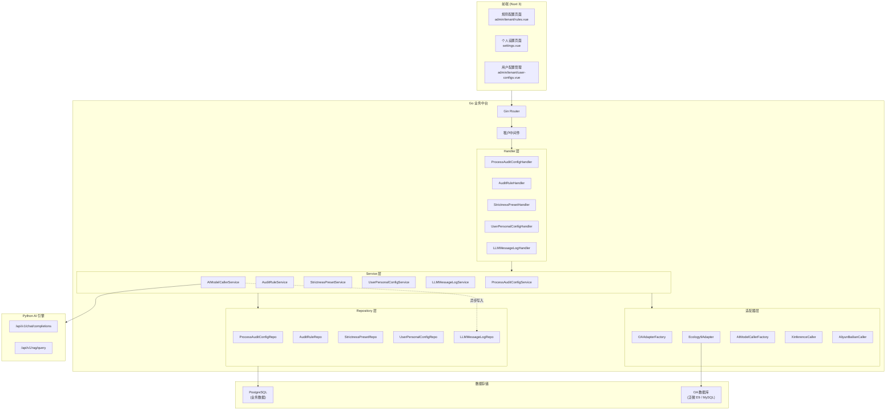
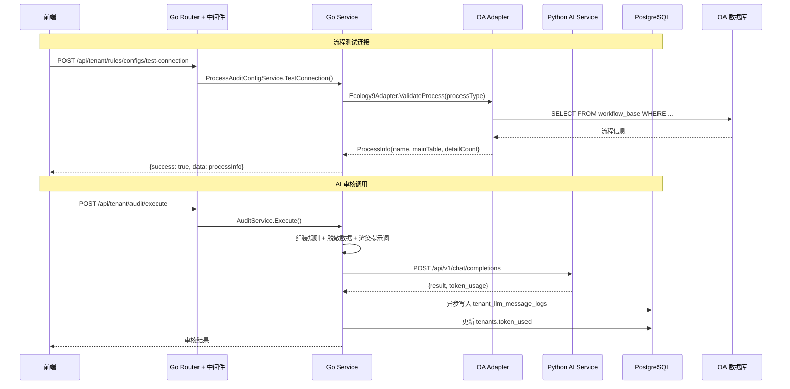
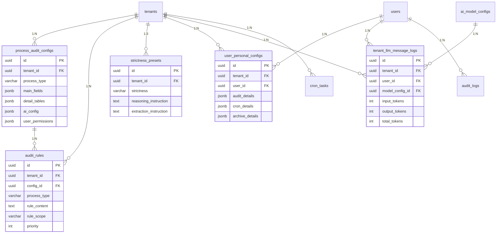

# 技术设计文档：规则配置与 OA 集成

## 概述

本设计文档描述"规则配置与 OA 集成"功能的技术实现方案。该功能将前端规则配置页面和个人设置页面从模拟数据驱动切换为真实后端 API 驱动，涵盖以下核心能力：

1. **OA 适配器类体系** — Go 层按 OA 类型（首发泛微 Ecology9）封装查询逻辑，支持流程验证、字段拉取
2. **AI 模型调用类体系** — Go 层按部署类型（Xinference 本地 / 阿里百炼云端）封装调用逻辑，统计 Token 用量
3. **流程审核配置 CRUD** — 租户级流程审核配置的完整生命周期管理
4. **审核规则持久化** — 规则的创建、查询、更新、删除，按租户隔离
5. **用户个人配置** — 业务用户在租户管理员授权范围内的个性化配置
6. **Go ↔ Python 服务间协议** — 明确两个服务的职责边界和数据传输格式
7. **数据库迁移** — 新增 process_audit_configs、audit_rules、strictness_presets 等表

### 设计决策

| 决策 | 选择 | 理由 |
|------|------|------|
| OA 适配器模式 | Go interface + 工厂函数 | 符合现有代码风格，易于扩展新 OA 类型 |
| AI 调用路由 | Go 层统一入口，按 deploy_type 分发 | Go 负责鉴权/脱敏/Token 统计，Python 专注 LLM 调用 |
| 字段配置存储 | JSONB 列 (main_fields, detail_tables) | 字段结构灵活多变，JSONB 避免频繁 DDL |
| 用户配置隔离 | tenant_id + user_id 联合唯一约束 | 确保跨租户配置互不干扰 |
| Token 日志写入 | 异步 goroutine + channel | 不阻塞主审核流程 |
| 前端数据迁移 | 逐页替换 mock 引用为 composable API 调用 | 渐进式迁移，降低风险 |

## 架构

### 系统架构图



### 请求流程




## 组件与接口

### 1. OA 适配器接口 (OAAdapter)

位置：`go-service/internal/pkg/oa/adapter.go`

```go
// OAAdapter 定义 OA 系统适配器接口。
// 不同 OA 类型（泛微 E9、致远、钉钉等）各自实现该接口。
type OAAdapter interface {
    // ValidateProcess 验证流程类型是否存在于 OA 系统中
    ValidateProcess(ctx context.Context, processType string) (*ProcessInfo, error)

    // FetchFields 拉取指定流程的全部字段定义（主表 + 明细表）
    FetchFields(ctx context.Context, processType string) (*ProcessFields, error)

    // CheckUserPermission 检查用户在 OA 中是否具有指定流程的审批权限
    CheckUserPermission(ctx context.Context, userID string, processType string) (bool, error)

    // FetchProcessData 拉取指定流程实例的业务数据（用于审核执行）
    FetchProcessData(ctx context.Context, processID string) (*ProcessData, error)
}

// ProcessInfo 流程基本信息
type ProcessInfo struct {
    ProcessType  string `json:"process_type"`
    ProcessName  string `json:"process_name"`
    MainTable    string `json:"main_table"`
    DetailCount  int    `json:"detail_count"`
}

// FieldDef 字段定义
type FieldDef struct {
    FieldKey  string `json:"field_key"`
    FieldName string `json:"field_name"`
    FieldType string `json:"field_type"`
}

// DetailTableDef 明细表定义
type DetailTableDef struct {
    TableName  string     `json:"table_name"`
    TableLabel string     `json:"table_label"`
    Fields     []FieldDef `json:"fields"`
}

// ProcessFields 流程字段集合
type ProcessFields struct {
    MainFields   []FieldDef       `json:"main_fields"`
    DetailTables []DetailTableDef `json:"detail_tables"`
}

// ProcessData 流程实例业务数据
type ProcessData struct {
    ProcessID  string                 `json:"process_id"`
    MainData   map[string]interface{} `json:"main_data"`
    DetailData []map[string]interface{} `json:"detail_data"`
}
```

#### Ecology9Adapter 实现

位置：`go-service/internal/pkg/oa/ecology9.go`

Ecology9Adapter 通过 GORM 连接泛微 E9 的 MySQL 数据库，封装 E9 特有的表结构查询：

- `workflow_base` — 流程基础信息表
- `workflow_billfield` — 流程字段定义表
- `workflow_detail_table` — 明细表定义

连接管理：通过 `OADatabaseConnection` 模型获取连接参数，使用 `gorm.io/driver/mysql` 建立独立连接池。

#### OAAdapterFactory

位置：`go-service/internal/pkg/oa/factory.go`

```go
// NewOAAdapter 根据 oa_type 创建对应的适配器实例。
// 当前支持: "weaver_e9"
func NewOAAdapter(oaType string, conn *model.OADatabaseConnection) (OAAdapter, error) {
    switch oaType {
    case "weaver_e9":
        return NewEcology9Adapter(conn)
    default:
        return nil, fmt.Errorf("不支持的 OA 类型: %s", oaType)
    }
}
```

### 2. AI 模型调用接口 (AIModelCaller)

位置：`go-service/internal/pkg/ai/caller.go`

```go
// AIModelCaller 定义 AI 模型调用接口。
// 不同部署类型（本地 Xinference / 云端阿里百炼）各自实现。
type AIModelCaller interface {
    // TestConnection 测试模型连接是否可用
    TestConnection(ctx context.Context) error

    // Chat 发送对话请求，返回模型响应和 Token 消耗
    Chat(ctx context.Context, req *ChatRequest) (*ChatResponse, error)
}

// ChatRequest AI 对话请求
type ChatRequest struct {
    SystemPrompt string            `json:"system_prompt"`
    UserPrompt   string            `json:"user_prompt"`
    ModelConfig  *model.AIModelConfig `json:"-"`
    Temperature  float64           `json:"temperature"`
    MaxTokens    int               `json:"max_tokens"`
}

// ChatResponse AI 对话响应
type ChatResponse struct {
    Content      string     `json:"content"`
    TokenUsage   TokenUsage `json:"token_usage"`
    ModelID      string     `json:"model_id"`
    DurationMs   int64      `json:"duration_ms"`
}

// TokenUsage Token 消耗统计
type TokenUsage struct {
    InputTokens  int `json:"input_tokens"`
    OutputTokens int `json:"output_tokens"`
    TotalTokens  int `json:"total_tokens"`
}
```

#### XinferenceCaller

通过 OpenAI 兼容 API 调用本地 Xinference 部署的模型。Endpoint 格式：`http://<host>:<port>/v1/chat/completions`。

#### AliyunBailianCaller

通过阿里云百炼 API 调用云端模型。需要 API Key 认证，Endpoint 格式：`https://dashscope.aliyuncs.com/compatible-mode/v1/chat/completions`。

#### AIModelCallerFactory

```go
// NewAIModelCaller 根据 deploy_type 创建对应的调用器实例。
func NewAIModelCaller(cfg *model.AIModelConfig) (AIModelCaller, error) {
    switch cfg.DeployType {
    case "local":
        return NewXinferenceCaller(cfg)
    case "cloud":
        return NewAliyunBailianCaller(cfg)
    default:
        return nil, fmt.Errorf("不支持的部署类型: %s", cfg.DeployType)
    }
}
```

### 3. Go ↔ Python 服务间协议

Go 服务通过 HTTP 调用 Python AI 服务。当前阶段（第一阶段：仅规则库模式），Go 层直接通过 AIModelCaller 调用 LLM，不经过 Python 服务。第二阶段引入 RAG 时，Go 调用 Python 的 RAG 端点。

#### 请求格式 (Go → Python)

```json
{
    "system_prompt": "你是一个审核助手...",
    "user_prompt": "请审核以下采购申请...",
    "model_config": {
        "model_id": "uuid",
        "provider": "xinference",
        "model_name": "qwen2.5-72b",
        "endpoint": "http://xinference:9997",
        "max_tokens": 4096,
        "temperature": 0.3
    },
    "audit_context": {
        "tenant_id": "uuid",
        "process_type": "采购审批",
        "rules": [...],
        "process_data": {...}
    }
}
```

#### 响应格式 (Python → Go)

```json
{
    "content": "审核结果 JSON 字符串",
    "token_usage": {
        "input_tokens": 1200,
        "output_tokens": 800,
        "total_tokens": 2000
    },
    "model_id": "qwen2.5-72b",
    "duration_ms": 3500
}
```

#### 数据脱敏规则

Go 层在发送数据到 AI 服务前执行脱敏：

| 字段类型 | 脱敏规则 | 示例 |
|---------|---------|------|
| 身份证号 | 保留前3后4，中间用 * | 110***1234 |
| 手机号 | 保留前3后4 | 138****5678 |
| 银行卡号 | 保留后4位 | ****5678 |
| 薪资金额 | 替换为区间 | [10k-20k] |

### 4. API 端点设计

#### 4.1 流程审核配置 API (tenant_admin)

| 方法 | 路径 | 说明 |
|------|------|------|
| GET | `/api/tenant/rules/configs` | 查询当前租户的流程审核配置列表 |
| POST | `/api/tenant/rules/configs` | 创建流程审核配置 |
| GET | `/api/tenant/rules/configs/:id` | 查询单个配置详情 |
| PUT | `/api/tenant/rules/configs/:id` | 更新流程审核配置 |
| DELETE | `/api/tenant/rules/configs/:id` | 删除流程审核配置 |
| POST | `/api/tenant/rules/configs/test-connection` | 测试流程连接 |
| POST | `/api/tenant/rules/configs/:id/fetch-fields` | 拉取 OA 字段 |

#### 4.2 审核规则 API (tenant_admin)

| 方法 | 路径 | 说明 |
|------|------|------|
| GET | `/api/tenant/rules/audit-rules` | 查询审核规则列表（支持按 process_type 筛选） |
| POST | `/api/tenant/rules/audit-rules` | 创建审核规则 |
| PUT | `/api/tenant/rules/audit-rules/:id` | 更新审核规则 |
| DELETE | `/api/tenant/rules/audit-rules/:id` | 删除审核规则 |

#### 4.3 审核尺度预设 API (tenant_admin)

| 方法 | 路径 | 说明 |
|------|------|------|
| GET | `/api/tenant/rules/strictness-presets` | 查询当前租户的三级预设 |
| PUT | `/api/tenant/rules/strictness-presets/:strictness` | 更新指定尺度的预设 |

#### 4.4 用户个人配置 API (business user)

| 方法 | 路径 | 说明 |
|------|------|------|
| GET | `/api/tenant/settings/processes` | 获取当前用户可见的流程列表（双重校验） |
| GET | `/api/tenant/settings/processes/:processType` | 获取单个流程的用户配置详情 |
| PUT | `/api/tenant/settings/processes/:processType` | 更新用户对某流程的个性化配置 |
| GET | `/api/tenant/settings/dashboard-prefs` | 获取用户仪表板偏好 |
| PUT | `/api/tenant/settings/dashboard-prefs` | 更新用户仪表板偏好 |

#### 4.5 用户配置管理 API (tenant_admin)

| 方法 | 路径 | 说明 |
|------|------|------|
| GET | `/api/tenant/user-configs` | 查询当前租户所有用户的个人配置摘要 |
| GET | `/api/tenant/user-configs/:userId` | 查询指定用户的完整个人配置 |

#### 4.6 Token 消耗统计 API (tenant_admin / system_admin)

| 方法 | 路径 | 说明 |
|------|------|------|
| GET | `/api/tenant/stats/token-usage` | 查询当前租户的 Token 消耗统计 |
| GET | `/api/admin/stats/token-usage` | 查询所有租户的 Token 消耗统计（system_admin） |

### 5. 前端组件变更

#### 5.1 新增 Composable

- `useRulesApi.ts` — 封装规则配置相关 API 调用（替代 useMockData 中的 mockProcessAuditConfigs）
- `useSettingsApi.ts` — 封装个人设置相关 API 调用（替代 useMockData 中的 mockUserPersonalConfigs）

#### 5.2 页面变更

| 页面 | 变更内容 |
|------|---------|
| `admin/tenant/rules.vue` | 替换 mockProcessAuditConfigs 为 useRulesApi；接入测试连接、字段拉取 API；AI 配置区域标签修改 |
| `settings.vue` | 替换模拟数据为 useSettingsApi；实现权限锁定 UI；接入双重校验流程列表 |
| `admin/tenant/user-configs.vue` | 替换 mockUserPersonalConfigs 为 useSettingsApi 管理端 API |


## 数据模型

### 数据库迁移计划

基于现有 000001-000006 迁移文件，新增以下迁移：

### 000007: process_audit_configs, audit_rules, strictness_presets

```sql
-- process_audit_configs — 流程审核配置表
CREATE TABLE process_audit_configs (
    id               UUID         PRIMARY KEY DEFAULT gen_random_uuid(),
    tenant_id        UUID         NOT NULL REFERENCES tenants(id) ON DELETE CASCADE,
    process_type     VARCHAR(200) NOT NULL,
    process_type_label VARCHAR(200) DEFAULT '',
    main_table_name  VARCHAR(200) DEFAULT '',
    main_fields      JSONB        NOT NULL DEFAULT '[]'::jsonb,
    detail_tables    JSONB        NOT NULL DEFAULT '[]'::jsonb,
    field_mode       VARCHAR(20)  NOT NULL DEFAULT 'all',
    kb_mode          VARCHAR(20)  NOT NULL DEFAULT 'rules_only',
    ai_config        JSONB        NOT NULL DEFAULT '{}'::jsonb,
    user_permissions JSONB        NOT NULL DEFAULT '{}'::jsonb,
    status           VARCHAR(20)  NOT NULL DEFAULT 'active',
    created_at       TIMESTAMPTZ  NOT NULL DEFAULT now(),
    updated_at       TIMESTAMPTZ  NOT NULL DEFAULT now(),
    UNIQUE(tenant_id, process_type)
);

CREATE INDEX idx_pac_tenant_id ON process_audit_configs(tenant_id);

-- audit_rules — 审核规则表
CREATE TABLE audit_rules (
    id              UUID         PRIMARY KEY DEFAULT gen_random_uuid(),
    tenant_id       UUID         NOT NULL REFERENCES tenants(id) ON DELETE CASCADE,
    config_id       UUID         REFERENCES process_audit_configs(id) ON DELETE CASCADE,
    process_type    VARCHAR(200) NOT NULL,
    rule_content    TEXT         NOT NULL,
    rule_scope      VARCHAR(20)  NOT NULL DEFAULT 'default_on',
    priority        INT          NOT NULL DEFAULT 0,
    enabled         BOOLEAN      NOT NULL DEFAULT TRUE,
    source          VARCHAR(20)  NOT NULL DEFAULT 'manual',
    related_flow    BOOLEAN      NOT NULL DEFAULT FALSE,
    created_at      TIMESTAMPTZ  NOT NULL DEFAULT now(),
    updated_at      TIMESTAMPTZ  NOT NULL DEFAULT now()
);

CREATE INDEX idx_ar_tenant_id ON audit_rules(tenant_id);
CREATE INDEX idx_ar_config_id ON audit_rules(config_id);
CREATE INDEX idx_ar_process_type ON audit_rules(tenant_id, process_type);

-- strictness_presets — 审核尺度预设表
CREATE TABLE strictness_presets (
    id                     UUID         PRIMARY KEY DEFAULT gen_random_uuid(),
    tenant_id              UUID         NOT NULL REFERENCES tenants(id) ON DELETE CASCADE,
    strictness             VARCHAR(20)  NOT NULL,
    reasoning_instruction  TEXT         NOT NULL DEFAULT '',
    extraction_instruction TEXT         NOT NULL DEFAULT '',
    created_at             TIMESTAMPTZ  NOT NULL DEFAULT now(),
    updated_at             TIMESTAMPTZ  NOT NULL DEFAULT now(),
    UNIQUE(tenant_id, strictness)
);

CREATE INDEX idx_sp_tenant_id ON strictness_presets(tenant_id);
```

### 000008: cron_tasks, cron_task_type_configs

```sql
-- cron_tasks — 定时任务表
CREATE TABLE cron_tasks (
    id              UUID         PRIMARY KEY DEFAULT gen_random_uuid(),
    tenant_id       UUID         NOT NULL REFERENCES tenants(id) ON DELETE CASCADE,
    task_type       VARCHAR(50)  NOT NULL,
    task_label      VARCHAR(200) NOT NULL DEFAULT '',
    cron_expression VARCHAR(100) NOT NULL,
    is_active       BOOLEAN      NOT NULL DEFAULT TRUE,
    is_builtin      BOOLEAN      NOT NULL DEFAULT FALSE,
    push_email      VARCHAR(255) DEFAULT '',
    last_run_at     TIMESTAMPTZ,
    next_run_at     TIMESTAMPTZ,
    success_count   INT          NOT NULL DEFAULT 0,
    fail_count      INT          NOT NULL DEFAULT 0,
    created_at      TIMESTAMPTZ  NOT NULL DEFAULT now(),
    updated_at      TIMESTAMPTZ  NOT NULL DEFAULT now()
);

CREATE INDEX idx_ct_tenant_id ON cron_tasks(tenant_id);

-- cron_task_type_configs — 定时任务类型配置表
CREATE TABLE cron_task_type_configs (
    id               UUID         PRIMARY KEY DEFAULT gen_random_uuid(),
    tenant_id        UUID         NOT NULL REFERENCES tenants(id) ON DELETE CASCADE,
    task_type        VARCHAR(50)  NOT NULL,
    label            VARCHAR(200) NOT NULL,
    enabled          BOOLEAN      NOT NULL DEFAULT TRUE,
    batch_limit      INT          DEFAULT NULL,
    push_format      VARCHAR(20)  NOT NULL DEFAULT 'html',
    content_template JSONB        NOT NULL DEFAULT '{}'::jsonb,
    created_at       TIMESTAMPTZ  NOT NULL DEFAULT now(),
    updated_at       TIMESTAMPTZ  NOT NULL DEFAULT now(),
    UNIQUE(tenant_id, task_type)
);

CREATE INDEX idx_cttc_tenant_id ON cron_task_type_configs(tenant_id);
```

### 000009: audit_logs, cron_logs, archive_logs

```sql
-- audit_logs — 审核日志表
CREATE TABLE audit_logs (
    id              UUID         PRIMARY KEY DEFAULT gen_random_uuid(),
    tenant_id       UUID         NOT NULL REFERENCES tenants(id) ON DELETE CASCADE,
    user_id         UUID         NOT NULL REFERENCES users(id),
    process_id      VARCHAR(100) NOT NULL,
    title           VARCHAR(500) NOT NULL,
    process_type    VARCHAR(200) NOT NULL,
    recommendation  VARCHAR(20)  NOT NULL,
    score           INT          NOT NULL DEFAULT 0,
    audit_result    JSONB        NOT NULL DEFAULT '{}'::jsonb,
    duration_ms     INT          NOT NULL DEFAULT 0,
    created_at      TIMESTAMPTZ  NOT NULL DEFAULT now()
);

CREATE INDEX idx_al_tenant_id ON audit_logs(tenant_id);
CREATE INDEX idx_al_user_id ON audit_logs(user_id);
CREATE INDEX idx_al_created_at ON audit_logs(tenant_id, created_at DESC);

-- cron_logs — 定时任务日志表
CREATE TABLE cron_logs (
    id          UUID         PRIMARY KEY DEFAULT gen_random_uuid(),
    tenant_id   UUID         NOT NULL REFERENCES tenants(id) ON DELETE CASCADE,
    task_id     UUID         NOT NULL REFERENCES cron_tasks(id),
    task_type   VARCHAR(50)  NOT NULL,
    status      VARCHAR(20)  NOT NULL DEFAULT 'running',
    message     TEXT         DEFAULT '',
    started_at  TIMESTAMPTZ  NOT NULL DEFAULT now(),
    finished_at TIMESTAMPTZ
);

CREATE INDEX idx_cl_tenant_id ON cron_logs(tenant_id);
CREATE INDEX idx_cl_task_id ON cron_logs(task_id);

-- archive_logs — 归档复盘日志表
CREATE TABLE archive_logs (
    id               UUID         PRIMARY KEY DEFAULT gen_random_uuid(),
    tenant_id        UUID         NOT NULL REFERENCES tenants(id) ON DELETE CASCADE,
    user_id          UUID         NOT NULL REFERENCES users(id),
    process_id       VARCHAR(100) NOT NULL,
    title            VARCHAR(500) NOT NULL,
    process_type     VARCHAR(200) NOT NULL,
    compliance       VARCHAR(30)  NOT NULL,
    compliance_score INT          NOT NULL DEFAULT 0,
    archive_result   JSONB        NOT NULL DEFAULT '{}'::jsonb,
    created_at       TIMESTAMPTZ  NOT NULL DEFAULT now()
);

CREATE INDEX idx_arcl_tenant_id ON archive_logs(tenant_id);
CREATE INDEX idx_arcl_user_id ON archive_logs(user_id);
```

### 000010: user_personal_configs, user_dashboard_prefs

```sql
-- user_personal_configs — 用户个人配置表
CREATE TABLE user_personal_configs (
    id             UUID        PRIMARY KEY DEFAULT gen_random_uuid(),
    tenant_id      UUID        NOT NULL REFERENCES tenants(id) ON DELETE CASCADE,
    user_id        UUID        NOT NULL REFERENCES users(id) ON DELETE CASCADE,
    audit_details  JSONB       NOT NULL DEFAULT '[]'::jsonb,
    cron_details   JSONB       NOT NULL DEFAULT '[]'::jsonb,
    archive_details JSONB      NOT NULL DEFAULT '[]'::jsonb,
    created_at     TIMESTAMPTZ NOT NULL DEFAULT now(),
    updated_at     TIMESTAMPTZ NOT NULL DEFAULT now(),
    UNIQUE(tenant_id, user_id)
);

CREATE INDEX idx_upc_tenant_id ON user_personal_configs(tenant_id);
CREATE INDEX idx_upc_user_id ON user_personal_configs(user_id);

-- user_dashboard_prefs — 用户仪表板偏好表
CREATE TABLE user_dashboard_prefs (
    id              UUID        PRIMARY KEY DEFAULT gen_random_uuid(),
    tenant_id       UUID        NOT NULL REFERENCES tenants(id) ON DELETE CASCADE,
    user_id         UUID        NOT NULL REFERENCES users(id) ON DELETE CASCADE,
    enabled_widgets JSONB       NOT NULL DEFAULT '[]'::jsonb,
    widget_sizes    JSONB       NOT NULL DEFAULT '{}'::jsonb,
    created_at      TIMESTAMPTZ NOT NULL DEFAULT now(),
    updated_at      TIMESTAMPTZ NOT NULL DEFAULT now(),
    UNIQUE(tenant_id, user_id)
);

CREATE INDEX idx_udp_tenant_user ON user_dashboard_prefs(tenant_id, user_id);
```

### 000011: tenant_llm_message_logs

```sql
-- tenant_llm_message_logs — 租户大模型消息记录表
CREATE TABLE tenant_llm_message_logs (
    id              UUID         PRIMARY KEY DEFAULT gen_random_uuid(),
    tenant_id       UUID         NOT NULL REFERENCES tenants(id) ON DELETE CASCADE,
    user_id         UUID         REFERENCES users(id),
    model_config_id UUID         REFERENCES ai_model_configs(id),
    request_type    VARCHAR(50)  NOT NULL DEFAULT 'audit',
    input_tokens    INT          NOT NULL DEFAULT 0,
    output_tokens   INT          NOT NULL DEFAULT 0,
    total_tokens    INT          NOT NULL DEFAULT 0,
    duration_ms     INT          NOT NULL DEFAULT 0,
    created_at      TIMESTAMPTZ  NOT NULL DEFAULT now()
);

CREATE INDEX idx_tllm_tenant_id ON tenant_llm_message_logs(tenant_id);
CREATE INDEX idx_tllm_created_at ON tenant_llm_message_logs(tenant_id, created_at DESC);
CREATE INDEX idx_tllm_model ON tenant_llm_message_logs(model_config_id);
```

### JSONB 字段结构说明

#### process_audit_configs.ai_config

```json
{
    "audit_strictness": "standard",
    "system_prompt": "你是一个专业的审核助手...",
    "user_prompt_template": "请审核以下{{process_type}}流程...\n字段数据：{{fields}}\n审核规则：{{rules}}",
    "reasoning_instruction": "请逐条检查规则...",
    "extraction_instruction": "请提取关键信息..."
}
```

#### process_audit_configs.user_permissions

```json
{
    "allow_custom_fields": true,
    "allow_custom_rules": true,
    "allow_modify_strictness": false
}
```

#### user_personal_configs.audit_details

```json
[
    {
        "process_type": "采购审批",
        "custom_rules": [{"id": "uuid", "content": "...", "enabled": true}],
        "field_overrides": ["合同编号"],
        "strictness_override": "strict",
        "rule_toggle_overrides": [{"rule_id": "uuid", "enabled": false}]
    }
]
```

### 多租户数据隔离策略

所有新增表均包含 `tenant_id` 列，通过以下机制确保隔离：

1. **中间件层**：`TenantContext()` 中间件从 JWT 提取 tenant_id 注入 gin.Context
2. **Repository 层**：`BaseRepo.WithTenant(c)` 自动添加 `WHERE tenant_id = ?` 条件
3. **数据库层**：外键约束 `REFERENCES tenants(id) ON DELETE CASCADE`
4. **唯一约束**：`UNIQUE(tenant_id, process_type)` 等确保租户内唯一性

### ER 关系图




## 正确性属性 (Correctness Properties)

*属性（Property）是在系统所有合法执行路径上都应成立的特征或行为——本质上是对系统应做什么的形式化陈述。属性是人类可读规格说明与机器可验证正确性保证之间的桥梁。*

### Property 1: OA 适配器工厂选择

*For any* 合法的 oa_type 值（如 "weaver_e9"），OAAdapterFactory 应返回与该 oa_type 对应的 OAAdapter 实现实例；对于任何不在支持列表中的 oa_type 值，应返回错误。

**Validates: Requirements 1.3, 1.4**

### Property 2: AI 调用器工厂选择

*For any* 合法的 deploy_type 值（如 "local", "cloud"），AIModelCallerFactory 应返回与该 deploy_type 对应的 AIModelCaller 实现实例；对于任何不在支持列表中的 deploy_type 值，应返回错误。

**Validates: Requirements 2.6**

### Property 3: Token 累加正确性

*For any* AI 模型调用返回的 TokenUsage，调用完成后租户的 token_used 字段应增加恰好 total_tokens 的数量，且 tenant_llm_message_logs 表中应新增一条包含正确 tenant_id、input_tokens、output_tokens、total_tokens 的记录。

**Validates: Requirements 2.4, 2.5, 15.2**

### Property 4: 流程审核配置 CRUD 往返

*For any* 合法的 ProcessAuditConfig（包含 process_type、ai_config JSONB、user_permissions JSONB、main_fields、detail_tables），创建后再查询应返回等价的配置数据，包括 ai_config 中的 system_prompt 和 user_prompt_template 字段。

**Validates: Requirements 6.1, 6.3, 6.4, 7.3, 4.4**

### Property 5: 审核规则 CRUD 往返

*For any* 合法的 AuditRule（包含 rule_content、rule_scope、priority、source、related_flow），创建后再按 process_type 查询应在结果列表中包含该规则，且所有字段值一致。

**Validates: Requirements 5.2**

### Property 6: 用户个人配置往返

*For any* 合法的用户个人配置更新（包含 audit_details、cron_details、archive_details 的 JSONB 数据），保存后再查询应返回等价的配置数据。

**Validates: Requirements 11.3, 12.4, 13.3**

### Property 7: 租户数据隔离

*For any* 两个不同的 tenant_id（A 和 B），在租户 A 下创建的 process_audit_configs、audit_rules、user_personal_configs 记录，通过租户 B 的上下文查询时不应返回任何结果。

**Validates: Requirements 5.1, 5.5, 14.3, 14.4**

### Property 8: 流程类型租户内唯一性

*For any* 租户，尝试创建两个具有相同 process_type 的 ProcessAuditConfig 时，第二次创建应失败并返回唯一性冲突错误。

**Validates: Requirements 6.2**

### Property 9: 审核尺度预设不变量

*For any* 租户，strictness_presets 表中应恰好存在 strict、standard、loose 三条记录，不多不少。更新某条预设的 reasoning_instruction 和 extraction_instruction 后再查询应返回更新后的值。

**Validates: Requirements 8.2, 8.3**

### Property 10: 权限锁定拒绝修改

*For any* ProcessAuditConfig 中 user_permissions 的三个标志（allow_custom_fields、allow_custom_rules、allow_modify_strictness），当某标志为 false 时，业务用户尝试修改对应配置项（字段覆盖、自定义规则、审核尺度）应被拒绝，用户个人配置保持不变。

**Validates: Requirements 9.1, 9.2, 9.3, 11.1, 11.2, 13.1, 13.2**

### Property 11: 强制规则不可关闭

*For any* rule_scope 为 "mandatory" 的审核规则，业务用户的 rule_toggle_overrides 中对该规则的 enabled=false 设置应在规则合并时被忽略，强制规则始终生效。

**Validates: Requirements 12.1**

### Property 12: 规则合并优先级

*For any* 租户规则集合和用户规则集合，合并后的有效规则列表应满足：(1) 所有 mandatory 规则始终包含且启用，(2) 用户私有规则优先于租户 default_on/default_off 规则，(3) 用户的 rule_toggle_overrides 覆盖租户默认启用状态。

**Validates: Requirements 12.5**

### Property 13: 用户覆盖优先

*For any* 租户级字段配置和用户级字段覆盖，合并结果应优先使用用户覆盖的值。*For any* 租户级默认审核尺度和用户级尺度覆盖（非 null），合并结果应使用用户覆盖的尺度；当用户覆盖为 null 时，使用租户默认值。

**Validates: Requirements 11.4, 13.4**

### Property 14: 流程列表双重校验

*For any* 返回给业务用户的流程列表中的流程，该流程必须同时满足：(1) 在 process_audit_configs 表中存在对应租户的配置记录，(2) 用户在 OA 系统中具有该流程的审批权限。不满足任一条件的流程不应出现在列表中。

**Validates: Requirements 10.2, 10.3, 10.4, 10.5**

### Property 15: 审核规则筛选正确性

*For any* 按 process_type、rule_scope 或 enabled 状态的筛选查询，返回的所有审核规则应满足所有指定的筛选条件。

**Validates: Requirements 5.3**

### Property 16: 敏感数据脱敏

*For any* 包含敏感字段（身份证号、手机号、银行卡号、薪资金额）的流程数据，经过脱敏函数处理后，输出中不应包含完整的敏感信息原文，且脱敏后的格式应符合预定义规则。

**Validates: Requirements 17.5**

### Property 17: 提示词组装正确性

*For any* 合法的 ProcessAuditConfig（包含 system_prompt 和 user_prompt_template），提示词组装函数应将 system_prompt 映射为系统角色消息、将渲染后的 user_prompt_template 映射为用户角色消息，且请求体应包含 system_prompt、user_prompt、model_config 和 audit_context 四个必需字段。

**Validates: Requirements 7.4, 17.3**

### Property 18: 字段结构完整性

*For any* OA 适配器返回的 ProcessFields，主表字段列表中的每个字段应包含非空的 field_key、field_name 和 field_type；明细表列表中的每个表应包含非空的 table_name 和 table_label。

**Validates: Requirements 4.2**

### Property 19: Token 日志时间范围筛选

*For any* 按时间范围查询 tenant_llm_message_logs 的请求，返回的所有记录的 created_at 应落在指定的时间范围内。

**Validates: Requirements 15.3**

### Property 20: 规则删除行为

*For any* source 为 "manual" 的审核规则，删除操作应将其从数据库中完全移除（硬删除）；对于 source 为 "file_import" 的规则，删除操作应保留记录但标记为禁用。

**Validates: Requirements 5.4**

## 错误处理

### 错误码体系

沿用现有 `errcode` 包的错误码风格，新增以下错误码：

| 错误码 | 常量名 | 说明 |
|--------|--------|------|
| 40401 | ErrProcessNotFound | 流程在 OA 系统中不存在 |
| 40402 | ErrConfigNotFound | 流程审核配置不存在 |
| 40403 | ErrRuleNotFound | 审核规则不存在 |
| 40901 | ErrDuplicateProcessType | 同一租户下流程类型重复 |
| 40301 | ErrPermissionDenied | 用户权限不足（如尝试修改被锁定的配置） |
| 40302 | ErrMandatoryRuleLocked | 强制规则不可修改 |
| 50201 | ErrOAConnectionFailed | OA 数据库连接失败 |
| 50202 | ErrOAQueryFailed | OA 数据库查询失败 |
| 50203 | ErrOATypeUnsupported | 不支持的 OA 类型 |
| 50301 | ErrAIConnectionFailed | AI 模型连接失败 |
| 50302 | ErrAICallFailed | AI 模型调用失败 |
| 50303 | ErrAIDeployTypeUnsupported | 不支持的 AI 部署类型 |
| 50304 | ErrTokenQuotaExceeded | 租户 Token 配额已用尽 |

### 错误处理策略

1. **OA 连接错误**：返回具体错误信息（连接超时、认证失败、数据库不存在），前端展示友好提示
2. **AI 调用错误**：记录错误日志，返回降级结果（如仅规则检查结果），不中断审核流程
3. **Token 配额超限**：在调用前检查剩余配额，不足时拒绝调用并返回 50304 错误
4. **并发冲突**：使用 `updated_at` 乐观锁，冲突时返回 409 状态码
5. **数据脱敏失败**：记录告警日志，拒绝发送未脱敏数据到 AI 服务

## 测试策略

### 双重测试方法

本功能采用单元测试 + 属性测试的双重测试策略：

- **单元测试**：验证具体示例、边界条件和错误处理
- **属性测试**：验证跨所有输入的通用属性

两者互补，单元测试捕获具体 bug，属性测试验证通用正确性。

### 属性测试配置

- **Go 语言属性测试库**：[`pgregory.net/rapid`](https://github.com/flyingmutant/rapid)（Go 生态中成熟的 PBT 库）
- **TypeScript 属性测试库**：[`fast-check`](https://github.com/dubzzz/fast-check)（前端逻辑测试）
- **最小迭代次数**：每个属性测试至少 100 次迭代
- **标签格式**：`Feature: rule-config-oa-integration, Property {number}: {property_text}`
- **每个正确性属性由一个属性测试实现**

### Go 后端测试

#### 属性测试（Property-Based Tests）

| 属性 | 测试文件 | 说明 |
|------|---------|------|
| P1 | `internal/pkg/oa/factory_test.go` | OA 适配器工厂选择 |
| P2 | `internal/pkg/ai/factory_test.go` | AI 调用器工厂选择 |
| P3 | `internal/service/ai_caller_service_test.go` | Token 累加 + 日志写入 |
| P4 | `internal/service/process_audit_config_service_test.go` | 配置 CRUD 往返 |
| P5 | `internal/service/audit_rule_service_test.go` | 规则 CRUD 往返 |
| P6 | `internal/service/user_personal_config_service_test.go` | 用户配置往返 |
| P7 | `internal/repository/tenant_isolation_test.go` | 租户数据隔离 |
| P8 | `internal/service/process_audit_config_service_test.go` | 流程类型唯一性 |
| P9 | `internal/service/strictness_preset_service_test.go` | 尺度预设不变量 |
| P10 | `internal/service/user_personal_config_service_test.go` | 权限锁定拒绝 |
| P11 | `internal/service/rule_merge_test.go` | 强制规则不可关闭 |
| P12 | `internal/service/rule_merge_test.go` | 规则合并优先级 |
| P13 | `internal/service/rule_merge_test.go` | 用户覆盖优先 |
| P15 | `internal/service/audit_rule_service_test.go` | 规则筛选正确性 |
| P16 | `internal/pkg/sanitize/sanitize_test.go` | 敏感数据脱敏 |
| P17 | `internal/service/prompt_builder_test.go` | 提示词组装 |
| P18 | `internal/pkg/oa/fields_test.go` | 字段结构完整性 |
| P19 | `internal/repository/llm_log_repo_test.go` | Token 日志时间筛选 |
| P20 | `internal/service/audit_rule_service_test.go` | 规则删除行为 |

#### 单元测试

- OA 适配器：模拟 OA 数据库响应，测试 Ecology9Adapter 的 SQL 查询逻辑
- API Handler：测试请求参数校验、错误响应格式
- 中间件：测试租户上下文注入、权限校验
- 数据脱敏：测试各类敏感字段的具体脱敏示例

### 前端测试

#### 属性测试（fast-check）

| 属性 | 测试文件 | 说明 |
|------|---------|------|
| P14 | `composables/__tests__/useSettingsApi.test.ts` | 流程列表双重校验逻辑 |

#### 单元测试

- `useRulesApi.ts`：测试 API 调用封装、错误处理、数据转换
- `useSettingsApi.ts`：测试权限锁定 UI 状态计算
- 页面组件：测试 mock 数据替换后的渲染正确性

### 集成测试

- OA 连接测试：使用 Docker 化的 MySQL 实例模拟泛微 E9 数据库
- AI 调用测试：使用 mock HTTP server 模拟 Xinference / 阿里百炼 API
- 端到端流程：创建配置 → 拉取字段 → 创建规则 → 执行审核 → 验证日志

