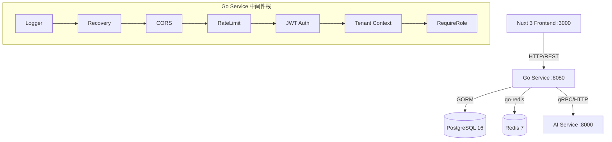
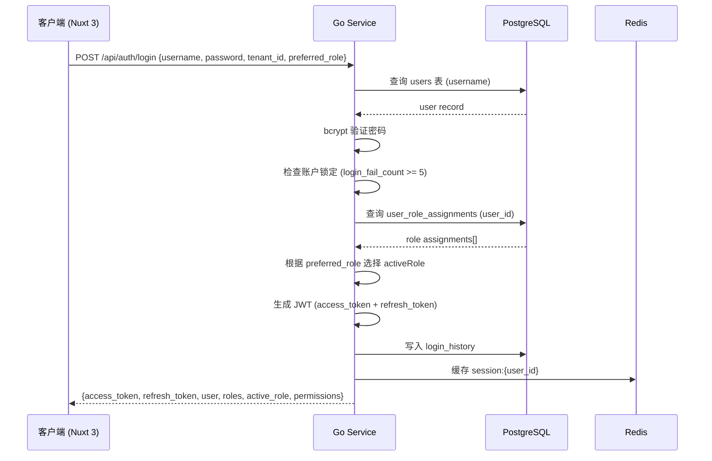
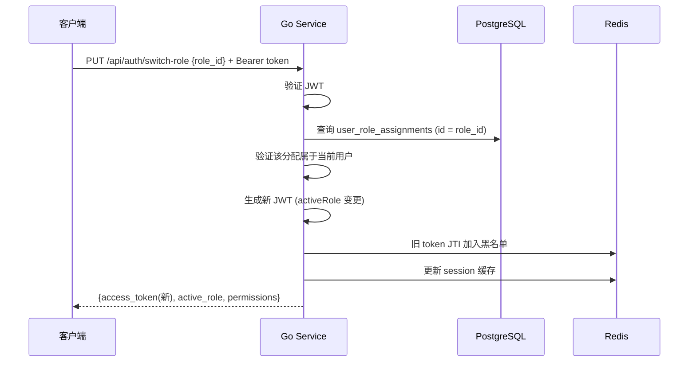

# 设计文档：租户·组织·认证·权限子系统 (tenant-org-auth)

## 概述

本设计文档覆盖 OA 智审平台 Phase 1 的核心子系统：多租户架构、组织人员管理、JWT 认证流程、RBAC 权限控制。系统采用 Go (Gin + GORM) 后端 + PostgreSQL 数据库 + Nuxt 3 前端的技术栈，实现共享数据库行级隔离的多租户模型。

本子系统是整个平台的基础设施层，所有业务模块（审核工作台、定时任务、归档复盘等）都依赖于此子系统提供的认证、权限和租户上下文。开发范围包括：Go 后端服务搭建、数据库 DDL 与种子数据分离、前端 Mock 数据替换为真实 API 调用。

## 架构

### 整体服务架构



### 认证流程时序图



### 角色切换时序图



## 组件与接口

### 组件 1: Auth Handler (认证处理器)

**职责**: 处理登录、登出、Token 刷新、角色切换、菜单获取

```go
// handler/auth_handler.go
type AuthHandler struct {
    authService service.AuthService
}

func (h *AuthHandler) Login(c *gin.Context)       // POST /api/auth/login
func (h *AuthHandler) Logout(c *gin.Context)      // POST /api/auth/logout
func (h *AuthHandler) Refresh(c *gin.Context)     // POST /api/auth/refresh
func (h *AuthHandler) SwitchRole(c *gin.Context)  // PUT  /api/auth/switch-role
func (h *AuthHandler) GetMenu(c *gin.Context)     // GET  /api/auth/menu
```

### 组件 2: Org Handler (组织人员处理器)

**职责**: 部门 CRUD、组织角色 CRUD、成员 CRUD（含用户创建逻辑）

```go
// handler/org_handler.go
type OrgHandler struct {
    orgService service.OrgService
}

// 部门
func (h *OrgHandler) ListDepartments(c *gin.Context)   // GET    /api/tenant/org/departments
func (h *OrgHandler) CreateDepartment(c *gin.Context)   // POST   /api/tenant/org/departments
func (h *OrgHandler) UpdateDepartment(c *gin.Context)   // PUT    /api/tenant/org/departments/:id
func (h *OrgHandler) DeleteDepartment(c *gin.Context)   // DELETE /api/tenant/org/departments/:id

// 组织角色
func (h *OrgHandler) ListRoles(c *gin.Context)          // GET    /api/tenant/org/roles
func (h *OrgHandler) CreateRole(c *gin.Context)          // POST   /api/tenant/org/roles
func (h *OrgHandler) UpdateRole(c *gin.Context)          // PUT    /api/tenant/org/roles/:id
func (h *OrgHandler) DeleteRole(c *gin.Context)          // DELETE /api/tenant/org/roles/:id

// 成员
func (h *OrgHandler) ListMembers(c *gin.Context)         // GET    /api/tenant/org/members
func (h *OrgHandler) CreateMember(c *gin.Context)         // POST   /api/tenant/org/members
func (h *OrgHandler) UpdateMember(c *gin.Context)         // PUT    /api/tenant/org/members/:id
func (h *OrgHandler) DeleteMember(c *gin.Context)         // DELETE /api/tenant/org/members/:id
```

### 组件 3: Tenant Handler (租户管理处理器)

**职责**: 系统管理员管理所有租户

```go
// handler/tenant_handler.go
type TenantHandler struct {
    tenantService service.TenantService
}

func (h *TenantHandler) ListTenants(c *gin.Context)    // GET    /api/admin/tenants
func (h *TenantHandler) CreateTenant(c *gin.Context)    // POST   /api/admin/tenants
func (h *TenantHandler) UpdateTenant(c *gin.Context)    // PUT    /api/admin/tenants/:id
func (h *TenantHandler) DeleteTenant(c *gin.Context)    // DELETE /api/admin/tenants/:id
func (h *TenantHandler) GetTenantStats(c *gin.Context)  // GET    /api/admin/tenants/:id/stats
```

### 组件 4: 中间件栈

**JWT 认证中间件**:

```go
// middleware/auth.go
func JWT() gin.HandlerFunc {
    return func(c *gin.Context) {
        token := extractBearerToken(c)
        if token == "" {
            c.AbortWithStatusJSON(401, response.Error(40100, "未提供认证令牌"))
            return
        }
        claims, err := jwt.ParseToken(token)
        if err != nil {
            c.AbortWithStatusJSON(401, response.Error(40101, "认证令牌无效或已过期"))
            return
        }
        if isBlacklisted(claims.JTI) {
            c.AbortWithStatusJSON(401, response.Error(40102, "认证令牌已失效"))
            return
        }
        c.Set("jwt_claims", claims)
        c.Set("user_id", claims.Sub)
        c.Set("username", claims.Username)
        c.Next()
    }
}
```

**租户上下文中间件**:

```go
// middleware/tenant.go
func TenantMiddleware() gin.HandlerFunc {
    return func(c *gin.Context) {
        claims := c.MustGet("jwt_claims").(*JWTClaims)
        if claims.ActiveRole.Role == "system_admin" {
            tenantID := c.Query("tenant_id")
            if tenantID != "" {
                c.Set("tenant_id", tenantID)
            }
            c.Set("is_system_admin", true)
        } else {
            c.Set("tenant_id", claims.ActiveRole.TenantID)
            c.Set("is_system_admin", false)
        }
        c.Next()
    }
}
```

**角色校验中间件**:

```go
// middleware/role.go
func RequireRole(roles ...string) gin.HandlerFunc {
    return func(c *gin.Context) {
        claims := c.MustGet("jwt_claims").(*JWTClaims)
        for _, r := range roles {
            if claims.ActiveRole.Role == r {
                c.Next()
                return
            }
        }
        c.AbortWithStatusJSON(403, response.Error(40300, "权限不足"))
    }
}
```

## 数据模型

### User (用户)

```go
// model/user.go
type User struct {
    ID                uuid.UUID  `gorm:"type:uuid;primaryKey;default:gen_random_uuid()"`
    Username          string     `gorm:"uniqueIndex;size:100;not null"`
    PasswordHash      string     `gorm:"size:255;not null"`
    DisplayName       string     `gorm:"size:100;not null"`
    Email             string     `gorm:"size:255"`
    Phone             string     `gorm:"size:50"`
    AvatarURL         string     `gorm:"size:500"`
    Status            string     `gorm:"size:20;not null;default:active"` // active|disabled|locked
    PasswordChangedAt time.Time  `gorm:"default:now()"`
    LoginFailCount    int        `gorm:"not null;default:0"`
    LockedUntil       *time.Time
    Locale            string     `gorm:"size:10;default:zh-CN"`
    CreatedAt         time.Time
    UpdatedAt         time.Time
}
```

**验证规则**:
- `username`: 必填，2-100 字符，全局唯一
- `password`: 登录时必填，最少 6 位
- `status`: 枚举 active/disabled/locked

### Tenant (租户)

```go
// model/tenant.go
type Tenant struct {
    ID                uuid.UUID       `gorm:"type:uuid;primaryKey;default:gen_random_uuid()"`
    Name              string          `gorm:"size:255;not null"`
    Code              string          `gorm:"uniqueIndex;size:100;not null"`
    Description       string          `gorm:"type:text"`
    Status            string          `gorm:"size:20;not null;default:active"` // active|inactive
    OAType            string          `gorm:"size:50;not null;default:weaver_e9"`
    OADBConnectionID  *uuid.UUID      `gorm:"type:uuid"`
    TokenQuota        int             `gorm:"not null;default:10000"`
    TokenUsed         int             `gorm:"not null;default:0"`
    MaxConcurrency    int             `gorm:"not null;default:10"`
    AIConfig          datatypes.JSON  `gorm:"type:jsonb;not null"`
    SSOEnabled        bool            `gorm:"not null;default:false"`
    SSOEndpoint       string          `gorm:"size:500"`
    LogRetentionDays  int             `gorm:"not null;default:365"`
    DataRetentionDays int             `gorm:"not null;default:1095"`
    AllowCustomModel  bool            `gorm:"not null;default:false"`
    ContactName       string          `gorm:"size:100"`
    ContactEmail      string          `gorm:"size:255"`
    ContactPhone      string          `gorm:"size:50"`
    CreatedAt         time.Time
    UpdatedAt         time.Time
}
```

### UserRoleAssignment (用户角色分配)

```go
// model/user_role_assignment.go
type UserRoleAssignment struct {
    ID        uuid.UUID  `gorm:"type:uuid;primaryKey;default:gen_random_uuid()"`
    UserID    uuid.UUID  `gorm:"type:uuid;not null;index"`
    Role      string     `gorm:"size:30;not null"` // business|tenant_admin|system_admin
    TenantID  *uuid.UUID `gorm:"type:uuid;index"`  // NULL for system_admin
    Label     string     `gorm:"size:200"`
    IsDefault bool       `gorm:"not null;default:false"`
    CreatedAt time.Time
}
```

### Department (部门)

```go
// model/department.go
type Department struct {
    ID        uuid.UUID  `gorm:"type:uuid;primaryKey;default:gen_random_uuid()"`
    TenantID  uuid.UUID  `gorm:"type:uuid;not null;index"`
    Name      string     `gorm:"size:200;not null"`
    ParentID  *uuid.UUID `gorm:"type:uuid;index"`
    Manager   string     `gorm:"size:100"`
    SortOrder int        `gorm:"not null;default:0"`
    CreatedAt time.Time
    UpdatedAt time.Time
}
```

### OrgRole (组织角色)

```go
// model/org_role.go
type OrgRole struct {
    ID              uuid.UUID      `gorm:"type:uuid;primaryKey;default:gen_random_uuid()"`
    TenantID        uuid.UUID      `gorm:"type:uuid;not null;index"`
    Name            string         `gorm:"size:100;not null"`
    Description     string         `gorm:"type:text"`
    PagePermissions datatypes.JSON `gorm:"type:jsonb;not null;default:'[]'"`
    IsSystem        bool           `gorm:"not null;default:false"`
    CreatedAt       time.Time
    UpdatedAt       time.Time
}
```

### OrgMember (组织成员)

```go
// model/org_member.go
type OrgMember struct {
    ID           uuid.UUID  `gorm:"type:uuid;primaryKey;default:gen_random_uuid()"`
    TenantID     uuid.UUID  `gorm:"type:uuid;not null;index"`
    UserID       uuid.UUID  `gorm:"type:uuid;not null;index"`
    DepartmentID uuid.UUID  `gorm:"type:uuid;not null;index"`
    Position     string     `gorm:"size:100"`
    Status       string     `gorm:"size:20;not null;default:active"` // active|disabled
    CreatedAt    time.Time
    UpdatedAt    time.Time

    // Associations
    User       User       `gorm:"foreignKey:UserID"`
    Department Department `gorm:"foreignKey:DepartmentID"`
    Roles      []OrgRole  `gorm:"many2many:org_member_roles"`
}
```

### JWT Claims 结构

```go
// pkg/jwt/claims.go
type ActiveRoleClaim struct {
    ID         string  `json:"id"`
    Role       string  `json:"role"`
    TenantID   *string `json:"tenant_id"`
    TenantName *string `json:"tenant_name"`
    Label      string  `json:"label"`
}

type JWTClaims struct {
    Sub         string          `json:"sub"`
    Username    string          `json:"username"`
    DisplayName string          `json:"display_name"`
    ActiveRole  ActiveRoleClaim `json:"active_role"`
    Permissions []string        `json:"permissions"`
    AllRoleIDs  []string        `json:"all_role_ids"`
    JTI         string          `json:"jti"`
    jwt.RegisteredClaims
}
```

## 关键函数与形式化规约

### 函数 1: AuthService.Login()

```go
func (s *AuthService) Login(req *dto.LoginRequest) (*dto.LoginResponse, error)
```

**前置条件:**
- `req.Username` 非空
- `req.Password` 非空
- 若 `req.PreferredRole` 非 `system_admin`，则 `req.TenantID` 非空

**后置条件:**
- 成功时返回 `LoginResponse` 包含有效的 access_token 和 refresh_token
- access_token 有效期 2 小时，refresh_token 有效期 7 天
- `active_role` 按优先级选择：preferred_role > system_admin > tenant_admin > business
- 登录失败时 `login_fail_count` 递增；成功时重置为 0
- `login_fail_count >= 5` 时账户锁定 15 分钟
- 写入 `login_history` 记录

### 函数 2: AuthService.SwitchRole()

```go
func (s *AuthService) SwitchRole(userID uuid.UUID, roleID string, oldJTI string) (*dto.SwitchRoleResponse, error)
```

**前置条件:**
- `userID` 对应有效用户
- `roleID` 存在于该用户的 `user_role_assignments` 中
- 当前 token 未在黑名单中

**后置条件:**
- 返回新的 access_token，其 `active_role` 为目标角色
- 旧 token 的 JTI 加入 Redis 黑名单
- 若目标角色绑定不同 tenant_id，新 token 反映新的租户上下文

### 函数 3: OrgService.CreateMember()

```go
func (s *OrgService) CreateMember(tenantID uuid.UUID, req *dto.CreateMemberRequest) (*dto.MemberResponse, error)
```

**前置条件:**
- `req.Username` 非空
- `req.DepartmentID` 存在于当前租户
- `req.RoleIDs` 中所有 ID 存在于当前租户的 `org_roles` 中
- 该用户在当前租户中不存在 `org_member` 记录

**后置条件:**
- 若 `users` 表中无此 username，创建新用户（含密码哈希）
- 创建 `org_members` 记录（关联 user_id + tenant_id + department_id）
- 创建 `org_member_roles` 关联记录
- 若 role_ids 包含 ROLE-003（租户管理员），自动创建 `tenant_admin` 的 UserRoleAssignment
- 默认创建 `business` 的 UserRoleAssignment
- 返回完整成员信息（含 user、department、roles）

### 函数 4: Repository.WithTenant()

```go
func (r *BaseRepo) WithTenant(c *gin.Context) *gorm.DB
```

**前置条件:**
- gin.Context 中已注入 `tenant_id`（由 TenantMiddleware 设置）

**后置条件:**
- 返回的 `*gorm.DB` 自动附加 `WHERE tenant_id = ?` 条件
- 若 `tenant_id` 为空（系统管理员无指定租户），返回无过滤的 DB 实例
- 保证所有租户数据查询的行级隔离

## 数据库脚本组织

数据库脚本分为两个目录，DDL（表结构）和 Seed（种子数据）分离：

```
db/
├── migrations/                    # DDL 表结构迁移
│   ├── 000001_init_extensions.up.sql
│   ├── 000001_init_extensions.down.sql
│   ├── 000002_tenants_users.up.sql
│   ├── 000002_tenants_users.down.sql
│   ├── 000003_org_structure.up.sql
│   ├── 000003_org_structure.down.sql
│   └── 000004_system_configs.up.sql
│   └── 000004_system_configs.down.sql
└── seeds/                         # 种子数据（开发/测试用）
    ├── 001_tenants.sql            # 租户数据
    ├── 002_users.sql              # 用户 + 角色分配
    ├── 003_departments.sql        # 部门数据
    ├── 004_org_roles.sql          # 组织角色（3个系统角色）
    ├── 005_org_members.sql        # 组织成员 + 成员角色关联
    └── 006_system_config.sql      # 系统通用配置
```

## 示例用法

### 登录流程

```go
// 1. 用户登录
resp, err := authService.Login(&dto.LoginRequest{
    Username:      "admin",
    Password:      "123456",
    TenantID:      "DEMO_HQ",
    PreferredRole: "system_admin",
})
// resp.AccessToken = "eyJhbG..."
// resp.ActiveRole = {ID: "admin-r1", Role: "system_admin", ...}

// 2. 角色切换
switchResp, err := authService.SwitchRole(userID, "admin-r2", oldJTI)
// switchResp.ActiveRole = {ID: "admin-r2", Role: "tenant_admin", TenantID: "T-001", ...}

// 3. 获取菜单（基于 activeRole）
menus := menuService.GetMenuByRole(switchResp.ActiveRole)
// menus = [{key: "tenant-rules", path: "/admin/tenant/rules"}, ...]
```

### 创建成员

```go
member, err := orgService.CreateMember(tenantID, &dto.CreateMemberRequest{
    Username:     "newuser",
    DisplayName:  "新用户",
    Password:     "123456",
    DepartmentID: "D-001",
    RoleIDs:      []string{"ROLE-001"},
    Email:        "new@example.com",
    Phone:        "13800138000",
    Position:     "工程师",
})
// 自动创建 users 记录（如不存在）
// 自动创建 org_members + org_member_roles
// 自动创建 business 的 user_role_assignment
```

## Go Service 项目结构

```
go-service/
├── cmd/
│   └── server/
│       └── main.go                 # 应用入口
├── internal/
│   ├── config/
│   │   └── config.go               # Viper 配置加载
│   ├── middleware/
│   │   ├── auth.go                 # JWT 认证
│   │   ├── cors.go                 # 跨域
│   │   ├── tenant.go               # 租户上下文
│   │   ├── logger.go               # 请求日志
│   │   └── recovery.go             # 异常恢复
│   ├── model/                      # GORM 数据模型
│   │   ├── user.go
│   │   ├── tenant.go
│   │   ├── department.go
│   │   ├── org_role.go
│   │   ├── org_member.go
│   │   └── login_history.go
│   ├── repository/                 # 数据访问层
│   │   ├── base_repo.go            # WithTenant 等通用方法
│   │   ├── user_repo.go
│   │   ├── tenant_repo.go
│   │   └── org_repo.go
│   ├── service/                    # 业务逻辑层
│   │   ├── auth_service.go
│   │   ├── tenant_service.go
│   │   ├── org_service.go
│   │   └── menu_service.go
│   ├── handler/                    # HTTP 处理器
│   │   ├── auth_handler.go
│   │   ├── tenant_handler.go
│   │   ├── org_handler.go
│   │   └── health_handler.go
│   ├── router/
│   │   └── router.go               # 路由注册
│   ├── dto/                        # 请求/响应结构体
│   │   ├── auth_dto.go
│   │   ├── tenant_dto.go
│   │   └── org_dto.go
│   └── pkg/
│       ├── jwt/
│       │   └── jwt.go              # JWT 生成/解析
│       ├── hash/
│       │   └── bcrypt.go           # 密码哈希
│       ├── response/
│       │   └── response.go         # 统一响应格式
│       └── errcode/
│           └── errcode.go          # 错误码定义
├── config.yaml                     # 默认配置文件
├── Dockerfile
├── go.mod
└── go.sum
```

## 前端改造要点

本次改造仅涉及组织人员相关的接口和数据，其他模块（审核工作台、定时任务、归档复盘等）继续使用 Mock 数据。`NUXT_PUBLIC_MOCK_MODE` 保持 `true` 不变。

### 改造策略：组织相关接口独立迁移

将组织人员相关的 Mock 数据调用迁移为真实 API 调用，同时保留 Mock 数据作为后备。具体做法是新增一个 `composables/useOrgApi.ts`，封装组织相关的 API 调用（部门、角色、成员），在需要组织数据的地方优先调用 API，API 失败时回退到 Mock 数据。

### 涉及文件

1. **`frontend/.env`**: 保持 `NUXT_PUBLIC_MOCK_MODE=true` 不变
2. **新增 `frontend/composables/useOrgApi.ts`**: 封装组织人员相关 API 调用（部门 CRUD、角色 CRUD、成员 CRUD），提供与 Mock 数据相同的类型接口
3. **`frontend/composables/useSidebarMenu.ts`**: 将 `mockOrgMembers` / `mockOrgRoles` 的直接引用替换为 `useOrgApi` 提供的响应式数据（API 优先，Mock 回退）
4. **`frontend/middleware/auth.ts`**: 将 `mockOrgMembers` / `mockOrgRoles` 的直接引用替换为 `useOrgApi` 提供的权限数据
5. **`frontend/pages/admin/tenant/org.vue`**: 组织人员管理页面对接真实 API（部门、角色、成员的 CRUD 操作）
6. **`frontend/composables/useMockData.ts`**: 保留所有 Mock 数据不删除，作为开发模式后备和其他模块的数据源

## 错误处理

### 错误码体系

| 错误码 | 说明 | HTTP Status |
|--------|------|-------------|
| 0 | 成功 | 200 |
| 40001 | 参数校验失败 | 400 |
| 40100 | 未提供认证令牌 | 401 |
| 40101 | 令牌无效或已过期 | 401 |
| 40102 | 令牌已被吊销 | 401 |
| 40103 | 用户名或密码错误 | 401 |
| 40104 | 账户被锁定 | 401 |
| 40105 | 账户已被禁用 | 401 |
| 40106 | 租户不存在或已停用 | 401 |
| 40107 | 用户在该租户无角色分配 | 401 |
| 40108 | 角色切换失败 | 401 |
| 40300 | 权限不足 | 403 |
| 40301 | 不允许跨租户访问 | 403 |
| 40400 | 资源不存在 | 404 |
| 40900 | 资源冲突 | 409 |
| 50000 | 服务器内部错误 | 500 |
| 50001 | 数据库错误 | 500 |
| 50002 | Redis 连接错误 | 500 |

### 统一响应格式

```go
// pkg/response/response.go
type Response struct {
    Code    int         `json:"code"`
    Message string      `json:"message"`
    Data    interface{} `json:"data"`
    TraceID string      `json:"trace_id,omitempty"`
}

func Success(c *gin.Context, data interface{}) {
    c.JSON(200, Response{Code: 0, Message: "success", Data: data})
}

func Error(c *gin.Context, httpStatus int, code int, message string) {
    c.JSON(httpStatus, Response{Code: code, Message: message, Data: nil})
}
```

## 测试策略

本项目以手动测试为主，开发者通过 Postman/curl 和浏览器进行端到端验证。代码中不强制要求编写自动化测试用例。

### 手动测试要点

- 认证流程：登录 → 获取菜单 → 角色切换 → 登出
- 权限隔离：跨租户访问应被拒绝
- 成员创建：含自动创建用户和角色分配的完整流程
- 前端组织页面：部门/角色/成员的 CRUD 操作

## 性能考量

- Redis 缓存 Token 黑名单，避免每次请求查数据库
- 用户会话缓存 TTL 2 小时，减少角色权限查询
- 租户配置缓存 TTL 5 分钟
- 数据库连接池：最大 50 连接，空闲 10 连接
- 所有 `tenant_id` 外键字段建立索引，保证行级隔离查询性能

## 安全考量

- 密码使用 bcrypt (cost=12) 哈希存储
- JWT 双令牌机制：access_token (2h) + refresh_token (7d)
- Token 黑名单机制防止已登出 token 被复用
- 登录失败 5 次锁定 15 分钟
- 所有数据查询自动附加 `tenant_id` 条件，防止跨租户数据泄露
- 系统管理员可跨租户查看但不可修改业务数据
- CORS 中间件限制允许的来源域名
- 请求限流防止暴力破解

## 依赖

### Go Service

| 依赖 | 版本 | 用途 |
|------|------|------|
| gin-gonic/gin | v1.9+ | HTTP 框架 |
| gorm.io/gorm | v1.25+ | ORM |
| gorm.io/driver/postgres | latest | PostgreSQL 驱动 |
| golang-jwt/jwt/v5 | v5.2+ | JWT 生成/解析 |
| spf13/viper | v1.18+ | 配置管理 |
| uber-go/zap | v1.27+ | 结构化日志 |
| go-redis/redis/v9 | v9.5+ | Redis 客户端 |
| google/uuid | v1.6+ | UUID 生成 |
| go-playground/validator/v10 | v10.19+ | 请求参数校验 |
| golang.org/x/crypto | latest | bcrypt 密码哈希 |

### 数据库

| 依赖 | 版本 | 用途 |
|------|------|------|
| PostgreSQL | 16+ | 主数据库 |
| Redis | 7+ | 缓存/会话/黑名单 |

### 前端（已有）

| 依赖 | 用途 |
|------|------|
| Nuxt 3 | SSR 框架 |
| Ant Design Vue | UI 组件库 |
| ofetch | HTTP 客户端 |

## 正确性属性

*正确性属性是系统在所有合法执行路径上都应保持的行为特征——即关于系统应做什么的形式化陈述。属性是人类可读规格与机器可验证正确性保证之间的桥梁。*

### Property 1: 租户数据隔离

*For any* 非 system_admin 用户的数据查询请求，Repository 层返回的结果集中所有记录的 tenant_id 都等于该用户 JWT Claims 中的 ActiveRole.TenantID，不包含任何其他租户的数据。

**Validates: Requirements 5.2, 5.3, 7.1, 7.5, 8.1, 8.5, 9.1**

### Property 2: 登录锁定生命周期

*For any* 用户，每次密码验证失败 login_fail_count 递增 1；当 login_fail_count 达到 5 时 locked_until 被设置为当前时间加 15 分钟；在锁定期间内所有登录请求被拒绝；登录成功后 login_fail_count 重置为 0 且 locked_until 被清除。

**Validates: Requirements 1.2, 1.3, 1.4, 1.5**

### Property 3: Token 黑名单强制执行

*For any* 已登出或已切换角色的 Token，其 JTI 存在于 Redis 黑名单中，后续携带该 Token 的任何请求（包括 API 访问和 refresh_token 刷新）都被 JWT_Middleware 拒绝并返回错误码 40102。

**Validates: Requirements 2.2, 2.3, 2.4**

### Property 4: 角色切换原子性

*For any* 角色切换操作，若验证通过则必须同时完成三件事：生成包含新 active_role 的 access_token、将旧 Token 的 JTI 加入 Redis 黑名单、更新 Redis 会话缓存；若目标角色绑定不同 tenant_id，新 Token 的租户上下文反映目标租户；若验证失败则所有状态保持不变。

**Validates: Requirements 3.1, 3.2, 3.3, 3.4**

### Property 5: Active Role 选择优先级

*For any* 拥有多个 UserRoleAssignment 的用户，登录时 active_role 的选择遵循确定性优先级：preferred_role 精确匹配 > system_admin > tenant_admin > business，且选中的 active_role 必须存在于该用户的 user_role_assignments 中。

**Validates: Requirements 1.10, 6.4**

### Property 6: 成员创建用户处理

*For any* 创建成员请求，若 username 在 users 表中不存在则先创建 users 记录（含 bcrypt 密码哈希），若已存在则复用现有 user_id；最终 org_members 记录的 user_id 指向正确的 users 记录。

**Validates: Requirements 9.2, 9.3**

### Property 7: 成员创建自动角色分配

*For any* 成员创建操作，系统默认创建 business 类型的 UserRoleAssignment；若 role_ids 包含 ROLE-003（租户管理员角色），则额外自动创建 tenant_admin 类型的 UserRoleAssignment。

**Validates: Requirements 9.4, 9.5**

### Property 8: 租户内成员唯一性

*For any* 租户 T 和用户 U，T 中最多存在一条 org_member 记录关联 U；重复创建返回错误码 40900。

**Validates: Requirement 9.6**

### Property 9: 租户编码唯一性

*For any* 租户创建请求，若 code 已被其他租户使用，则创建被拒绝并返回错误码 40900。

**Validates: Requirement 10.3**

### Property 10: 统一响应格式一致性

*For any* API 响应，JSON 结构包含 code、message、data 三个字段；成功时 code 为 0 且 message 为 "success"；失败时 code 在 40001-50002 范围内且 message 为描述性错误消息。

**Validates: Requirements 11.1, 11.2, 11.3**

### Property 11: 密码哈希不可逆

*For any* 存储在 users 表中的 password_hash，该值是使用 bcrypt（cost=12）生成的哈希，原始密码不可从哈希值逆推。

**Validates: Requirement 14.1**

### Property 12: 登录响应完整性

*For any* 成功的登录请求，响应中包含有效的 access_token（有效期 2 小时）、refresh_token（有效期 7 天）、user 信息、roles 列表、active_role 和 permissions，且 login_history 表中新增一条记录。

**Validates: Requirements 1.1, 1.9, 1.11**

### Property 13: 成员删除级联清理

*For any* 成员删除操作，系统同时删除 org_members 记录、org_member_roles 关联记录和对应的 user_role_assignments 记录，不留孤立数据。

**Validates: Requirement 9.10**

### Property 14: 租户统计准确性

*For any* 租户统计查询，返回的成员数、部门数、角色数与该租户下实际的 org_members、departments、org_roles 记录数一致。

**Validates: Requirement 10.5**

### Property 15: 菜单权限合并

*For any* business 用户，其可访问菜单列表等于该用户所有 OrgRole 的 page_permissions 的并集，不多不少。

**Validates: Requirement 6.4**
