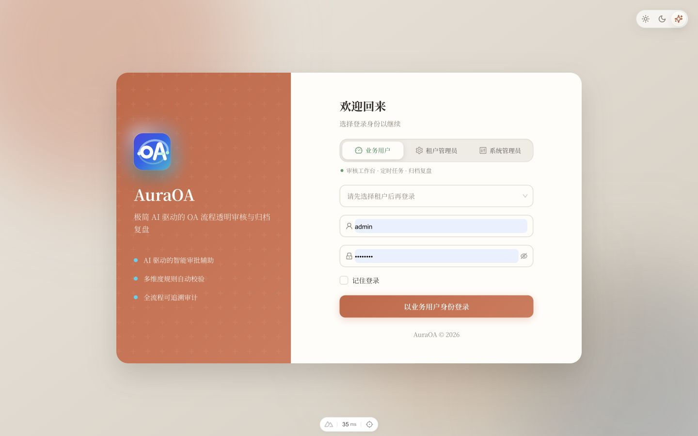
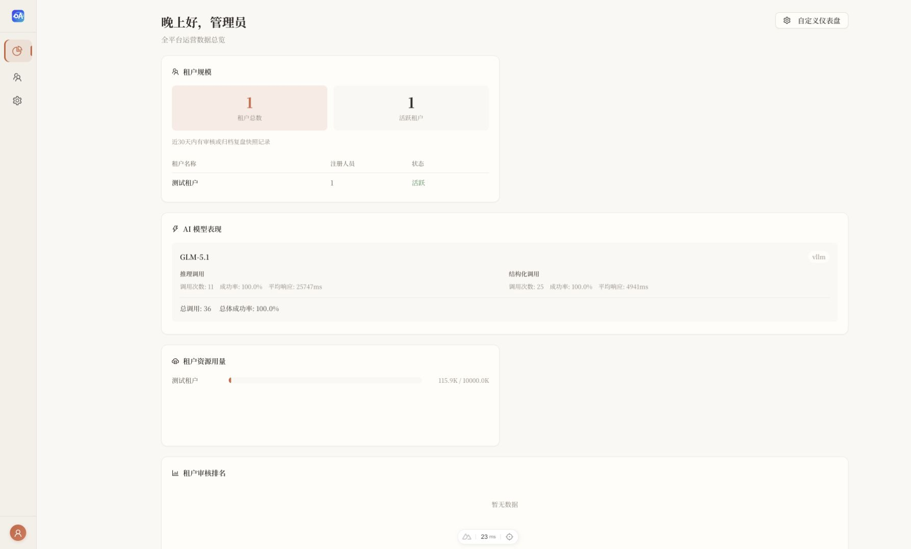
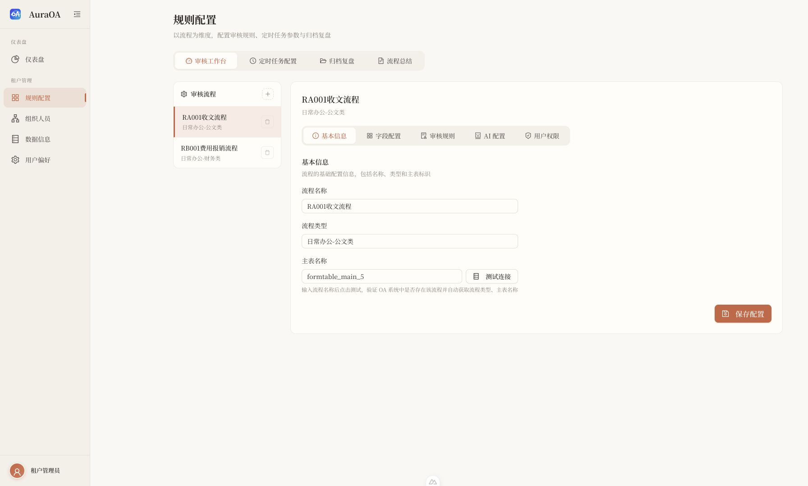
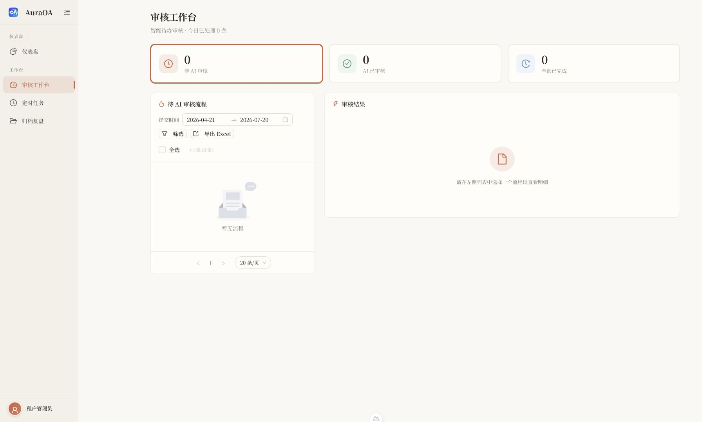
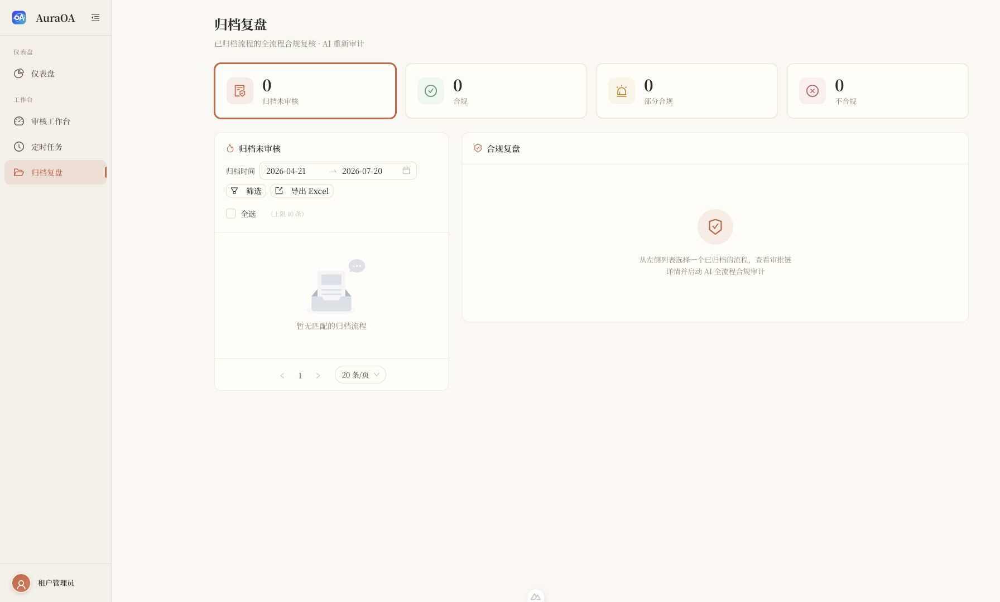
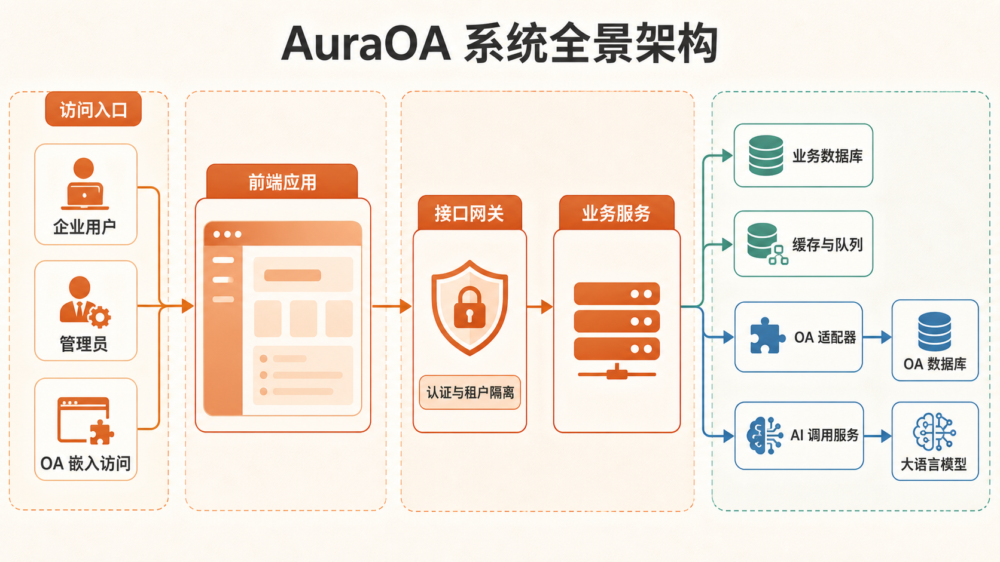
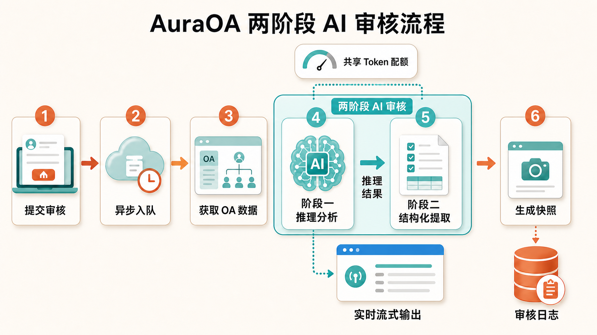

<div align="center">

# AuraOA

**极简 AI 驱动的企业 OA 流程审核框架** — *Minimalist, AI-driven audit framework designed to bring transparency and intelligence to enterprise workflows.*

[](LICENSE)
[](https://go.dev/)
[](https://nuxt.com/)
[](https://www.postgresql.org/)
[](https://docs.docker.com/compose/)

</div>

---

## 项目简介

**AuraOA** 是一套面向企业内部 OA 流程的极简 AI 审核框架。通过连接企业 OA 系统的数据库，提取流程表单数据与审批流信息，结合自定义审核规则与大语言模型（LLM），实现对 OA 流程的智能合规性审核与归档复盘。

### 核心能力

| 能力 | 说明 |
|------|------|
| 🔍 **智能审核** | 两阶段 AI 审核（推理→结构化提取），支持严格/标准/宽松三种审核尺度 |
| 📦 **归档复盘** | 对已归档流程进行全流程合规复核，含审批流节点完整性分析 |
| ⏰ **定时任务** | 批量审核、日报/周报自动推送，支持自定义 Cron 表达式 |
| 🏢 **多租户** | 租户隔离的数据与配置，支持独立 AI 模型分配与 Token 配额管理 |
| 🔗 **OA 适配** | 可扩展的 OA 适配器架构，当前支持泛微 Ecology E9（MySQL/Oracle/达梦） |
| 🤖 **多模型** | 支持本地部署（Xinference、Ollama、vLLM）与云端 API（阿里云百炼、DeepSeek、OpenAI 等） |
| 👤 **个性化配置** | 用户可自定义审核字段、规则、AI 尺度偏好，支持租户管理员集中查看与管理 |
| 🌐 **国际化** | 支持中文/英文双语界面 |

---

## 界面预览

<p align="center">
  
</p>

<table>
  <tr>
    <td width="50%" align="center">
      <strong>系统运营总览</strong><br />
      <sub>租户规模、AI 模型表现、资源用量与服务健康状态</sub><br /><br />
      
    </td>
    <td width="50%" align="center">
      <strong>流程规则配置</strong><br />
      <sub>统一管理字段、审核规则、AI 参数与用户权限</sub><br /><br />
      
    </td>
  </tr>
  <tr>
    <td width="50%" align="center">
      <strong>AI 审核工作台</strong><br />
      <sub>待办筛选、批量审核、流式推理与结果展示</sub><br /><br />
      
    </td>
    <td width="50%" align="center">
      <strong>归档合规复盘</strong><br />
      <sub>对已归档流程重新审计，保留完整审批链和快照</sub><br /><br />
      
    </td>
  </tr>
</table>

> 截图来自本地演示环境，页面数据仅用于展示系统功能。

---

## 技术栈

### 后端（Go Service）
- **语言**：Go 1.25+
- **Web 框架**：Gin
- **ORM**：GORM
- **数据库**：PostgreSQL 16（pgvector 镜像）
- **缓存**：Redis 7
- **认证**：JWT（Access Token 2h + Refresh Token 7d）
- **配置**：Viper（YAML + 环境变量）
- **日志**：Zap（支持租户级日志隔离）
- **加密**：AES-256（数据库密码等敏感字段）

### 前端（Frontend）
- **框架**：Nuxt 3（SSR 关闭，SPA 模式）
- **UI 库**：Ant Design Vue 4
- **语言**：TypeScript / Vue 3 Composition API
- **国际化**：自研 i18n（基于 `zh-CN.ts` / `en-US.ts`）
- **数据可视化**：内置图表组件

### 兼容文档解析（Document Parser）
- **语言**：Java 21
- **文档解析**：Apache POI（DOC / XLS / PPT）、OFDRW（OFD）
- **接入方式**：仅通过 Docker 内网向 Go 服务提供 HTTP API
- **安全边界**：不记录附件正文，临时文件随请求清理，可选 Bearer 鉴权

### 基础设施
- **容器化**：Docker Compose（开发环境 + 生产环境）
- **数据库迁移**：golang-migrate（`db/migrations/`）

---

## 系统架构

### 系统全景

下图为根据实际模块关系使用 AI 生成的中文架构信息图：



前端只通过 `/api` 与后端交互；后端保持 `handler → service → repository` 分层。认证中间件在请求中注入用户、角色与租户上下文，租户数据查询通过 `WithTenant(c)` 实现隔离。

### 认证架构

```
┌─────────────────────────────────────────────────────────────┐
│                      JWT 双令牌架构                          │
├─────────────────────────────────────────────────────────────┤
│                                                             │
│  Access Token (2h)          Refresh Token (7d)              │
│  ├── 用户信息                ├── 用户 ID                    │
│  ├── 当前角色                └── JTI (用于黑名单)           │
│  ├── 权限列表                                               │
│  └── JTI (用于黑名单)                                       │
│                                                             │
│  Redis 存储:                                                │
│  ├── session:{user_id} → 用户会话缓存 (2h TTL)             │
│  └── blacklist:{jti} → 已吊销令牌 (与 Token TTL 一致)      │
│                                                             │
└─────────────────────────────────────────────────────────────┘
```

### 角色体系

| 层级 | 角色 | 说明 |
|-----|------|------|
| 系统级 | `system_admin` | 管理租户、OA 连接、AI 模型、系统配置 |
| 系统级 | `tenant_admin` | 管理组织架构、流程配置、审核规则、用户配置 |
| 系统级 | `business` | 使用审核工作台、归档复盘、个人设置 |
| 组织级 | 自定义角色 | 通过 `page_permissions` 控制页面访问权限 |

### 配置层级

```
系统配置 (system_configs)
    │
    ├── auth.* — 认证相关配置
    ├── tenant.* — 租户默认配置
    └── system.* — 系统全局配置
    │
    ▼
租户配置 (tenants + process_audit_configs)
    │
    ├── 流程审核配置 — 字段/规则/AI 配置
    ├── 用户权限控制 — 允许自定义字段/规则/尺度
    └── 访问控制 — 角色/成员/部门白名单
    │
    ▼
用户个人配置 (user_personal_configs)
    │
    ├── 字段覆盖 — 在租户基础上新增字段
    ├── 规则覆盖 — 开关租户规则 + 自定义规则
    └── AI 尺度覆盖 — 个人审核严格度偏好
```

实际审核时按“用户个人配置 > 租户流程配置 > 系统默认值”的优先级合并，使统一治理与个人化需求能够同时生效。

### AI 审核运行流程

```
用户选择流程 → 获取配置 → 从 OA 提取数据 → 合并规则 → 构建提示词 → AI 审核 → 返回结果
                  │              │              │              │
                  ▼              ▼              ▼              ▼
            租户配置 +      OA 适配器      MergeRules()   两阶段审核
            用户配置       (Weaver E9)    (优先级排序)   (推理→提取)
```

下图为使用 AI 生成的中文流程信息图，将异步入队、OA 取数、流式输出与快照落库串联为完整链路。其中“阶段一：推理分析”和“阶段二：结构化提取”是两次连续的 AI 调用：



`AIModelCallerService` 统一负责 Token 配额预扣/结算、失败重试、主备模型切换和调用日志。审核与归档复盘共用这套调用基础设施，但分别落入独立的日志与流程快照表。

---

## 项目结构

```
AuraOA/
├── README.md
├── LICENSE
├── docker-compose.yml            # 生产环境编排
├── docker-compose.dev.yml        # 开发环境编排
├── .env.example                  # 环境变量模板
│
├── go-service/                   # Go 后端服务
│   ├── cmd/server/main.go        # 应用入口
│   ├── config.yaml               # 默认配置
│   └── internal/
│       ├── cache/                # Redis 缓存管理
│       ├── config/               # 配置加载
│       ├── dbmigrate/            # 数据库迁移
│       ├── dto/                  # 请求/响应 DTO
│       ├── handler/              # HTTP 处理器
│       ├── middleware/           # 中间件（JWT/CORS/日志/权限/租户）
│       ├── model/                # 数据模型
│       ├── pkg/                  # 工具包
│       │   ├── ai/               # AI 模型调用
│       │   ├── crypto/           # AES 加解密
│       │   ├── errcode/          # 错误码定义
│       │   ├── jwt/              # JWT 签发与验证
│       │   ├── logger/           # 日志工具
│       │   ├── mail/             # 邮件发送
│       │   ├── oa/               # OA 系统适配器
│       │   ├── response/         # 统一响应封装
│       │   └── sanitize/         # 输入清洗
│       ├── repository/           # 数据访问层
│       ├── router/               # 路由注册
│       └── service/              # 业务逻辑层
│
├── frontend/                     # Nuxt 3 前端
│   ├── pages/                    # 页面路由
│   ├── components/               # 公共组件
│   ├── composables/              # 组合式 API
│   ├── constants/                # 常量定义
│   ├── layouts/                  # 布局组件
│   ├── locales/                  # 国际化语言包
│   ├── middleware/               # 路由守卫
│   ├── types/                    # TypeScript 类型
│   └── utils/                    # 工具函数
│
├── document-parser/              # DOC / XLS / PPT / OFD 兼容解析服务
│   ├── src/main/java/            # Java 解析与 HTTP 接口
│   ├── src/test/                 # 单元测试与无敏感信息样本
│   ├── pom.xml                   # Maven 依赖与构建配置
│   └── Dockerfile                # Java 21 运行镜像
│
├── db/                           # 数据库
│   └── migrations/               # 迁移脚本（30+）
│
└── docs/                         # 项目文档
    ├── oa-integration.md         # OA 系统对接说明
    ├── ai-integration.md         # AI 系统对接说明
    ├── api/                      # API 接口文档
    │   ├── README.md             # 接口总览与通用约定
    │   ├── auth.md               # 认证接口
    │   ├── system-admin.md       # 系统管理接口
    │   ├── org.md                # 组织架构接口
    │   ├── audit-config.md       # 流程审核配置接口
    │   ├── audit.md              # 审核工作台接口
    │   ├── archive.md            # 归档复盘接口
    │   ├── cron.md               # 定时任务接口
    │   ├── user-settings.md      # 用户设置接口
    │   └── cache.md              # 缓存管理接口
    └── known-issues/             # 已知缺陷与待办
        └── README.md             # 缺陷清单、待完成事项
```

---

## 快速开始

### 环境要求

- Docker & Docker Compose
- Node.js 18+（前端本地开发）
- Go 1.25+（后端本地开发，可选）

### Docker 本地一键部署（推荐）

```bash
cp .env.example .env
```

编辑 `.env`，至少修改数据库密码、`JWT_SECRET`、`ENCRYPTION_KEY`，并按需配置对外访问端口：

```env
AURAOA_ENV_FILE=.env
AURAOA_IMAGE_TAG=latest
NGINX_HTTP_PORT=80
AURAOA_PUBLIC_API_BASE=
NUXT_INTERNAL_API_BASE=http://go-service:8080
```

`AURAOA_PUBLIC_API_BASE` 留空表示浏览器使用同源 `/api`，由 Nginx 容器反代到 Go 服务。`NUXT_INTERNAL_API_BASE` 是 Nuxt 服务端嵌入代理访问 Go 的 Docker 内部地址，通常保持默认值。启动后访问 `http://localhost:${NGINX_HTTP_PORT}`：

```bash
docker compose up -d --build
docker compose ps
```

生产环境如需绑定域名，可设置：

```env
NGINX_SERVER_NAME=oa.example.com
NGINX_HTTP_PORT=80
```

### Docker 镜像打包与服务器部署

服务器部署按“本地构建镜像、导出 tar、上传服务器、服务器加载镜像并启动”的方式组织。`docker-compose.yml` 中应用服务使用固定镜像名：

```text
auraoa-go-service:${AURAOA_IMAGE_TAG:-latest}
auraoa-frontend:${AURAOA_IMAGE_TAG:-latest}
auraoa-document-parser:${AURAOA_IMAGE_TAG:-latest}
```

#### 1. 本地构建 Linux 镜像

Mac 构建、Linux 服务器运行时，需要显式指定目标平台。常见 x86_64 服务器使用 `linux/amd64`；ARM 服务器可改为 `linux/arm64`。

```bash
export AURAOA_IMAGE_TAG=latest

docker buildx build --platform linux/amd64 \
  -t auraoa-go-service:${AURAOA_IMAGE_TAG} \
  -f go-service/Dockerfile \
  --load .

docker buildx build --platform linux/amd64 \
  -t auraoa-frontend:${AURAOA_IMAGE_TAG} \
  -f frontend/Dockerfile \
  --load ./frontend

docker buildx build --platform linux/amd64 \
  -t auraoa-document-parser:${AURAOA_IMAGE_TAG} \
  -f document-parser/Dockerfile \
  --load ./document-parser
```

导出应用镜像：

```bash
mkdir -p dist/docker-images
docker save auraoa-go-service:${AURAOA_IMAGE_TAG} \
  -o dist/docker-images/auraoa-go-service-${AURAOA_IMAGE_TAG}-linux-amd64.tar
docker save auraoa-frontend:${AURAOA_IMAGE_TAG} \
  -o dist/docker-images/auraoa-frontend-${AURAOA_IMAGE_TAG}-linux-amd64.tar
docker save auraoa-document-parser:${AURAOA_IMAGE_TAG} \
  -o dist/docker-images/auraoa-document-parser-${AURAOA_IMAGE_TAG}-linux-amd64.tar
```

如果服务器不能访问公网，也需要把运行依赖镜像一起导出：

```bash
docker pull --platform linux/amd64 nginx:1.27-alpine
docker pull --platform linux/amd64 pgvector/pgvector:pg16
docker pull --platform linux/amd64 redis:7-alpine
docker save \
  nginx:1.27-alpine \
  pgvector/pgvector:pg16 \
  redis:7-alpine \
  -o dist/docker-images/auraoa-runtime-linux-amd64.tar
```

数据库迁移脚本不需要单独上传，`go-service` 镜像已经包含 `db/migrations`，服务启动时会从容器内 `/migrations` 自动执行迁移。

#### 2. 上传服务器

服务器目录示例使用 `/opt/auraoa`：

```bash
ssh root@服务器IP "mkdir -p /opt/auraoa/deploy/nginx/templates /opt/auraoa/docker-images"

scp docker-compose.yml .env.example root@服务器IP:/opt/auraoa/
scp deploy/nginx/templates/default.conf.template \
  root@服务器IP:/opt/auraoa/deploy/nginx/templates/
scp dist/docker-images/*.tar root@服务器IP:/opt/auraoa/docker-images/
```

#### 3. 服务器加载镜像

```bash
cd /opt/auraoa
docker load -i docker-images/auraoa-go-service-latest-linux-amd64.tar
docker load -i docker-images/auraoa-frontend-latest-linux-amd64.tar
docker load -i docker-images/auraoa-document-parser-latest-linux-amd64.tar

# 如果上传了运行依赖镜像，再加载这一份。
docker load -i docker-images/auraoa-runtime-linux-amd64.tar
```

#### 4. 测试部署

测试环境用于验收镜像、数据库迁移、初始化登录、OA 连接、AI 模型配置和审核流程：

```bash
cp .env.example .env.test
```

编辑 `.env.test`，至少修改：

```env
AURAOA_ENV_FILE=.env.test
AURAOA_IMAGE_TAG=latest
NGINX_HTTP_PORT=8088
NGINX_SERVER_NAME=测试服务器IP
AURAOA_PUBLIC_API_BASE=
NUXT_INTERNAL_API_BASE=http://go-service:8080
POSTGRES_PASSWORD=测试库强密码
REDIS_PASSWORD=测试缓存强密码
JWT_SECRET=测试环境独立随机值
ENCRYPTION_KEY=32字节加密密钥
DOCUMENT_PARSER_API_KEY=测试环境独立随机值
# OA 嵌入密钥在「系统管理 → 租户管理 → OA 嵌入」中按租户生成
```

启动：

```bash
docker compose --env-file .env.test up -d --no-build
docker compose --env-file .env.test ps
docker compose --env-file .env.test logs -f go-service
```

启动后访问 `http://测试服务器IP:8088`。首次部署空库时，访问 `/setup` 创建首个系统管理员。

#### 5. 正式部署

正式环境应使用正式域名、独立数据库密码、独立 Redis 密码和独立强随机密钥：

```bash
cp .env.example .env.prod
```

编辑 `.env.prod`，至少修改：

```env
AURAOA_ENV_FILE=.env.prod
AURAOA_IMAGE_TAG=latest
NGINX_HTTP_PORT=80
NGINX_SERVER_NAME=oa.example.com
AURAOA_PUBLIC_API_BASE=
NUXT_INTERNAL_API_BASE=http://go-service:8080
POSTGRES_PASSWORD=正式库强密码
REDIS_PASSWORD=正式缓存强密码
JWT_SECRET=正式环境独立随机值
ENCRYPTION_KEY=32字节加密密钥
DOCUMENT_PARSER_API_KEY=正式环境独立随机值
# OA 嵌入密钥在「系统管理 → 租户管理 → OA 嵌入」中按租户生成
```

启动：

```bash
docker compose --env-file .env.prod up -d --no-build
docker compose --env-file .env.prod ps
docker compose --env-file .env.prod logs -f go-service
```

`ENCRYPTION_KEY` 用于敏感字段加密，一旦正式环境已写入 OA 数据库密码、AI 密钥等密文数据，不要在未做密文迁移的情况下直接更换。容器启动后，还需在“系统设置 → 附件解析”中填写与 `DOCUMENT_PARSER_API_KEY` 相同的兼容解析服务 API Key，再执行连接测试。

#### 6. 更新版本

推荐每次发版使用明确标签，例如日期或 Git commit：

```bash
export AURAOA_IMAGE_TAG=20260630
```

按上面的步骤重新构建、导出、上传并 `docker load` 后，修改服务器 `.env.test` 或 `.env.prod` 中的 `AURAOA_IMAGE_TAG`，再执行：

```bash
docker compose --env-file .env.prod up -d --no-build
docker compose --env-file .env.prod ps
```

如需回滚，把 `AURAOA_IMAGE_TAG` 改回服务器已加载的旧标签后再次 `up -d`。

### 1. 启动基础服务（开发模式）

```bash
# 复制环境变量
cp .env.example .env

# 启动 PostgreSQL + Redis + Go 后端
docker-compose -f docker-compose.dev.yml up -d
```

### 2. 启动前端

```bash
cd frontend
pnpm install
pnpm dev
```

访问 `http://localhost:3000` 进入系统。

### 3. 首次初始化

系统首次启动时会自动检测是否需要初始化：
1. 访问 `/setup` 页面创建系统管理员账号
2. 登录后进入系统管理后台
3. 创建租户并配置 OA 数据库连接
4. 配置 AI 模型
5. 创建流程审核配置

---

## 核心配置说明

### JWT 配置 (`config.yaml`)

```yaml
jwt:
  secret: "change-me-in-production"  # 生产环境必须修改
  access_token_ttl: 2h               # Access Token 有效期
  refresh_token_ttl: 168h            # Refresh Token 有效期（7天）
```

### 数据库配置

```yaml
database:
  host: localhost
  port: 5432
  user: oa_admin
  password: changeme_pg_password
  dbname: oa_smart_audit
  sslmode: disable
```

### 加密配置

```yaml
encryption:
  key: "4f9e2b8c5a1d7f0e3a6c9b2d5e8f1a4c"  # 32 字节 AES-256 密钥
```

---

## 文档目录

### 核心功能说明

| 文档 | 说明 |
|------|------|
| [开发规范](docs/development-guide.md) | 前后端约定、i18n、分页、接口、模块关联与自检清单 |
| [OA 系统对接说明](docs/oa-integration.md) | OA 适配器架构、泛微 E9 实现、数据提取流程、未完成适配 |
| [OA Basic 单点登录](docs/oa-basic-sso-integration.md) | OA 服务端 Basic 换取一次性浏览器登录地址的配置、Java 示例与联调说明 |
| [AI 系统对接说明](docs/ai-integration.md) | AI 调用架构、两阶段审核流程、Token 配额管理、未完成适配 |

### API 接口文档（[`docs/api/`](docs/api/)）

| 文档 | 路由前缀 | 说明 |
|------|---------|------|
| [接口总览](docs/api/README.md) | `/api` | 通用约定、认证方式、角色说明 |
| [认证接口](docs/api/auth.md) | `/api/auth` | 登录、OA Basic 单点登录、登出、Token 刷新、角色切换、通知 |
| [系统管理接口](docs/api/system-admin.md) | `/api/admin` | 租户管理、OA 连接、AI 模型、系统配置、监控 |
| [组织架构接口](docs/api/org.md) | `/api/tenant/org` | 部门、角色、成员管理 |
| [流程审核配置接口](docs/api/audit-config.md) | `/api/tenant/rules` | 流程配置、审核规则、提示词模板 |
| [审核工作台接口](docs/api/audit.md) | `/api/audit` | 审核执行、任务管理、流式输出、日志、快照 |
| [归档复盘接口](docs/api/archive.md) | `/api/archive` | 归档复盘执行、历史记录、日志、快照 |
| [定时任务接口](docs/api/cron.md) | `/api/tenant/cron` | 任务类型配置、任务实例、执行日志 |
| [用户设置接口](docs/api/user-settings.md) | `/api/tenant/settings` | 个人配置、仪表盘偏好、Token 统计 |
| [缓存管理接口](docs/api/cache.md) | `/api/admin/cache` | 缓存统计、清除、开关 |

### 已知缺陷与待办（[`docs/known-issues/`](docs/known-issues/)）

| 文档 | 说明 |
|------|------|
| [缺陷与待办总览](docs/known-issues/README.md) | 当前已知缺陷、待完成事项与优先级 |

---

## 开发指南

日常开发请先阅读 **[开发规范](docs/development-guide.md)**（国际化、分页、注释、API、审核/归档对称模块等）。

### 添加新的 OA 适配器

1. 在 `go-service/internal/pkg/oa/` 下创建新适配器
2. 实现 `OAAdapter` 接口
3. 在 `NewOAAdapter` 工厂函数中注册

### 添加新的 AI 模型

1. 在系统管理后台添加 AI 模型配置
2. 支持 OpenAI 兼容协议的模型可直接使用
3. 非兼容协议需在 `go-service/internal/pkg/ai/` 中添加适配

### 添加新的系统配置

1. 在 `db/migrations/` 中添加迁移脚本
2. 在 `system_config_service.go` 中添加读取逻辑
3. 在前端系统设置页面添加配置项

---

## 贡献

欢迎提交 Issue 和 Pull Request！

1. Fork 本仓库
2. 创建特性分支 (`git checkout -b feature/amazing-feature`)
3. 提交更改 (`git commit -m 'feat: add amazing feature'`)
4. 推送到分支 (`git push origin feature/amazing-feature`)
5. 提交 Pull Request

## 许可证

本项目基于 [MIT License](LICENSE) 开源。
